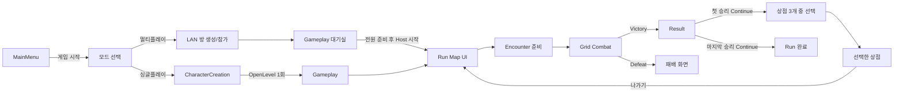

# ProjectA 구현 구조와 설정

기준일: 2026-09-22. 현재 모듈 책임·실행 절차·콘텐츠 설정을 정의한다.

기본 Combat는 [GAME_DESIGN 8절](GAME_DESIGN.md#8-라운드-계획과-시간차-자동-전투)의 행동 계획·시간차 실행으로 교체했다. 기존 순차 턴·AI 연속 행동·End Turn 실행은 제거했다. 순차 모드 보존용 진입점은 없으며 이전 Blueprint 참조용 클래스·프로퍼티만 남긴다. 기존 Run·상점·직업·원래 소유권과 비전투 저장은 유지한다. 2026-09-18 위임 실행에서 싱글 Run·같은 PC 2/4인 PIE와 저장·전투 예외 회귀를 통과했다. 실제 서비스·다중 PC·지연/손실 확인은 별도다.

T14의 이전 턴 복구·승계 성공은 과거 코드 이력이다. 새 라운드는 저장된 준비 완료 경계에서 복구하며 이전 순차 Combat 저장은 계속 거절한다. 진행 중 시전·투사체의 임의 시점 복원은 지원하지 않는다. Steam/PlayFab·MMR은 미구현이며 [최신 확인](TODO.md#2-14-확정-전투-규칙과-준비-완료-복구)을 따른다.

| 영역 | 기준 문서 |
|---|---|
| 게임 목표와 콘텐츠 방향 | [GAME_DESIGN](GAME_DESIGN.md) |
| 남은 작업과 완료 조건 | [TODO](TODO.md) |
| Snapshot·Co-op·저장/재개·온라인 계약 | [MULTIPLAYER](MULTIPLAYER.md) |
| 남은 사용자 확인 항목 | [남은 확인](TODO.md#1-사용자-작동-확인) |
| 변경 과정과 과거 판단 | [HISTORY](HISTORY.md) |

## 기본 실행 흐름

실행 환경은 UE 5.7의 `ProjectA.uproject`다.

1. 기본 시작 맵인 `/Game/User_JeHoon/LEVEL/MainMenu`를 연다.
2. 게임 시작 → 싱글플레이 → CharacterCreation에서 1~4명의 캐릭터를 생성하고 직접 조작할 한 명을 선택한다. 직업 화살표와 Edit로 직업·이름을 바꾼다. 멀티플레이는 기존 같은 PC·LAN 개발용 방으로 연결한다.
3. Start Game → `/Game/User_JeHoon/LEVEL/Gameplay` → Run Map에서 첫 Combat 노드를 선택한다.
4. 전장에서 적 또는 스킬이 요구하는 타일을 클릭하고 하단의 실제 장착 스킬 버튼으로 계획을 적용한 뒤 준비 완료한다. 스킬 미선택 준비 완료는 행동 비용 없이 턴을 넘기며 선택한 스킬은 취소할 수 있다. 위치 이동은 이동 예약 → 아군 빈칸 한 번 클릭으로 예약하며 스킬 없이 이동만 예약하면 SAP 1만 소모한다. 전원 준비 후 SAP 이동을 먼저 끝내고 선택한 AP 행동을 실행한다. 나머지 생성 동료는 서버 AI가 계획·실행한다.
5. 속도차 대기·이동·시전·피격·복귀를 관찰한다. 남은 유효 투사체까지 정리되면 다음 라운드 계획으로 돌아간다. 해결 중 새 행동을 입력할 수 없다.
6. 첫 Victory → 5~15G 보상 3개 중 1개 수령 → Continue → 상점1·상점2·상점3 중 하나 선택 → 나가기 → 두 번째 Combat 노드를 진행한다. 두 번째 Victory도 보상을 수령한 뒤 Continue로 완료된 Run Map을 표시한다.
7. 잔여 공격까지 정리한 뒤 양 팀 전멸을 포함한 패배는 Defeat 화면을 표시하고 Run을 종료한다. 승리 보상은 지급하지 않는다.

빌드 후 UE를 재시작하여 C++·리플렉션 변경을 반영한다. 이번 전환에는 새 맵·WBP 생성이나 Config 변경이 필요하지 않다.

2026-09-16 사용자는 지금까지 플레이한 범위에서 이상이 없다고 보고했다. 추가 확인은 [TODO](TODO.md#1-사용자-작동-확인)에 짧게 기록하며 협동은 2인 → 4인 순서로 진행한다.

Gameplay는 계속 유지하는 단일 레벨이며 두 Combat 노드는 `DefaultEncounter`를 재사용한다. 월드 진행은 CommonUI 노드 화면으로 표현한다. 물리적인 WorldMap 탐험과 전투별 CombatMap 전환은 현재 흐름에 없다.

## 모듈과 책임

런타임은 `Source/ProjectA`, 에셋 생성·에디터 도구·PIE 테스트는 `Source/ProjectAEditor`에 둔다. Editor 의존성을 런타임 모듈로 옮기지 않는다.

| 구성 | 책임과 수명 |
|---|---|
| `URunStateSubsystem` | GameInstance 수명. Run/소유권·관리 lease와 저장 성공 후 상태 반영 조율. 경로/진행 검사는 `RunProgressRules`, 저장 버전 해석은 `RunSaveFormat` 사용 |
| `AGameplayGameModeBase` | 서버 월드의 Arena·EncounterManager·CombatManager 준비와 신뢰된 C++ 참가자 배정. 종료 시 전투를 멈춘 뒤 관리 lease 해제 |
| `AGameplayGameState` | 단계·파티·노드·결과와 전투/아레나 참조를 읽기 전용 뷰로 복제. Client RunState는 서버 권위의 대체물이 아님 |
| `AGameplayPlayerController` | `APartyPlayerController` 상속. 로컬 Root UI, 소유 연결의 전투 RPC, 현재 Host의 노드 선택·Continue 요청 |
| `UGameplayRootWidget` | 해당 플레이어 화면의 CommonUI Run/Combat/Modal 스택과 저장 실패·재시도 안내 |
| `URunMapWidget` | 노드와 진행 상태 표시, 선택 요청. 직접 Spawn하지 않음 |
| `URunEncounterWidget` | 상점 3개 선택·본인 골드·스킬 4종 가격/보유 상태·구매·나가기 표시. 기존 RunLayer의 native CommonUI 화면 |
| `AEncounterManager` | Encounter 준비·스폰·라운드 전투 연결·종료 HP 추출·정리와 Run 전이. 순차 턴 저장/복원 훅 제거 |
| `ACombatArena` | 배치된 Grid, 슬롯별 좌표, 카메라, 타일 활성화 관리 |
| `ACombatManager` / `ACombatRoundCoordinator` | Run 전투 연결, 라운드 계획·시간표·실행·잔여 공격 정리·결과 확정. `UTurnManager`는 참조 호환용 외형만 유지 |
| `UCombatActionAuthority` | 기존 Run 식별·원래 소유권·서버 연결·관리 lease·Human/AI 검증 유지. 이전 즉시 순차 행동 실행은 제거 |
| `AUnitBase` / GAS / Grid | 서버 HP/AP·사망·실제 위치/복귀 칸·복제 표현. 라운드가 이동/피격을 소유하며 기존 ASC 데이터와 사망 표현 연결 |
| 적·아군 AI | `CombatAIPlanning`이 장착 순서와 태그 조건으로 후보를 선택하고 Coordinator가 인간 초안 전에 한 명령씩 고정. 이전 AI 컴포넌트는 참조 호환 유지 |
| `ACombatRoundPlayerController` / `UCombatRoundPlanningWidget` | 소유 연결의 계획·준비 RPC와 CommonUI 계획 화면. `UCombatHUDWidget`은 이전 WBP 참조용 외형 |
| `UEncounterResultWidget` | 승리 골드 3택1·개인 잔액·수령 상태·Continue, 패배 Run 종료 안내 |

실행 중 복제 뷰와 Actor 조회는 허용하되 Run/Party/Encounter/Command는 직렬화 가능한 값 데이터가 기준이다. GameInstance에 전투 Actor나 UI 동작을 집중시키지 않는다.

## 파티와 전투 규약

**전투 승리 보상**

`FRunGoldRewardState`의 노드·골드 선택지 3개·캐릭터별 수령 기록을 저장하고 복제 뷰로 표시한다. `RunEncounterPoolDataAsset.GoldRewardMin/GoldRewardMax`의 기본값은 5/15이며 각 선택지를 독립 추첨한다. 서버가 연결 소유자·현재 Human·노드·선택 인덱스·미수령·잔액 범위를 검증하고 골드와 수령을 함께 저장한다. 파티 승리 시 사망한 직접 조작 캐릭터도 수령할 수 있으며 AI는 제외한다. 현재 인간 참가자가 모두 선택해야 Host가 Continue한다. 마지막 전투도 보상 수령 후 종료하며 패배 보상은 없다.

선택지와 수령은 재개 시 복원한다. 기존 보상 필드가 없는 Result는 그대로 Continue하고 스킬 상점 schema 1 저장의 다음 승리부터 보상을 적용한다. 상점 도입 전 저장은 기존 골드·장착 규약을 유지한다. [사용자 확인](TODO.md#2-24-전투-승리-골드-보상)

### 상점 인카운터

새 Run은 첫 승리 보상 수령 후 Continue에서 `EncounterChoice`, 선택 시 `Shop`, 나가기 시 `Map`으로 전환한다. 전투 노드 수는 2개를 유지하며 상점 방문을 전투 완료 수에 더하지 않는다. 선택하지 않은 상점은 방문할 수 없다. 레벨 이동·별도 Arena 스폰 없이 UI로 처리한다.

2026-09-22 확정: 아군 네 직업은 비무장 공격 하나로 시작한다. 직접 조작 캐릭터별 개인 10G, AI 동료 0G이며 상점 3곳은 검·원거리·AOE·휩쓸기와 HP 전체 회복을 각 1G에 판매한다. 본인 생존 인간 캐릭터만 구매하고 같은 스킬의 재구매를 거절한다. 습득 즉시 Run 장착 목록에 추가하며 다음 전투부터 사용한다. 회복은 직업 설정의 최대 HP까지 즉시 적용하고 만피 구매를 거절한다. 10G·1G는 시험값이다.

`RunEncounterPoolDataAsset.StartingGold/FixedSkillOffers/Recovery`에서 시험 구성을 관리하고 새 Run에 `FRunSkillShopState`로 복사한다. `FRunPartyMember.Gold/Skills/bHasSkillLoadout/CurrentHP`를 저장 기준으로 사용한다. 서버가 신뢰 연결의 소유자·상점 단계·Human 상태·잔액과 스킬 중복 또는 부족 HP를 검사하고, 저장 복사본에 잔액과 구매 효과를 함께 반영한 뒤 성공한 변경만 공개한다. 실패하면 메모리와 기존 파일을 보존한다. 기존 schema 1 저장의 회복 필드 누락은 기본값 1G로 읽고 고정 스킬 상품·보유 골드를 유지한다. schema 0에는 상품·골드를 소급 지급하지 않으며 명시 장착이 없는 기존 파티는 과거 직업 기본값을 유지한다. [사용자 확인](TODO.md#2-19-비무장-시작과-스킬-상점)

| 데이터 | 역할 |
|---|---|
| `URunEncounterPoolDataAsset` | `FixedOffers`에 상점 3개, `FixedSkillOffers`에 스킬 상품·가격, `Recovery`에 전체 회복 가격, `StartingGold`에 개인 시작 골드 정의. 추첨하지 않음 |
| `FRunEncounterOffer` | `EncounterId`·`DisplayName`·`Type`의 USTRUCT 값 데이터 |
| `FRunEncounterProgress` | schema·제시 목록·선택 ID·퇴장 완료 여부. Run 저장과 GameState 표시 뷰에 포함 |
| `UPartyDefinitionDataAsset::RunEncounterPool` | 새 Run에서 사용할 풀. 미지정 시 native 기본값 상점1·상점2·상점3 사용 |

풀을 직접 편집하려면 `Content/User_JeHoon/Blueprint/DataAsset` 아래에 `RunEncounterPoolDataAsset` 유형의 DataAsset을 만들고 `DA_VerticalSliceParty.RunEncounterPool`에 연결한다. 서로 다른 ID와 이름을 가진 Shop 3개가 필요하다. 기본 동작에는 에셋 생성·WBP 재생성이 필요 없다. 정의는 새 Run 초기화 시 값으로 복사하며 진행 중 풀 수정으로 저장된 선택지가 바뀌지 않는다.

향후 확률 제시는 정의와 별도의 `FRunEncounterPoolEntry` USTRUCT에 정의 ID/참조·상대 가중치·출현 구간·조건을 두는 구성을 권장한다. 에디터 중심 편집은 DataAsset의 배열, 대량 수치·CSV 편집이 필요하면 `FTableRowBase` 기반 DataTable을 사용한다. 추첨은 Host에서 확정하고 제시 결과를 Run에 저장한다. 현재 가중치 필드·추첨·재추첨 정책은 미구현이다.

전이는 후보 저장 객체에 계산하고 저장 성공 후 선택·퇴장 상태를 반영한다. 실패하면 기존 상태를 유지하며 같은 버튼으로 재시도한다. 기존 저장의 schema 0은 상점 없는 경로를 유지하며 새 Run의 schema 1과 구분한다. 상점 내부 재개·관리 lease·Host 진행 권한은 [MULTIPLAYER](MULTIPLAYER.md), 사용자 확인은 [남은 확인](TODO.md#1-사용자-작동-확인)을 따른다.

### 파티

- CharacterCreation은 네 슬롯 중 하나 이상 생성하고 직접 조작할 한 명을 선택해야 시작한다. 각 생성 카드의 `직접 조작` 버튼으로 선택하며 선택한 카드를 삭제하면 다시 선택해야 한다. 직업·이름 편집은 선택을 유지하고 화면 재진입은 초안과 선택을 초기화한다.
- 빈 슬롯은 스폰하지 않으며 원래 `SlotIndex`를 Arena의 PlayerCoords에 대응한다. 슬롯은 이름·`ClassId`·생성 여부·현재 HP와 `bPlayerControlled` 선택을 전달한다. 식별된 Run은 `CharacterId`와 원래 `OwnerAccountId`도 보존한다.
- 일반 싱글의 매 전투에서 선택한 슬롯만 `Human`, 나머지 생성 동료는 `ServerAI`로 설정한다. 선택이 사망한 멤버를 가리키면 생존자로 조작권을 옮기지 않는다. 남은 AI가 자동으로 계획·준비하며 전체 아군 생존 상태로 결과를 판정한다.
- 직업은 전사 `Warrior`·마법사 `Mage`·궁수 `Archer`·도적 `Rogue` 순서다. `UProfessionBase`의 native 자식 클래스 4개를 `UPartyDefinitionDataAsset::Professions`의 `ProfessionClass`로 연결한다. 직업 정의는 UObject이며 전투 Actor와 분리한다.
- `CombatClass`가 없으면 기존 `PlayerUnitClasses`와 명시적인 `FallbackPlayerUnitClass`를 사용한다. 네 직업은 `BP_WarriorUnit`·`BP_MageUnit`·`BP_ArcherUnit`·`BP_RogueUnit`으로 구분하고 Kwang·Gideon·Sparrow·Countess 원본 메시를 직접 참조한다. Blueprint의 이전 기본 스킬과 별개로 새 Run은 비무장 스킬만 시작한다.
- 수정하지 않은 이름은 직업 표시명과 슬롯 번호를 사용한다. 개별 이름 변경은 `SetSlotCharacterName`으로 반영한다.
- 네 직업의 현재 시작값은 HP 100·힘/민첩/지능 각 10이다. 첫 스폰은 직업 정의의 HP와 능력치를 사용하고 이후 전투는 저장한 결과 HP를 유지한다. HP 0인 멤버는 다음 전투에 스폰하지 않는다. 최종 밸런스·성장률·능력치의 피해 보정 공식은 별도다.
- 전투 속도는 현재 GAS 민첩과 1:1이다. 기본 아군 속도는 10이며 일반 `AEnemyUnit`의 시작 힘/민첩/지능은 각각 5·속도 5다. 일반 적 HP 150·AP 2는 유지하고 Snapshot 적은 스폰 후 저장된 세 능력치로 설정한다.

`UPartyDefinitionDataAsset::IsDataValid`는 Unreal Data Validation에서 동일한 `ResolveProfession` 검사를 사용한다. 에셋 경로·직업 ID와 함께 누락 또는 Abstract/Deprecated 클래스, 유효하지 않은 HP/AP와 힘·민첩·지능, 빈·누락·중복 시작 스킬과 잘못된 라운드 프로필을 보고한다. 전투 Actor의 `CombatClass` → `PlayerUnitClasses` → 명시 fallback 순서를 유지한다. 직업 정의용 `ProfessionClass`는 별도로 필수이며 목록의 ClassId와 일치해야 한다. 실제 선택된 전투 클래스만 검사하며 잘못된 명시 클래스를 fallback으로 대체하지 않는다. 제작 파티 에셋을 Content Browser에서 선택해 **Validate Assets**로 사전 확인할 수 있으며, 전투 실행 검증과 구분한다.

### 행동과 결과

`CanStartNode → BeginEncounter → PrepareArena → SpawnParty/Enemies → ConfigureCombatParticipants → MarkCombatStarted → StartCombat`으로 시작한다. 누락 클래스·잘못된 초기 배치·등록 실패는 부분 스폰을 정리하고 오류를 표시한다.

준비 취소의 지도 저장이 실패하면 `AEncounterManager`가 취소 대기와 원래 준비 오류를 보존한다. `URunStateSubsystem::AbortEncounter`는 일반·관리 Run 모두 저장 실패 시 기존 단계·노드를 복구한다. Host의 기존 **저장 다시 시도**로 취소를 반복하며 저장 성공 후 Map으로 돌아간다. 저장 중 동기 Map 통지와 취소 대기 중 새 노드 시작·중복 스폰은 허용하지 않는다. 화면의 전투 입력은 Combat 단계뿐 아니라 실제 전투 활성 상태도 요구한다. 로컬·복제 표시 모두 준비·저장 오류를 중복 없이 함께 유지한다. 추가 확인 항목은 [남은 확인](TODO.md#2-2-전투-준비-취소와-저장-실패)을 따른다.

`ACombatRoundCoordinator`가 계획·준비·잠금·해결을 관리한다. 서버가 Planning 진입 시 양 팀 생존자의 `GetCombatSpeed()`로 현재 GAS 민첩을 읽어 속도·시작 지연을 고정하며 라운드마다 AP/SubAP를 초기화한다. 복제용 `RoundView.Speed`는 float로 소수 값을 유지한다. 서버가 명령의 소유권·전투 ID·라운드·수정 번호·부여 스킬·자원·대상·최종 배치를 검증한다. 이동 SAP 1과 공격 SubAP 비용을 합산하고 준비 완료 상태 저장 성공 뒤 Ready Phase 종료 시 AP/SAP를 즉시 한 번 차감한다. 이후 불발·실패·사망에도 환불하지 않는다. 예약·변경·취소와 저장 실패는 비용을 차감하지 않는다.

계획·이동 예약을 수정한 소유자의 준비만 해제하며 다른 팀원의 준비는 유지한다. `SkillId == NAME_None`은 인간·AI 공통 내부 대기로 처리하며 별도 스킬을 부여하지 않는다. 스킬 미선택 Ready도 기존 schema 3의 계획·준비 상태로 저장·복구한다. 첫 라운드·다음 라운드 Planning과 준비 완료·수정·취소는 복구 상태를 먼저 저장한 뒤 공개한다. 저장 실패 시 기존 준비·계획·파일을 보존하고 전투 시작을 확정하지 않는다. 저장된 Ready 경계는 비용 차감 전 상태이며 복구 후 정상 잠금 경로에서 비용을 한 번 차감한다.

근접 접근·복귀는 DA `MoveSpeed`와 Planning에 고정한 `RoundView.Speed`로 [초기 속도 튜닝](GAME_DESIGN.md#8-4-공격-접근과-복귀)을 적용한다. 실행 중 민첩 변경은 다음 라운드부터 반영한다. 비근접 스킬의 시전·이동·투사체 속도 추가 구현은 별도 작업으로 보류하고 기존 값을 유지한다. SAP 이동은 아래의 고정 속도를 사용한다.

`CanPlanCommand`는 Planning 단계에서 서버의 `ValidateCommand`와 같은 명령 조건을 검사한다. UI는 적용 전 AP/SubAP·타일·대상을 검사하고, 자신에게 인간 조작이 허용된 모든 생존 유닛에 적용된 계획이 유효한지 확인한 뒤 준비 요청을 허용한다. 이 사전 검사는 소유권·수정 번호·관리 lease·최종 목적지 예약 충돌에 대한 서버 검증을 대체하지 않는다.

해결은 0.01초 서버 진행 단위에서 접근·시전·공격 충돌·복귀를 처리한다. 일반 단일 근접은 전방 sphere sweep, 휩쓸기는 전방 박스, 검은 활성 구간의 칼날 궤적 sweep을 사용한다. 지점 공격은 3D sphere overlap과 벽 차폐, 투사체는 이동 구간 sphere sweep을 사용한다. 현재 전투에 등록된 생존 적의 Capsule을 검사하며 대상 선택이나 중심점 거리만으로 피해를 확정하지 않는다. 세부 범위·장애물 조건은 [GAME_DESIGN 8-5절](GAME_DESIGN.md#8-5-발동과-피격)을 따른다. 느린 프레임의 누적 시간을 보존하지만 서버 순서·실시간 충돌을 사용하므로 원자적 동시 판정이나 전체 결정성 보장을 주장하지 않는다. 피해는 즉시 HP·사망에 반영하고 선행 사망자의 미발동 공격은 취소하며 이미 발사한 투사체는 유지한다. 최신 충돌 판정의 사용자 작동 확인은 미실행이다.

UnitBase의 기존 순차 이동/행동 수명·유닛 체크포인트 capture/restore와 UnitAIController의 경로 완료 루프는 제거했다. Coordinator의 `CanMoveUnit → SubmitMove`는 SAP 이동 예약·변경이며 `CancelMove`는 예약 취소다. 캐릭터별 목적지 하나를 복제하고 예약 단계에서는 위치·자원을 유지한다. 기존 8방향 BFS·MoveRange·빈 아군 칸 조건과 다른 출발/예약 칸 중복 금지를 유지한다. 복귀형 공격의 임시 타일 접근 목적지도 예약에 포함한다. 잠금 후 서버가 모든 예약 SAP 이동을 처리하고, 도착 위치·방향을 AP 행동의 새 복귀점으로 저장한 뒤 AP 시간차 실행을 시작한다. AP 시계는 SAP 단계 뒤 0초부터 시작한다. 실행 중 입력을 막고 실패·중단 시 생존자를 출발점으로 복원하며 잠금 시 차감한 자원은 환불하지 않는다.

SAP 이동은 Coordinator의 `SAPMoveSpeed=350cm/s`를 사용하며 민첩·`RoundView.Speed`·CharacterMovement의 `MaxWalkSpeed`와 무관하다. 예약·비용·경로·실행 순서는 유지한다.

`AUnitBase`의 기본 CharacterMovement는 `UUnitCharacterMovementComponent`를 사용한다. 조정자의 수동 이동이 SAP·접근·복귀에서 속도와 보행용 가속도를 함께 공급하고 정지·시전·중단·사망에서 초기화한다. 기존 `ABP_Unarmed`의 속도/가속도 조건을 유지하며, 클라이언트 `MOVE_None`의 생략된 가속도 갱신은 기존 복제 속도로 보완한다. 엔진 보간과 서버 위치 권위는 유지한다. [남은 확인](TODO.md#2-10-전장-대상-선택과-sap-이동-예약)은 미실행이다.

기존 GA/SkillActor의 즉시 실행과 순차 `StartSkill`·TurnManager·AI 연속 판단·End Turn은 실행하지 않는다. 모든 예약 행동과 복귀·잔여 투사체가 종료된 뒤에만 결과를 Encounter로 전달한다. 양 팀 전멸은 패배·Run 종료이며 승리 보상을 지급하지 않는다. 엄호의 계획·실행·피해 흡수는 제거하고 상태이상은 후순위로 둔다. 확정 규칙은 [GAME_DESIGN 8절](GAME_DESIGN.md#8-라운드-계획과-시간차-자동-전투)을 기준으로 한다.

Standalone은 결과 저장 성공 후 유닛·전투 상태를 정리한다. 네트워크는 Result 표시 동안 최종 상태를 유지하고 Continue/월드 종료 시 정리한다. 결과/Continue 저장 실패는 기존 단계와 파일을 보존하며 재시도할 수 있다. Continue 재시도 성공 시 이전 오류를 동기 상태 전이 통지 전에 제거하여 상점 선택 화면에 남기지 않는다.

### 입력

활성 CommonUI 화면이 입력 모드를 소유한다. Combat 계획은 `All / CaptureDuringMouseDown`으로 최초 한 번 클릭부터 전장 유닛·타일을 선택하고 RunMap/Result는 `Menu / NoCapture`를 유지한다. Controller는 실제 게임 뷰포트에 닿은 로컬 클릭만 전달하며 UI 패널 뒤 월드 선택·실행 중 입력·타인 조작을 막는다. 이전 타일 즉시 행동/End Turn HUD는 사용하지 않는다.

`DefaultGame.ini`의 `CommonInputSettings.InputData`는 엔진의 `/CommonUI/GenericInputData.GenericInputData_C`를 참조한다. 기본 뒤로가기 입력 정의가 없어서 게임 모드 선택 화면을 열 때 발생하던 action binding 오류를 해소했으며 Enhanced Input 사용 설정은 유지한다.

MainMenu·Gameplay GameMode는 `InitializeHUDForPlayer`에서 HUDClass가 있을 때만 엔진 기본 AHUD 초기화를 호출한다. HUDClass=None인 CommonUI 화면은 빈 클래스 생성 요청을 생략한다.

GameplayCue 검색은 `DefaultGame.ini`의 `GameplayAbilitiesDeveloperSettings`와 `AbilitySystemGlobals`에 `GameplayCueNotifyPaths=/Game/User_JeHoon`을 지정한다. UE 5.7은 두 배열을 중복 없이 합친다. DeveloperSettings 배열이 비었던 이전 실행에 대비한 공식 호환 설정 보완이며, 빈값의 최초 원인과 최신 실행의 경고 해소는 아직 확인하지 않았다. 이전 에셋 조사에서는 `/Game`의 GameplayCueNotify 에셋이 0개였으며 외부 Cue 도입 시 의존 경로도 등록한다. 남은 실행 확인은 [남은 확인](TODO.md#2-1-gameplaycue-설정과-경고)을 따른다.

GameplayController에서 별도 `SetInputMode`를 추가하지 않는다. MainMenu의 UIOnly 상태에서 travel한 뒤 남는 viewport `IgnoreInput`과 로컬 포커스는 native 진입 코드가 복구한다. 이 입력 수정에는 WBP 재생성이 필요 없다.

## 콘텐츠·UI 설정

### 개발용 협동 진입

Non-Shipping MainMenu의 **게임 시작 → 멀티플레이**는 같은 PC·LAN의 새 2~4인 개발용 방으로 연결한다. 첫 화면의 별도 개발용 협동 버튼은 제거했다. `UGameModeSelectionWidget`은 싱글플레이 선택 시 기존 CharacterCreation, 멀티플레이 선택 시 `UDevelopmentCoopWidget`을 연다. Host는 `OpenLevel(..., listen?ProjectADevCoop=2~4)`, Client는 정규화한 IPv4:포트로 `ClientTravel`을 사용한다. 기본 포트는 7777이며 별도 세션 검색·온라인 인증은 없다.

`UDevelopmentCoopSubsystem`은 GameInstance 단위 연결 대기·실패 메시지를 관리한다. `ADevelopmentCoopLobby`가 참가 번호·연결·준비 상태를 복제하고, GameMode의 PreLogin/PostLogin에서 정원·시작 여부와 서버 배정을 확인한다. 준비 RPC는 요청한 연결에만 적용하며 시작·노드·Continue는 Host만 허용한다.

Host 1번, 최초 원격 접속 순서대로 2~4번이다. 전원 준비 후 서버가 LocalDevelopment 식별자·궁수 `Archer` 한 명씩의 파티를 생성하고 기존 Run/Combat 흐름으로 연결한다. 이탈 시 번호를 재사용하지 않고 방을 닫으며 전투 중에는 기존 중단 처리를 적용한다. 대체 참가·자동 승계·AI 전환은 없다.

체크포인트는 `ProjectA_DevCoop_<RunId>`로 분리한다. 메뉴 복귀 시 메모리와 저장 슬롯 선택을 초기화하고 디스크 기록은 보존한다. 일반 `ProjectA_Run`과 관리 저장은 덮어쓰지 않는다. 개발용 방에는 저장 선택·협동 재접속·Host 승계 UI를 제공하지 않는다.

| 항목 | 현재 규칙 |
|---|---|
| 직업 편집 | Edit에서 이름 1~32자·직업 편집. 저장 시 적용, 취소 시 기존 값 유지. ClassInfo는 HP·힘/민첩/지능·민첩에서 구한 전투 속도·AP/SubAP·시작 스킬 표시 |
| 직업 데이터 | `bUseUnitClassDefaults`의 능력치/AP 해석과 CombatClass fallback 유지. 새 Run은 `UnarmedStartingSkill`을 사용하고 다음 전투는 파티에 저장된 습득 목록을 사용. 명시 스킬 목록이 없는 기존 저장만 과거 직업 기본값 해석 유지. 미지원 직업·잘못된 수치·중복 스킬 ID 거절 |
| 회복약 | 기존 데이터 프로퍼티만 보존. 즉시 회복 실행과 이전 HUD 버튼은 제거했으며 새 라운드 소비 행동은 미구현 |
| 추가 스킬 | 전투 진입 시 EncounterSkillPool 자동 추첨·장착 제거. 실제 시작/명시 장착 DA만 사용하며 장착 최대 5개·계획/해결 중 변경 거절 유지. 기존 풀 에셋과 명시 획득 API는 보존 |
| 휩쓸기 | `BPDA_SweepingStrike`: 근접 전방 박스 충돌·피해 10·AP 1·시전 몽타주·종료 후 복귀. 이전 이름/ID 리디렉션 유지 |
| 전투 간 이관 | HP 유지. 새 전투의 추가 스킬 자동 추첨 없음. 전투 복구는 저장된 Ready 경계 사용. Snapshot 적은 저장된 스킬 구성 사용 |
| 적·아군 AI | 실제 장착 스킬 순서·가까운 적 기준으로 인간 초안 전에 단일 명령 고정. 장착된 복귀형 Tile 공격은 적 HomeCoord를 공격/접근 좌표로 선택 가능. 합법 공격이 없으면 목록에 노출되지 않는 내부 대기 처리 |
| 사망 표현 | 아군은 `UnitBase.DeathAnimation` 단발 재생·마지막 자세 유지와 캡슐/메시 충돌 해제. `ETeam::Enemy`는 Snapshot을 포함해 기존 래그돌·사망 충격량 적용, 캡슐만 충돌 해제. Kwang/Sparrow `Death_Bwd`, Gideon `Death_Back`, Countess `Death` 원본 직접 참조. 기존 적의 사망 시퀀스 설정은 보존하되 적 진영에서는 미사용. 설정은 `ConfigureDeathAnimations.py`, 원본 사망 시퀀스·메시 복제 없음. [사용자 확인](TODO.md#2-28-사망-애니메이션-전환) |
| 메뉴 프리뷰 | MainMenuPreviewStage의 카메라·4개 앵커·직업별 `BP_*MenuPreview` 사용. 파라곤 원본 메시와 리타깃 `MM_Idle` 반복 재생, 마법사 왼손 지팡이 연결. 전투 Pawn 생성 없음. [남은 확인](TODO.md#2-25-직업별-파라곤-외형) |
| 생성 화면 종료 | Back/X는 초안·프리뷰 정리. 재진입 시 빈 4슬롯. 상세 패널이 열려 있으면 먼저 패널만 닫음. 최소 슬롯 높이로 ClassInfo 표시 유지 |
| 모드 선택 | 게임 시작 → 싱글플레이/멀티플레이. 캐릭터 생성·접속 시작 전 멀티 화면에서 돌아오면 모드 선택 복원, 모드 선택의 뒤로가기는 첫 화면 복원. 연결 이후 나가기는 기존 세션 정리/메뉴 복귀 |
| 싱글 여정 항복 | 이어하기 옆 104×40 버튼·`URunSurrenderWidget` 확인창. 돌아가기 기본 포커스, 확인된 현재 일반 싱글 저장만 삭제. 취소·실패·저장 변경은 원본/현재 Run 보존 |
| 옵션·종료 | MainMenu의 native `UOptionsWidget`에서 해상도·화면 모드·품질·VSync를 편집. 화면 변경은 15초 확인 후 `GameUserSettings.ini`에 저장하며 취소·시간 초과·미확인 종료 시 전체 변경 복원. 품질·VSync만 변경하면 적용 시 저장. Quit는 게임 종료 요청 |
| 공통 UI 외형 | `UDemonicUITheme`이 기존 DemonicUI 텍스처를 참조하여 메뉴·설정·캐릭터 생성·협동·Run·상점·결과·라운드 계획과 저장/협동 안내를 꾸민다. 기존 입력·바인딩·권한 조건 유지 |
| 공통 UI 배율 | `UserInterfaceSettings`의 1920×1080 기준 `ScaleToFit`·`ApplicationScale=1` 사용. 화면별 추가 축소 제거, 전투는 화면 가장자리의 정보·조작 패널과 중앙 전장으로 구성 |

설정은 Unreal `UGameUserSettings`의 화면·Scalability API를 사용한다. 테두리 없는 전체 화면은 게임 창 기준 모니터의 바탕 화면 해상도로 고정하고 기존 혼합 품질은 프리셋을 선택하기 전까지 보존한다. 미확인 화면의 전체 화면 단축키 전환을 차단하고 정상 창 종료 전 복원한다. 새 제작 에셋·Config 변경은 필요하지 않다. 상세 계약은 [UI_README 8절](UI_README.md#8-시작-메뉴-설정), 사용자 확인은 [남은 확인](TODO.md#1-사용자-작동-확인)을 따른다.

공통 테마는 [UI/Theme](../Source/ProjectA/UI/Theme)의 native 클래스 기본 객체가 `UPROPERTY` 텍스처 참조를 유지하고 기존 Designer·native 컨트롤에 브러시·글자색을 적용한다. `/Game/DemonicUI` 원본은 무변경 참조하며 새 WBP·JSON 생성이나 에셋 복사는 필요하지 않다. MainMenu의 메뉴·관리 이어가기 패널은 가로 배치를 유지하고 다른 화면과 동일한 공통 DPI를 적용한다. 프리뷰 투명 영역과 전투 중앙 월드 입력을 유지한다. 적용 기준은 [UI_README 9절](UI_README.md#9-demonicui-공통-테마), 시각·입력·패키지 검증은 [남은 확인](TODO.md#1-사용자-작동-확인)을 따른다.

공통 DPI는 [DefaultEngine.ini](../Config/DefaultEngine.ini)에 설정한다. 메뉴·설정·협동·지도·상점·결과의 개별 축소를 제거하며 `CombatArena`의 활성 카메라는 고정 화면 비율을 해제하고 세로 시야각을 유지한다. 에셋 생성 스크립트도 같은 카메라 기본값을 사용하며 기존 맵·WBP를 다시 생성하지 않는다. 배율 공식·카메라 적용 범위는 [UI_README 10절](UI_README.md#10-공통-dpi와-전투-화면-배치), 사용자 확인은 [남은 확인](TODO.md#1-사용자-작동-확인)을 따른다.

Gameplay 인벤토리·설정은 `GameplayRootWidget`의 독립 CommonUI 레이어에서 표시한다. `I`는 개인 골드·스킬 조회, `Esc`는 기존 Options 화면으로 연결하며 창이 열린 동안 로컬 전장 입력을 차단한다. 키·복구 계약은 [UI 단축키](UI_README.md#8-2-gameplay-인벤토리와-설정-단축키)를 따른다.

### 타겟·행동 세부 규칙

- `GetCombatSpeed()`는 현재 GAS 민첩을 그대로 사용하며 독립 `CombatSpeed=20` 값은 제거했다. 시작 지연은 `(최고 속도 − 해당 속도) × 0.1초`이고 기본 아군 10·일반 적 5에서는 적이 0.5초 늦게 시작한다. Planning에서 고정한 속도는 근접 접근·복귀에도 적용한다. [남은 확인](TODO.md#2-8-민첩-기반-전투-속도)
- 현재 검·비무장·휩쓸기는 `Approach=Unit`으로 대상 Actor의 현재 월드 위치를 추적하며 타일은 배치·복귀 기준이다. 접근 범위에 들어오면 즉시 `Casting`으로 전환하고 검의 접근 거리 105cm보다 가까워도 간격을 맞추려고 후퇴하지 않는다. 상호 접근·시전 전환은 [사용자 확인](TODO.md#2-15-전사와-검-공격-콘텐츠) 대상이다.
- 휩쓸기는 타일 좌표와 무관한 전방 박스 충돌로 전환했다. `RoundDefinition.bUseMeleeAreaCollision`·`MeleeAreaHalfExtent`와 시전 몽타주를 사용하며 근접 접근·복귀·피해 10·AP 1을 유지한다. 타일 기반 `TargetAndSides` 계산과 기존 타일 범위 라이브러리는 보존한다. [공격 정의](GAME_DESIGN.md#8-7-기본-전투-전환과-스킬-데이터) · [작동 확인](TODO.md#2-12-휩쓸기-근접-범위-충돌)
- `SkillDefinitionDataAsset.bUseRoundDefinition`과 `RoundDefinition`으로 스킬별 실제 시간·범위·접근·복귀·투사체 정책을 편집한다. 근접·투사체의 발동 전 대상 사망은 가장 가까운 유효 생존 적 재선택으로 공통 해석한다. 공격자의 현재 위치로 거리를 계산하고 `IsValidUnitTarget` 조건을 재사용하며, 유닛 접근형은 접근·미발동 시전·칼날 궤적을 다시 시작한다. 후보가 없으면 불발 후 복귀하고 추가 비용은 차감하지 않는다. 지점 공격·발사 후 투사체·기존 저장 프로필 값은 유지한다. 미지정 장착 스킬은 [GAME_DESIGN 8-7](GAME_DESIGN.md#8-7-기본-전투-전환과-스킬-데이터)의 초기 변환을 사용한다.
- 시전 표현은 명시 프로필의 `RoundDefinition.CastMontage`를 우선하며 비어 있으면 `AbilityClass`의 기존 `AttackMontage`를 사용한다. 서버가 시전 진입 시 한 번 재생을 전달한다. 몽타주 재생 인스턴스의 루트 모션과 유닛의 기존 `AN_SkillRelease` 효과 발동은 차단하며, `WindupSeconds`·충돌·AP 계산과 발동 1회는 유지한다. 발동 후 `Recovery`에서 서버의 실제 몽타주 인스턴스가 블렌드 아웃까지 끝날 때까지 기다린 뒤 복귀한다. 서버의 재생 인스턴스를 사용할 수 없으면 에셋 길이/RateScale·블렌드 아웃·여유 시간 0.25초를 사용하며 시전 시작 기준 최대 60초로 제한한다. 반복·자동 종료 누락·잘못된 길이/속도로 무한 대기하지 않으며 시간 초과 시 남은 표현을 즉시 정리한다. 사망·중단·발동 전 취소·다음 행동 시작도 해당 인스턴스를 정리한다. [남은 확인](TODO.md#2-4-da-시전-몽타주-연결)
- 몽타주 대기 시간은 서버가 받은 `DeltaSeconds`를 프레임당 한 번 누적하며 고정 간격 시뮬레이션의 미처리 시간과 분리한다. 프레임 지연 뒤 누적 시뮬레이션을 처리할 때 시전 대기까지 중복 차감하여 조기에 복귀하지 않도록 한다.
- 기존 GAS 효과·모든 타일 범위·상태효과·회복약이 새 행동으로 완전 변환된 것은 아니다. 새 Run의 아군은 비무장 1개와 상점에서 본인이 습득한 DA만 사용한다. Blueprint의 과거 기본 4/5개는 이전 저장 fallback으로 보존한다. 기본 적은 검 공격 1개, Snapshot은 입력의 저장된 스킬 구성을 복원한다. [지원 변환](GAME_DESIGN.md#8-7-기본-전투-전환과-스킬-데이터)에 `EnemyTile·AroundTarget`을 포함한다.
- `RoundMontageOverrides`는 공통 DA를 변경하지 않고 유닛의 Skeleton에 맞는 몽타주로 바꾼다. 전사의 기존 4스킬과 적의 검 표현에 적용하며 Root Motion·서버 발동 권위·몽타주 종료 후 복귀 규칙을 유지한다. 검은 `hand_r`에 하나만 부착한다.
- 검만 `bUseWeaponTrace=true`를 사용한다. 서버가 최종 몽타주의 에셋 포즈·메시·무기 부착·소켓을 `GetAnimationPose`로 계산하고 0.23~0.43초를 0.005초 간격·반경 4cm로 검사한다. 렌더 메시 갱신·인스턴스 종료와 독립적으로 누적 구간을 처리하며 행동 취소·사망·대상 상실은 서버 단계에서 처리한다. 최초 적 한 명에게 기존 GAS `Data.Damage`로 1회 피해를 적용한다. `SM_Sword`의 `BladeBase=(0,0,-22)`·`BladeTip=(0,0.191992,-118.28656)`, Pitch/Yaw 0도·Roll 180도, 전사 부착 `(-11.095651,5.605028,-10)`·적 `(-8.5,5,-10)`을 사용한다. 단위는 cm이며 손잡이 위치와 궤적을 함께 관리한다.
- 리타깃 도구 4개의 중복 연산을 각 6개로 정리하고 보행·공격 시퀀스 48개를 기존 경로에 다시 작성했다. 원본 Root Motion 설정·참조를 보존하며 별도 재로드에서 길이·유효한 포즈·유한 좌표·골반 이동 범위를 검사한다. 전사 전방 보행의 골반 이동은 약 454cm에서 8cm로 줄었으며 실제 순간이동·흔들림 확인은 대기다.
- 서버의 실제 공격 충돌로 피격을 검사하며 별도 명중 확률·성공 슬롯·유닛 간 이동 충돌은 사용하지 않는다. 기본 공격 후 복귀하며 잔류 이동은 자기 진영으로 제한한다.
- 복귀형 행동은 계획 잠금 시 시작 방향을 저장하고 원위치 도착·복귀 시간 초과 복원·제자리 완료 시 해당 방향과 정지 속도를 복원한다. 성공한 잔류 이동은 조준 방향을 유지한다. 서버의 최종 회전은 기존 Actor 이동 복제로 전달한다.
- 다른 유닛의 복귀·예약 칸으로 이동하거나 자리를 교환할 수 없으며 실패한 이동은 출발점으로 복원한다. 같은 시각에도 서버 순서대로 피해·사망을 즉시 반영하고 미발동 공격을 취소한다. 계획 수정은 해당 소유자의 준비만 해제한다.

## 저장과 멀티플레이 연결 경계

기본 슬롯은 `ProjectA_Run`, 상대 Snapshot 슬롯은 `ProjectA_Opponent_` 접두사다. 새 게임·승패·Continue·상점 전이와 전투의 준비 완료 경계를 저장한다. 준비 완료·전투 시작은 저장 성공 뒤 확정하며 실패 시 이전 상태를 보존한다. 강제 종료 뒤 일반 Continue 또는 관리 명시적 재개로 마지막 저장 계획·Ready·유닛·자원·배치를 복구한다. 진행 중 시전·투사체의 시각을 복원하지 않고 저장된 경계에서 다시 실행한다. 테스트 슬롯은 `-ProjectASaveSlot=...`로 분리한다.

| 저장 종류 | 현재 처리 |
|---|---|
| 일반 v1 | Identity 없는 LegacyOffline 비전투 호환. 소유자/Host 추정 이관 금지 |
| 일반 v2 | 비전투 파티·진행·식별/소유권 유지 |
| 일반 v3 | 이전 순차 Combat 본문. 구조를 읽어 식별하되 이어하기/로드 거절, 파일 보존 |
| 관리 v4 | 비전투 상태·영속 Human 목록·CAS·HostEpoch·lease 유지. CombatCheckpoint schema 3의 Ready 경계만 명시적 재개 지원 |
| 일반 v5 | CombatCheckpoint schema 3의 양 팀 유닛·라운드·수정 번호·스킬/대상·Ready·SAP 예약 저장. 비용 차감 전 Ready 경계 복구 |
| LegacyOffline v6 | Identity 없는 오프라인 Combat의 schema 3 Ready 경계. 기존 파티 슬롯으로 Standalone에서 복구하며 Host·소유권·식별자를 새로 만들지 않음. 비전투 저장은 기존 v1 |
| 상대 Snapshot v1 | 기존 별도 USaveGame·카탈로그 사용. Speed/Tactics/장비 실행 지원을 확대한 것은 아님 |

이전 순차 CombatCheckpoint schema 1/2는 구조만 인식하고 로드·재개를 거절한다. 새 schema 3은 Actor 참조 대신 안정 ID·클래스/스킬 참조·값 데이터로 복구하며 원래 소유권을 유지한다. 기존 파일을 임의로 낮추거나 삭제하지 않는다. 최신 컴파일·사용자 확인은 [TODO](TODO.md#2-14-확정-전투-규칙과-준비-완료-복구)를 따른다.

`FRunPartyMember::bPlayerControlled`는 기존 저장 버전을 바꾸지 않고 추가한 선택 필드다. 일반 `LocalDevelopment` Run 중 원래 참가자가 한 명인 경우에만 사용한다. 명시 선택 한 명은 그대로 복원하며, 필드가 없거나 모두 false인 이전 데이터는 생성된 멤버 중 가장 낮은 `SlotIndex`를 메모리에서 선택하고 다음 정상 저장에 남긴다. HP 0인 멤버도 이 선택 순서에 포함하며 생존자로 승계하지 않는다. 복수 선택·미생성 슬롯 선택은 거절한다.

`LegacyOffline`은 이 정규화와 AI 전환을 적용하지 않아 기존 전체 인간 조작을 유지한다. 협동·관리 Run·관리 싱글 전환은 기존 소유 계정과 `HumanParticipants` 규칙을 유지한다. 선택 보완이 구직업·지원하지 않는 Combat 저장을 수용하는 근거는 아니다. 저장·조작 선택의 추가 확인은 [남은 확인](TODO.md#2-9-싱글플레이-직접-조작-캐릭터-선택)에서 별도로 관리한다.

일반 Continue의 지원 계정 범위, 관리 메뉴의 신뢰 C++ 호출자/재개 대상, 현재 인간 참가자와 원래 소유권 조건을 유지한다. 저장·실행 권위는 [MULTIPLAYER](MULTIPLAYER.md), 새 저장 거절 테스트는 [남은 확인](TODO.md#1-사용자-작동-확인)을 따른다.

현재 메뉴 항복은 별도 정책 선택 응답이 없어 기존 자율 진행 위임 범위에서 **확인 후 현재 일반 싱글 Run의 저장을 포기하는 기본안**으로 적용했다. 유효한 Standalone Continue 대상만 허용하고 확인창을 연 시점의 저장과 실제 삭제 직전의 슬롯·내용이 일치해야 한다. 취소는 무변경이며 삭제 실패는 파일·메모리를 보존하고 재시도한다. 성공 후 해당 슬롯과 현재 Run 메모리를 정리하여 이어하기를 비활성화한다. 지원하지 않는 협동·관리·계정 제공자 저장, 완료/패배 저장, 이전 Combat 저장을 이 버튼으로 삭제하지 않는다. 패배 결과 보존·랭크 반영 정책은 추가하지 않았다. [남은 확인](TODO.md#2-7-시작-모드-선택과-싱글-여정-항복)

현재 네 직업 외의 이전 테스트 ClassId는 파티 해석에서 거절하며 Continue 오류에 해당 ID와 원인을 표시한다. 저장 원본과 현재 Run은 유지하고 새 직업으로 자동 대응하지 않는다. Snapshot 카탈로그도 새 ClassId 4개만 허용하며 힘·민첩·지능은 Snapshot 값 데이터와 GAS 속성으로 전달한다. DA 폴더의 PackageRedirect는 객체 경로만 연결하므로 구직업 저장을 수용하는 근거가 아니다. [남은 확인](TODO.md#3-2-아이템과-직업)

Snapshot 적의 전투 속도는 전달된 민첩을 사용한다. 저장/복구 경로에 별도 속도 필드를 만들지 않으며 소수 민첩을 일반 적 기본값 5나 이전 독립 속도 20으로 대체하지 않는다.

## Gameplay 에셋과 배치

외부 에셋은 원본 경로에서 직접 참조하고 작업 편의를 위한 `User_JeHoon` 복제를 하지 않는다. 새 프로젝트 에셋과 필수 리타깃 결과는 `Content/User_JeHoon/`에 작성하며 외부 팩 기반 파생 결과의 하위 구조·대소문자를 유지한다. 중복 정리는 원본에서 `User_JeHoon`으로 복사한 사본에 한정하며 외부 팩끼리는 비교·통합하지 않는다. 기존 사본은 수정 차이·참조·이전 경로 호환을 확인하고 Unreal 기능으로 통합한다. C++·설정·생성 명세는 기존 Source·Config 위치를 유지한다.

2026-09-11: 별도 `/Game/T12Validation`에 있던 메뉴 검증 위젯 3종을 `/Game/User_JeHoon/Validation/T12`로 이동했다. 일반 메뉴의 `UI/MainMenu` 원본과 구분하며 기존 검증 코드·문서·Saved의 T12 생성 명세도 새 경로를 사용한다. UI 생성 도구는 작업 폴더 밖의 assetPath를 거절한다.

기존 `/Game/Cursor` 4개는 직접 작업한 사본인지 외부 원본인지 사용자 확인 대기이므로 유지한다. TopDown과 외부 리소스 원본, TopDown의 External Actors/Objects도 기존 위치를 유지한다.

아래 에셋 경로는 모두 `/Game/User_JeHoon/` 기준이다. 디스크에서는 `Content/User_JeHoon/`에 대응한다. 기존 에셋에는 필수 수동 재연결 작업이 없다.

기존 DA는 유형별 폴더를 사용한다. 파라곤 외형은 `/Game/ParagonKwang`·`ParagonSparrow`·`ParagonGideon`·`ParagonCountess`의 원본을 직접 참조하며 팩끼리의 중복 비교·통합은 하지 않는다. 기존 전투 동작에 필요한 리타깃 애니메이션·Rig·직업 Blueprint는 `/Game/User_JeHoon/`에 작성한다. 지팡이 FBX 한 개와 공용 PBR 텍스처는 `/Game/MageStaff_FreeWeapons`로 직접 임포트한다. Manny·GKnight·Skeleton_Guard의 메시·뼈대는 원본으로 통합하고, 필요한 `DefaultGroup.DefaultSlot`은 GKnight·Skeleton_Guard 원본 뼈대에 보존한다. 타격용 `BladeBase`·`BladeTip` 소켓이 추가된 검 수정본은 유지한다. 제작·검사 명령은 [에셋 스크립트](../Source/ProjectAEditor/Scripts/README.md)를 따른다.

`UCharacterAppearanceComponent`는 메시 인스턴스의 내장 무기 본만 숨기며 원본이나 판정을 수정하지 않는다. 별도 `Sword` 표시는 `AUnitBase::RefreshSkillPresentation`에서 저장된 장착에 맞춰 갱신하며 아군과 Snapshot 상대가 공유한다. `Staff`는 왼손에 항상 표시하고 충돌을 비활성화한다. 이전 전투 체크포인트는 저장된 클래스 경로를 복구하므로 새 외형 확인은 새 Run을 기준으로 한다.

| 에셋 경로 | 클래스 / 저장된 연결 |
|---|---|
| `LEVEL/MainMenu` | 기본 시작 맵 |
| `LEVEL/Gameplay` | TestMap geometry·NavMesh·Grid를 복제한 기준 레벨, `BP_GameplayGameMode` Override |
| `Blueprint/Game/BP_GameplayGameMode` | `AGameplayGameModeBase`, PartyDefinition과 `EncounterDefinitions[DefaultEncounter]` 설정 |
| `Blueprint/Controller/BP_GameplayPlayerController` | `AGameplayPlayerController`, GameplayRootWidgetClass 설정 |
| `Blueprint/DataAsset/Parties/DA_VerticalSliceParty` | `UPartyDefinitionDataAsset`, 네 직업별 `BP_*Unit` 연결, 일반 fallback은 `BP_PlayerUnit` |
| `Blueprint/DataAsset/Encounters/DA_DefaultEncounter` | `UEncounterDefinitionDataAsset`, 시험용 `BP_EnemyUnit` 4마리 |
| `Blueprint/DataAsset/Skills/BPDA_DefaulatAttack` | `USkillDefinitionDataAsset`, 기존 경로·ID·공격값 유지, 표시명만 `비무장 공격` |
| `Blueprint/DataAsset/Skills/BPDA_RangedAttack` | `USkillDefinitionDataAsset`, 기본 공격 복제. 별도 `Blueprint/GAS/Ability/BPGA_RangedAttack` 연결, 공통 플레이어 시험 장착에 포함 |
| `Blueprint/DataAsset/Skills/BPDA_AreaAttack` | `USkillDefinitionDataAsset`, 기존 EnemyTile·AroundTarget을 지점 공격으로 변환. 피해 200·AP 1·Attack03 몽타주 보존, 공통 플레이어 시험 장착에 포함 |
| `Blueprint/DataAsset/Skills/BPDA_SweepingStrike` | `USkillDefinitionDataAsset`, 근접 전방 박스 충돌·피해 10·AP 1·몽타주와 복귀. 이전 경로·PrimaryAssetId 리디렉션 |
| `Blueprint/DataAsset/Skills/BPDA_swoard_attack` | `USkillDefinitionDataAsset`, 검 공격·논리 ID `SwordAttack`·칼날 궤적·피해 50·AP 1·활성 0.23~0.43초 |
| `Blueprint/Unit/BP_WarriorUnit`, `BP_MageUnit`, `BP_ArcherUnit`, `BP_RogueUnit` | Kwang·Gideon·Sparrow·Countess 원본 참조·유닛별 몽타주·오른손 검·마법사 왼손 지팡이 |
| `Blueprint/Unit/BP_*SnapshotOpponent` | 네 직업의 Snapshot 외형, 저장된 스킬·능력치 적용 유지 |
| `GKnight/Meshes/SK_GothicKnight_VA`, `GKnight/Meshes/SK_GothicKnight_Skeleton` | 원본 `/Game/GKnight`로 연결하는 작은 Redirector. 메시·뼈대 페이로드 중복 제거 |
| `Skeleton_Guard/Mesh_UE4/Full/SKM_Skeleton_Guard_Body`, `Skeleton_Guard/Demoscene_UE4/Mesh/UE4_Mannequin_Skeleton` | 원본 `/Game/Skeleton_Guard`로 연결하는 작은 Redirector |
| `Characters/Mannequins/Anims/Unarmed` | 기존 ABP·BS·Walk/Jog/Jump/Attack 하위 구조를 유지한 리타깃 사본. 유닛별 접미사로 구분 |
| `Blueprint/Unit/Animation/Montage` | 기존 프로젝트 공격 몽타주와 유닛별 리타깃 사본 |
| `BossyEnemy/Animations/InPlace/Attacks` | 이전 `Boss_Attack_Swing_InP` 리타깃 시퀀스와 검 몽타주 보존 |
| `ParagonAnimationsRetargetedToManny/KwangManny/Attack` | 기존 공격·복귀와 적 몽타주 보존, 직업별 `AM_SwordAttack_Manny_<Hero>` 리타깃 |
| `Paragon*/Characters/Heroes/*/Rigs`, `GKnight/Rigs`, `Skeleton_Guard/Rigs` | 직업별 원본 메시를 참조하는 새 IK Rig·Retargeter와 기존 전사/적 도구 |
| `Weapon_Pack/Mesh/Weapons/Weapons_Kit/SM_Sword` | 원본 구조를 유지한 검 사본. 전사·기본 적의 `hand_r` 부착 |
| `Characters/Mannequins/Meshes/SK_Mannequin`, `Characters/Mannequins/Meshes/SKM_Manny_Simple` | 원본 `/Game/Characters/Mannequins/Meshes`로 연결하는 작은 Redirector. AnimSequence는 원본 뼈대·프리뷰 직접 참조 |
| `ParagonAnimationsRetargetedToManny` | 원본 32개 캐릭터/하위 폴더를 유지한 AnimSequence 5,385개. 전체 저장·별도 재로드 확인, Kwang 검 공격용 리타깃은 별도 연결 |
| `Blueprint/DataAsset/SkillPools/DA_EncounterSkillPool` | `USkillPoolDataAsset`, 기존 추가 스킬 후보·가중치 유지 |
| `Blueprint/DataAsset/Snapshots/DA_OpponentSnapshotCatalog` | `UOpponentSnapshotCatalogDataAsset`, 네 직업별 Snapshot Blueprint 연결. 기존 스킬 별칭·`SwordAttack`·콘텐츠 버전 보존 |
| `UI/Gameplay/WBP_GameplayRootWidget` | `UGameplayRootWidget`, 기존 RunMap/Result와 native RoundPlanning 화면 연결 |
| `UI/Gameplay/WBP_RunMapWidget` | `URunMapWidget` |
| `UI/Gameplay/WBP_CombatHUDWidget` | 이전 순차 HUD 참조만 보존. 현재 Combat에서는 생성하지 않음 |
| `UI/Gameplay/WBP_EncounterResultWidget` | `UEncounterResultWidget` |

클래스는 런타임 Blueprint 문자열 경로 Load 대신 DataAsset과 Blueprint 기본값 참조로 연결한다.

Paragon의 FBX 원본은 `Content/ParagonAnimationsRetargetedToManny`에 보존하며 32개 캐릭터 폴더·5,385개 파일이다. `ImportParagonAnimations.py`로 AnimSequence 5,385개를 생성·저장하고 최신 저장본의 별도 재로드에서 전체 뼈대·Manny 프리뷰·양수 길이·유효한 본 트랙·원본 FBX 참조를 확인했다. 샘플링률은 자동 판정하고 종료 시간을 프레임 경계에 맞춘다. `Additive`·`MSA` 등 파일명만으로 FBX에 없는 Unreal 전용 설정을 추정 적용하지 않는다. [Animation Editor의 사용자 확인](TODO.md#2-16-paragon-fbx-애니메이션-가져오기)은 대기다.

2026-09-16 DA 7개의 폴더 변경은 Unreal AssetTools로 수행하고 구경로 해석·기존 저장 해시 보존을 확인했다. 2026-09-21 휩쓸기를 `BPDA_SweepingStrike`로 변경하며 루트/Skills의 두 이전 경로에 Package/ObjectRedirects, 기존 PrimaryAssetId에 AssetManager 리디렉션을 연결했다. 표시명·Snapshot 별칭은 유지하고 외부 저장의 소프트 경로도 보존한다. 이번 재로드에서 두 구경로와 새 에셋 연결을 확인했으며 실제 Continue는 [사용자 확인](TODO.md#2-15-전사와-검-공격-콘텐츠)과 구분한다.

| Gameplay 배치 대상 | 값 |
|---|---|
| `GameplayCombatArena` | `ACombatArena`, Grid는 배치된 `BP_CombatGridManager`, CameraAnchor는 `GameplayCamera` |
| Grid | TileClass=`BP_CombatGridTile`, Rows/Cols=`4`, Location Z=`5` |
| Arena PlayerCoords | 슬롯 0~3 → `(0,1), (1,1), (2,1), (3,1)` |
| Arena EnemyCoords | `(1,2), (2,2), (0,3), (3,3)`; 앞열 중앙 2·뒷열 양끝 2마리 |
| `GameplayCamera` | `ACameraActor`, 위치 `(-300,-1000,1500)`, Pitch `-46.97`, Yaw `90`, FOV `55` |
| 여러 Arena 배치 시 | 사용할 Arena의 Actor Tags에 `GameplayArena` 지정 |

### 설정 변경 또는 연결 복구 순서

1. `DA_VerticalSliceParty`의 Professions에서 직업별 CombatClass를 설정한다. 기존 PlayerUnitClasses 매핑과 FallbackPlayerUnitClass도 확인하고 Save한다.
2. `DA_DefaultEncounter`의 EnemyUnitClasses에 `AEnemyUnit` 자식 클래스를 지정한다.
3. `BP_GameplayGameMode` Class Defaults에서 PartyDefinition, EncounterDefinitions의 `DefaultEncounter`, CombatManagerClass=`ACombatManager`, EncounterManagerClass=`AEncounterManager`를 확인한다.
4. 같은 GameMode의 PlayerControllerClass는 `BP_GameplayPlayerController`, DefaultPawnClass/HUDClass는 None으로 설정하고 Compile → Save한다.
5. `BP_GameplayPlayerController`의 GameplayRootWidgetClass와 Root WBP의 RunMapWidgetClass/ResultWidgetClass를 위 표대로 연결한다. 새 계획 화면은 native 기본값을 사용하며 기존 CombatHUDWidgetClass를 다시 연결할 필요가 없다.
6. Gameplay의 World Settings에서 GameMode Override를 지정하고 Arena의 Grid/CameraAnchor/좌표를 위 표와 맞춘다.
7. Grid의 TileClass·크기·Z를 확인한다. P 키로 NavMesh가 바닥/스폰 위치를 덮는지 보고 필요할 때 Build → Build Paths 후 Save All한다.
8. `BP_MainMenuPlayerController`의 GameplayLevelName을 `/Game/User_JeHoon/LEVEL/Gameplay`로 지정한다. 제거된 옛 `StartGameLevelName=WorldMap` 필드는 실행에 사용하지 않는다.

### Designer 바인딩

| 화면 | 이름과 형식 |
|---|---|
| GameplayRoot | `RootOverlay`, `RunLayer`, `CombatLayer`, `ModalLayer`; 세 레이어는 `CommonActivatableWidgetStack` |
| RunMap | `Text_Progress`, `Text_Party`, `Text_FlowMessage`, `NodeList`(`VerticalBox`); 노드 버튼은 런타임 생성 |
| RoundPlanning | Native CommonUI 상단 요약·우측 대상·좌하단 파티·하단 중앙 스킬·우하단 행동. 전장 대상 선택·장착 스킬 버튼 적용·SAP 이동 예약/취소·준비/취소. 필수 WBP 바인딩 없음 |
| Result | `Text_Result`, `Button_Continue` |

새 계획 화면의 스킬 목록은 실제 장착 DA에서 해석한 서버 라운드 프로필로 구성한다. 적을 클릭하면 스킬 버튼이 나타나며 버튼 클릭이 계획 적용 요청이다. 시험 스킬·자동 추첨 스킬을 더하지 않는다. 파티·선택 캐릭터·행동 패널을 하단에 분리하고 각 내용을 독립 스크롤한다. 배치·크기는 [UI 기준](UI_README.md#10-2-전투-배치와-카메라), 화면·입력의 추가 확인은 [남은 확인](TODO.md#2-17-전투-상단-현황-가독성)에서 관리한다.

이전 HUD의 선택적 바인딩은 참조 호환용이다. Designer를 수정한 WBP를 덮어쓰기 전에 변경 내용을 확인한다. JSON spec 변경은 실제 생성·Compile·Save를 거쳐 반영하며 DryRun만으로 완료를 기록하지 않는다.

## 에셋 도구와 CLI

Development Editor / Win64 빌드를 사용한다. 초기 순서는 UI 생성 → Gameplay 생성 → Navigation Build → 저장 연결 검사다. 최초 생성 도구는 대상이 없는 환경에서만 실행하며 현재 TestMap 삭제 상태를 사전에 확인한다.

JSON 명세는 `Source/ProjectAEditor/UiScaffoldSpecs`에서 관리한다. Designer WBP가 화면 구조의 기준이며 자동 재생성하지 않는다. `-AddMissing`은 기존 속성·계층을 보존해 누락 위젯만 추가하며 `-Overwrite`와 병용할 수 없다. 현재 명세는 `generateNativeSource=false`다. 생성본은 실제 Compile·Save가 필요하며 DryRun은 구조 검사만 수행한다.

메뉴 WBP 3종은 `UI/MainMenu`, 검증 사본은 `Validation/T12`에 둔다. `ProjectA.Menu.AssetContracts -T12GeneratedAssets`로 생성본을 검사한다. 지원 위젯·명세·옵션은 [UI 명세](UI_README.md), 실행 명령·제약은 [에셋 도구](../Source/ProjectAEditor/Scripts/README.md)를 따른다.

## 현재 한계와 보존 대상

- 기본 콘텐츠는 두 노드와 공통 PlayerUnit을 사용한다. 네 직업의 공통 초기값·상점 HP 회복·임시 승리 골드 보상은 구현했으며 직업별 고유 스킬·최종 밸런스, 부활·추가 보상, 전체 인벤토리/장비와 여러 Act는 미구현이다.
- 4×4 Grid·ASC HP/AP·기존 외형/사망 표현과 시전 몽타주를 연결한다. 순차 턴·AI·기존 GAS/몽타주 알림의 효과 실행은 기본 전투에서 제외하며 장착 스킬은 초기 라운드 변환을 사용한다. 미지원 이전 대상/범위/커스텀 능력은 명시 프로필을 요구하며 자동으로 다른 효과로 바꾸지 않는다. Streaming/Level Instance는 현재 흐름에 없다.
- 2026-09-11부터 작업 폴더에서 삭제된 TestMap·BP_PartyPlayerController·TestGameModebase의 삭제 이력을 2026-09-16 Git에 반영한다. 자동 복원하지 않으며 기존 최초 생성·Audit 도구의 TestMap 입력은 별도 원본 확보가 필요하다. WorldMap 레벨/native class는 deprecated 상태이며 실행 흐름에서 제외한다.
- WorldMap의 WorldSettings가 참조하는 WorldMapGameModeBase는 호환을 위해 보존한다.
- 로컬 Snapshot·Listen Server·개발용 관리 저장의 구현을 실제 계정 인증, Steam 연결, PlayFab 운영, 경쟁 결과 검증이나 MMR 완료로 기록하지 않는다.
- 빌드·자동화 결과와 사용자의 실제 조작 검증을 구분한다. 다음 구현 우선순위와 T14 잔여 조건은 [TODO](TODO.md), 최종 작동 확인은 [남은 확인](TODO.md#1-사용자-작동-확인)을 따른다.
- 2026-09-16 계획 입력·AI 보완의 Editor 컴파일은 최종 초안 보존 수정을 포함해 성공했다. 당시 코드·문서 정적 검사는 통과했고 작동 검증은 미실행이었다. 추가 확인은 [남은 확인](TODO.md#1-사용자-작동-확인), 디자인 보류 범위와 해제 조건은 [TODO 5절](TODO.md#5-디자인-확정-후-구현할-일)을 따른다.

## 9 공통 검증과 실행 책임

| 구성 | 책임 |
|---|---|
| `UnitDataRules` | DataAsset·유닛·Snapshot·Checkpoint의 능력치/장착 제한 공유. 최대 HP 1000000, AP 1~100, SAP 0~100은 기존 저장 제한이며 최종 밸런스가 아님 |
| `CombatPlanValidator` | 액터 없는 값 입력으로 런타임과 체크포인트의 계획 규칙 공유. 소유권·월드 충돌·실시간 GAS 조건은 호출 경계에서 검사 |
| `CombatAIPlanning` / `CombatSkillExecutor` | 기존 AI 선택 정책과 서버 스킬 충돌·검 궤적·GAS 효과 실행. Coordinator는 순서·시간·행동 상태 전이·결과 조율 |
| `CombatCollisionPolicy` / `CombatEffectLibrary` | 대상 자격·벽 차폐·접촉 우선순위와 효과 Spec 생성/적용 공통화. 즉시 효과 성공은 `WasSuccessfullyApplied()` 사용 |
| `RunProgressRules` / `RunSaveFormat` | 시험 경로/진행 규칙과 저장 v1~v6 해석 분리. 현재 두 전투와 중간 상점 유지; 목표 10회 PvP 콘텐츠는 구현 대기 |
| `CommitSaveCandidate` | 준비 완료·결과·취소·Continue·상점·보상을 후보 계산 후 저장하고 성공한 상태만 공개. 실패 시 기존 상태와 재시도 보상 추첨 유지 |
| `Combat/Legacy` | Unit·Controller·Manager의 비활성 순차 전투 구현 격리. 리플렉션 이름·Blueprint·저장 참조 보존 |

스킬의 Source/Target GameplayTagQuery, 기존 공격 Ability의 요구/차단/Asset 태그와 효과 클래스를 실제 계획·AI·발동·피격 경로에 연결한다. 빈 조건과 기본 피해 동작은 유지한다. 시전자 조건은 발동 시 확인하며 이미 발사한 투사체는 시전자 사망 뒤에도 유지한다. 효과 Spec 생성과 대상 조건 검사는 실제 피격 시 수행한다. 현재 체크포인트 계약은 활성 효과의 남은 시간·태그를 저장하지 않으므로 라운드 효과는 Instant만 허용하고 Duration/Infinite은 명시적으로 거절한다. 임의 사용자 Ability의 `ActivateAbility` 재실행, GAS 활성 효과·임시 태그 저장 복구, 상태이상 정책·콘텐츠 가중치는 이번 완료 범위에 포함하지 않는다.

최신 컴파일·사용자 확인 상태는 [TODO 2-27절](TODO.md#2-27-공통-검증과-실행-책임-분리)을 따른다.
