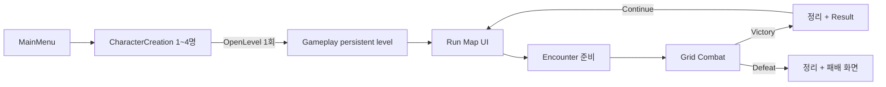

# ProjectA 기획과 구현 현황

게임의 목표와 이후 기능 판단 기준은 [게임 기획 방향](GAME_DESIGN.md)을 따른다. 이 문서는 현재 Vertical Slice의 구현 규약과 검증 경계를 기록하며, 목표 기능이나 후속 제안을 구현 완료로 취급하지 않는다.

기준일: 2026-09-08. 기존 미커밋 메뉴·4슬롯 프리뷰 작업을 보존하며 첫 Vertical Slice를 연결한다. 코드·빌드·에셋·PIE의 실제 결과는 [작업 보고](VERTICAL_SLICE_REPORT.md)에 별도로 기록한다.

## 1. 확정한 게임 흐름

월드 진행은 CommonUI 노드 화면으로 구현한다. `WorldMap` 물리 탐험과 전투별 CombatMap 전환 계획은 폐기한다. 두 개의 순차 Combat 노드가 `DefaultEncounter` 정의를 재사용하며 두 번째 Victory 이후 Run Map에 완료 상태를 표시한다. 패배 후에는 입력과 턴이 잠긴 결과 화면을 유지한다.

## 2. 책임과 수명

| 구성 | 역할 / 수명 |
|---|---|
| `URunStateSubsystem` | GameInstance 수명. PartyMembers, CurrentNodeId, CompletedNodes, CurrentEncounterId, Phase, LastResult, HP만 보존. Actor 참조 없이 전투 밖 체크포인트를 SaveGame에 저장 |
| `AGameplayGameModeBase` | 레벨 BeginPlay 다음 틱에 Arena를 찾아 EncounterManager와 CombatManager 생성, Controller 연결 |
| `AGameplayPlayerController` | PartyPlayerController 상속. Root UI와 전투 조작 허용 상태 관리, 노드/Continue 요청 전달 |
| `UGameplayRootWidget` | CommonUI Run / Combat / Modal 스택 관리 |
| `URunMapWidget` | 노드 정의 표시, 선택 요청. Spawn 수행 안 함 |
| `AEncounterManager` | 준비/스폰/전투 연결/HP 추출/정리. RunState의 유효 전이를 요청 |
| `ACombatArena` | Grid origin·슬롯별 좌표·카메라·타일 활성화. 향후 다른 Arena 구현으로 교체 가능 |
| `ACombatManager` / `UTurnManager` | 기존 이동·타겟·턴 로직 재사용, 결과 이벤트 및 정지/등록 해제 추가 |
| `UCombatHUDWidget` | CommonActivatableWidget, 기존 Move/Skill/End Turn 명령 연결 |
| `UEncounterResultWidget` | Victory Continue / Defeat. 향후 보상 선택을 넣을 위치 |

Streaming, Level Instance, 전투 중 상태 저장, 인벤토리와 장비, 여러 Act, 즉시 전체 Replication 리팩터링은 현재 Vertical Slice 범위 밖이다. GameInstance에 전투/UI를 몰아넣지 않는다.

D01 / T14: ProjectA는 최종적으로 Async PvP와 실시간 Co-op을 지원한다. 첫 Vertical Slice와 기본 Run은 싱글플레이를 유지하며, 네트워크 기획 확정과 구현 완료를 구분한다. 상세 범위·미결정 항목·완료 조건은 [T14 작업 카드](TODO.md)를 기준으로 한다.

Async PvP는 서버에 저장된 상대 Party/Build Snapshot으로 Encounter를 구성하고 기존 PvE Unit/Combat 흐름을 재사용한다. Snapshot은 파티 구성·Class·Stats·Skills·Equipment·Formation·데이터 버전을 표현해야 한다. 초기 로컬 Snapshot 전투와 경쟁 콘텐츠의 서버 결과 검증은 별도 단계다.

상대 Snapshot은 AI가 조작하며 아군은 직접 Grid 전투를 조작한다. 향후 플레이어가 설정한 Tactics를 Snapshot에 포함할 수 있는 구조를 고려하되 전술 편집 기능은 후속 기획으로 둔다.

Co-op은 Listen Server의 Host-authoritative 구조를 우선한다. 각 플레이어는 할당된 Party Member만 조작하고 Client의 Action Request는 서버가 검증·실행한다. CombatManager·TurnManager·Grid Occupancy·Unit State·HP/AP·사망·Combat Result의 최종 권위는 서버에 있다. Steam/EOS 등의 P2P transport와 접속 인원 등은 아직 결정하지 않았다.

새 Run/Party/Encounter/Combat 기능은 직렬화 가능한 Runtime Data와 Command를 우선하고 Actor reference 및 로컬 PlayerController에 강하게 결합하지 않는다. 미결정 정책이 구현에 영향을 주면 사용자에게 선택지와 영향을 설명해 결정한다. 현재는 싱글플레이 루프·콘텐츠 개발을 계속하며 전체 Replication 리팩터링을 즉시 시작하지 않는다.

## 3. 파티 규칙

- CharacterCreation은 기존 네 슬롯을 사용하며 1명 이상 생성하면 시작한다. 반드시 4명 규칙은 없다.
- 각 슬롯은 `SlotIndex`, `CharacterName`, `ClassId`, `bCreated`, `CurrentHP`를 전달한다. 빈 슬롯은 스폰하지 않고 슬롯 번호에 해당하는 PlayerCoords를 사용한다.
- 생성 UI에서 Edit로 슬롯 이름·직업을 편집한다. 수정하지 않은 슬롯은 직업 표시명과 슬롯 번호로 기본 이름을 갖는다. `SetSlotCharacterName`으로 개별 이름을 지정할 수 있다.
- `StableHand`, `Scholar`, `Herbalist`, `Hunter` → `UPartyDefinitionDataAsset::Professions`에서 직업 설정을 찾는다. CombatClass 미지정 시 기존 PlayerUnitClasses와 명시적인 FallbackPlayerUnitClass를 사용한다.
- 네 직업 콘텐츠가 아직 없으므로 첫 데이터 에셋은 기존 `BP_PlayerUnit`을 공통 임시 클래스로 사용한다. 직업별 스킬/스탯 완성으로 취급하지 않는다.
- 첫 스폰은 직업 정의 HP(기본은 클래스 HP), 이후 스폰은 이전 결과 HP를 복원한다. HP 0인 파티 멤버는 다음 전투에서 스폰하지 않는다. 부활/회복 보상은 미구현이다.

## 4. Encounter와 전투 규약

Gameplay의 입력 모드는 활성 CommonUI 화면이 소유한다. CombatHUD는 `All / CaptureDuringMouseDown`으로 버튼과 타일 클릭을 함께 허용하고 커서를 유지한다. RunMap과 Result는 `Menu / NoCapture`로 월드 입력을 차단한다. GameplayController는 별도로 `SetInputMode`를 호출하지 않으며, MainMenu의 기존 UIOnly 설정에서 travel 후 남는 viewport `IgnoreInput`을 해제하고 해당 로컬 플레이어의 최초 뷰포트 포커스를 복원한다.

`CanStartNode → BeginEncounter → PrepareArena → SpawnParty/Enemies → MarkCombatStarted → StartCombat` 순서다. 누락 클래스/잘못된 좌표/중복 점유/빈 편성은 부분 스폰을 정리하고 Run Map 오류 메시지로 돌아간다.

`OnUnitDied → EvaluateCombatResult → StopCombat`에서 결과를 1회 확정한다. 먼저 모든 유닛의 활성 턴을 끄고 행동을 취소하며 추가 입력을 막는다. 사망 콜백이 반환된 다음 틱에 HP를 저장하고 TurnOrder·CombatUnits·ASC/AI 이동·타이머·컨트롤러·스킬 액터·Unit·타일 점유를 정리한다. Result Continue는 정리가 끝난 상태에서 다음 노드를 연다.

전체 팀이 전멸하지 않은 상태에서 현재 턴 유닛이 죽으면 다음 틱에 다음 생존 유닛으로 진행한다. 같은 사망으로 중복 전이하지 않는다.

R01/R02는 `EUnitActionResult`와 공통 행동 완료 경로로 수정한다. GAS 종료 델리게이트는 활성화 전에 연결하여 동기 완료도 받는다. 제자리 스킬은 복귀를 요구하지 않는다. 실패/취소는 원래 타일과 위치로 복구하며 AI는 다음 틱에 안전한 턴 종료로 전이한다. 이미 소비한 AP는 환불하지 않는다.

## 5. 기존 기반과 남은 P2

기존 4×4 grid, 타일 선택/이동·타겟 표시, GAS 피해/몽타주/스킬 액터, 적 스킬 판단, AP·보조 AP 규칙을 재사용한다. `TestMap`은 원본을 보존하고 그 geometry/NavMesh/Grid를 복제한 `Gameplay`를 기준 레벨로 사용한다.

| 항목 | 현재 경계 |
|---|---|
| R03 / T03 AP 비용 | DataAsset 비용으로 표시·판정·차감 통합 완료. 비용 1 이상, 컨텍스트 검증/GAS 커밋 후 차감. 2026-09-10 빌드 및 자동화 11건 통과 |
| R04 / T04 타겟 | 공통 진영·생존·전열 보호 검사와 실행 직전 재검증 완료. 양 진영·6개 규칙 및 AI/실행/저장 맵 PIE를 포함한 전체 자동화 14건 통과 |
| R05 / T05 입력 | PlayerController로 타일 명령 집중, 요청 유닛을 확인하는 AI 내부 종료 분리, 턴 전환/종료 시 선택 정리 완료. 정식 빌드 및 입력·AI·저장 맵 PIE 포함 전체 자동화 16건 통과 |
| R06 / T06 범위 | Single/AroundTarget/AroundSelf 공통 계산, 기존 시전자 제외 유지. 미지원 타입/음수 반경은 에셋 검증·실행 전 거절. 전체 자동화 18건 통과 |
| T07 발사체 완료 | GAS가 몽타주+impact 완료를 기다림. 미충돌 시간 제한·취소/사망 정리 및 플레이어 AP·보조 AP 모두 소진 시 자동 종료 완료. 빌드 및 전체 자동화 20건 통과 |
| T09 직업/편집 | 공통 직업 정의로 UI/스폰 연결, 이름·직업 편집과 읽기 전용 ClassInfo 구현. 기존 클래스 밸런스 유지, 직업별 신규 콘텐츠는 별도 |
| T11 메뉴 기능 | 버전 1 체크포인트 자동 저장/이어하기, 품질·수직 동기화 옵션, 실제 Quit 연결. 빌드·자동화 23건 및 패키지 저장/Continue/Quit 검증 완료 |
| T12 메뉴 에셋 | Designer 기준 유지, 표시 전용 프리뷰·재진입 정리, 누락 상태 안내 바인딩 보완. 빌드·전체 24건 및 최종 PIE·생성본 검증 완료 |
| T13 콘텐츠 | 전투 한정 회복약·HUD, SkillPool 휩쓸기 획득/GAS 장착, 적 전진 후보와 AP당 대상 점수 구현. 빌드·자동화 26건 및 저장 맵 PIE 통과 |
| T14 네트워크 | Async PvP Snapshot + Listen Server Co-op 기획 확정 / 구현 후속. 현재 싱글플레이 유지, Snapshot 전투·다중 PIE 미검증 |

## 6. 검증과 다음 단계

검증 ID는 VERTICAL-01~10을 사용한다. 빌드 성공만으로 PIE 통과로 표시하지 않으며, 강제 GAS 피해를 이용한 종료 검증과 실제 스킬/이동/AI 검증도 구분한다. [설정 안내](VERTICAL_SLICE_SETUP.md), [리뷰](CODE_REVIEW.md), [작업 보드](TODO.md), [최종 보고](VERTICAL_SLICE_REPORT.md)를 함께 확인한다.

다음 콘텐츠 작업은 공통 `BP_PlayerUnit` fallback을 실제 네 직업 정의로 교체하는 것이다.
