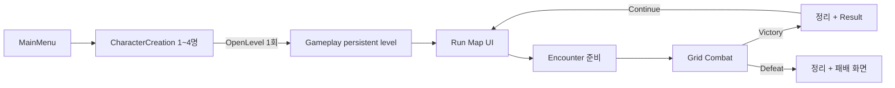

# ProjectA 기획과 구현 현황

게임의 목표와 이후 기능 판단 기준은 [게임 기획 방향](GAME_DESIGN.md)을 따른다. 이 문서는 현재 Vertical Slice의 구현 규약과 검증 경계를 기록하며, 목표 기능이나 후속 제안을 구현 완료로 취급하지 않는다.

기준일: 2026-09-10. 기본 싱글플레이 Vertical Slice를 유지하며 T14 순차 1~5번의 소유권·2인 동기화·확정 턴 복구·아군 AI를 검증했다. 추가 승인으로 7번의 독립적인 3·4인 전투·끊김·기존 Host 새 세션 복구와 일반 4명 입장 정원을 검증했다. 최종 Editor 빌드·전체 회귀 65건·별도 2·3·4인 AI 복구 3건을 통과했다. 6번 명시적 Host 승계·불참 AI와 이에 의존하는 7번 통합은 정책 답변 대기이고, 8번 실제 온라인 서비스는 공급자·랭크 정책 확정 후 연결한다. 기존 slice 결과는 [작업 보고](VERTICAL_SLICE_REPORT.md), T14 번호별 결과는 [순차 대기열](T14_QUEUE.md)에 별도로 기록한다.

## 1. 확정한 게임 흐름

아래는 기본 싱글플레이 흐름이다. 네트워크 전투는 결과 화면에서 최종 유닛 상태를 유지하고 명시적인 Continue 또는 월드 종료에서 정리한다.

월드 진행은 CommonUI 노드 화면으로 구현한다. `WorldMap` 물리 탐험과 전투별 CombatMap 전환 계획은 폐기한다. 두 개의 순차 Combat 노드가 `DefaultEncounter` 정의를 재사용하며 두 번째 Victory 이후 Run Map에 완료 상태를 표시한다. 패배 후에는 입력과 턴이 잠긴 결과 화면을 유지한다.

## 2. 책임과 수명

| 구성 | 역할 / 수명 |
|---|---|
| `URunStateSubsystem` | GameInstance 수명. 파티·노드·결과·HP와 Run/참가자/캐릭터 소유권/Host/동의 보존. Actor 참조 없이 전투 밖 진행과 확정 턴 체크포인트를 SaveGame에 저장 |
| `AGameplayGameModeBase` | 서버에서 Arena·EncounterManager·CombatManager 준비, 신뢰된 C++ 참가자 배정과 전투 바인딩 |
| `AGameplayGameState` | Run 단계·파티·노드·결과의 읽기 전용 표시 뷰와 전투/아레나 참조 복제. 클라이언트 RunState를 권위 상태로 사용하지 않음 |
| `AGameplayPlayerController` | PartyPlayerController 상속. Root UI와 서버 전투 문맥 수신, 소유 연결의 전투 RPC. 노드/Continue UI 명령은 현재 Standalone만 허용 |
| `UGameplayRootWidget` | CommonUI Run / Combat / Modal 스택 관리 |
| `URunMapWidget` | 노드 정의 표시, 선택 요청. Spawn 수행 안 함 |
| `AEncounterManager` | 준비/스폰/전투 연결/HP 추출/정리. RunState의 유효 전이를 요청 |
| `ACombatArena` | Grid origin·슬롯별 좌표·카메라·타일 활성화. 향후 다른 Arena 구현으로 교체 가능 |
| `ACombatManager` / `UTurnManager` | 서버만 턴·승패 확정. CombatManager가 전투 ID·턴·결과·유닛 식별/원래 소유권의 복제 뷰 전달 |
| `UCombatActionAuthority` | CombatManager 소유 서버 객체. 인간 연결과 별도 AI 실행 세션을 검증하고 공통 턴·장착·자원·대상 검사로 유닛 행동 실행. AI 모드에는 인간 명령 거절 |
| `UPartyAutoCombatComponent` | PlayerUnit의 서버 전용 판단·행동 대기. 매 프레임 Tick 없이 턴 시작과 완료 통지에서 회복약·스킬·이동·턴 종료 Command를 선택 |
| `UCombatHUDWidget` | CommonActivatableWidget, 기존 Move/Skill/End Turn 명령 연결 |
| `UEncounterResultWidget` | Victory Continue / Defeat. 향후 보상 선택을 넣을 위치 |

Streaming, Level Instance, 인벤토리와 장비, 여러 Act, 즉시 전체 Replication 리팩터링은 현재 Vertical Slice 범위 밖이다. T14 순차 4번은 다음 턴 시작 전 경계를 v3 값 데이터로 저장하고 새 Actor로 복구한다. GameInstance에 전투/UI를 몰아넣지 않는다.

D01 / T14: ProjectA는 최종적으로 Async PvP와 실시간 Co-op을 지원한다. 첫 Vertical Slice와 기본 Run은 싱글플레이를 유지하며, 네트워크 기획 확정과 구현 완료를 구분한다. 상세 범위·미결정 항목·완료 조건은 [T14 작업 카드](TODO.md)를 기준으로 한다.

Async PvP는 서버에 저장된 상대 Party/Build Snapshot으로 Encounter를 구성하고 기존 PvE Unit/Combat 흐름을 재사용한다. Snapshot은 파티 구성·Class·Stats·Skills·Equipment·Formation·데이터 버전을 표현해야 한다. 초기 로컬 Snapshot 전투와 경쟁 콘텐츠의 서버 결과 검증은 별도 단계다.

T14의 첫 구현은 사용자 선택 1A+2B에 따라 로컬 Snapshot 전투와 Unreal `USaveGame` v1을 사용한다. 파티 값은 Actor 참조 없는 USTRUCT로 저장하고, 고정 ID를 DataAsset 카탈로그로 해석해 기존 적 AI/Combat을 실행한다. 저장 구조 버전은 1만 허용하고 콘텐츠 버전은 카탈로그와 일치해야 한다. 로컬 전투 한 사이클 검증 이후 Listen Server Co-op 동기화를 진행한다. 실행 방법과 현재 계약은 [T14 Snapshot 안내](T14_SNAPSHOT.md)를 따른다.

상대 Snapshot은 AI가 조작하며 아군은 직접 Grid 전투를 조작한다. 향후 플레이어가 설정한 Tactics를 Snapshot에 포함할 수 있는 구조를 고려하되 전술 편집 기능은 후속 기획으로 둔다.

Co-op은 Listen Server의 Host-authoritative 구조를 우선한다. 최대 4인으로 설계하고 첫 동기화는 2인으로 검증한다. 원래 캐릭터 소유자만 직접 조작하고 다른 사람이 같은 Run에 대체 참가하지 못한다. Host가 바뀌어도 타인 캐릭터의 인간 조작권은 얻지 않는다. Client의 Action Request는 서버가 검증·실행하며 CombatManager·TurnManager·Grid Occupancy·Unit State·HP/AP·사망·Combat Result의 최종 권위는 서버에 있다.

순차 2번에서 이동·스킬·회복약·턴 종료를 값 Command와 PlayerController의 소유 연결 RPC 진입점으로 통합했다. 순차 3번은 실제 두 PIE 월드 사이의 RPC와 소유권 검증, Turn·HP/AP/SubAP·이동·Grid 점유/전열 보호·사망·결과·장착/HUD 복제를 구현하고 실제 2인 PIE에서 검증했다. 서버만 유닛 행동과 GAS 능력을 실행하며 HP/MaxHP는 Attribute RepNotify로 전달한다. GameState의 Run 표시 뷰와 CombatManager의 실행 중 복제 뷰를 영속 Run/Command 데이터와 분리한다.

`AssignRunParticipant`와 `ApplyCombatParticipantBindings`는 신뢰된 서버 C++ 연결 배정이며 실제 로그인은 아니다. 네트워크 자동화는 알려진 두 연결에 원래 참가자 계정을 명시적으로 배정하고, 기존 자동 연결은 Standalone의 개발용 단일 참가자를 유지한다. 전투 밖 노드 선택·Continue의 협동 결정권은 사용자 답변 대기 중이다. 결정 전 네트워크 화면의 해당 버튼은 읽기 전용이며 테스트는 서버 진입점으로 진행한다. [Listen Server 안내](T14_NETWORK.md)와 [확정 턴 저장·복구](T14_CHECKPOINT.md)에 구현 경계를 기록한다. 4번은 Editor 빌드·전체 52건·독립 프로세스 저장/복원·원본 상대 교체/삭제 후 복구·별도 Snapshot PIE를 통과했다. 번호별 결과는 [대기열](T14_QUEUE.md)을 따른다.

5번은 `APlayerUnit`에 Human/ServerAI 조작 모드와 `UPartyAutoCombatComponent`를 연결했다. 신뢰된 서버 C++는 전투 시작 전에 원래 소유자의 Run 시작 시 동의(`Granted`, 정책 버전 1)를 확인해 모드를 설정한다. AI는 별도 실행 세션·요청 순번으로 공통 행동 검증을 이용하며 인간 입력과 중복 실행되지 않는다. Run 저장 v3의 전투 본문 schema 2에 모드를 저장하고 schema 1은 Human으로 호환한다. 복원 시 AI 실행 세션은 새로 만들며 소유권·Host·팀을 바꾸지 않는다. 최종 Editor Build5·전체 회귀 56건(성공 36·경고 동반 성공 20·실패 0), 실제 AI `Coop2` 1건과 독립 프로세스 AI `RestartWrite`·`RestartRead` 각 1건, 별도 Snapshot PIE 회귀 1건을 통과했다. 초기 테스트 생존 전제 보정과 상세 결과는 [대기열](T14_QUEUE.md)을 따른다. 원래 참가자 전원의 연결 조건은 유지하며, 재개 시 전환·불참 연결 예외·승계/AI 이어하기 UI는 다음 6번에 남긴다.

정상 종료·갑작스러운 끊김만으로 Host를 자동 변경하지 않는다. 4번은 연결 끊김 시 전투를 중단하고 기존 Host와 원래 참가자가 새 세션에서 마지막 확정 턴을 복구하도록 한다. 원래 파티가 다시 모일 수 없을 때 명시적인 Host 승계·AI 이어하기 버튼을 제공하는 것은 후속 6번이다. AI 전환에는 각자의 Run 시작 시 사전 동의를 사용하며, 이후 MMR은 현재 인간 참가자에게만 반영하고 불참자에게 추가 변동을 주지 않는다. 실제 MMR 정책·연동은 후속 범위다.

MMR 랭크를 목표로 하므로 원래 참가자·캐릭터 소유자·현재 Host를 구분하고, 동일 Run의 동시 승계·진행 분기·결과 중복 반영을 방지해야 한다. Unreal 기본 네트워크 기능을 사용하되 경쟁 콘텐츠의 계정 인증·권위 저장·MMR 검증은 별도 단계다. Steam/EOS, Backend와 불리한 전투에서의 고의 이탈 방지 정책은 아직 결정하지 않았다. 상세 합의와 순서는 [Co-op 확정 기획](T14_COOP_DESIGN.md)을 따른다.

새 Run/Party/Encounter/Combat 기능은 직렬화 가능한 Runtime Data와 Command를 우선하고 Actor reference 및 로컬 PlayerController에 강하게 결합하지 않는다. 실행 중 복제 뷰의 유닛 조회에만 Actor 참조를 사용한다. 미결정 정책이 구현에 영향을 주면 사용자에게 선택지와 영향을 설명해 결정한다. 기본 Run은 싱글플레이를 유지한다. 6번 정책 대기와 독립적인 7번 3·4인 검증은 추가 승인으로 먼저 마쳤으며, 승계/불참 AI 통합과 8번 서비스 연동 전 T14 전체를 완료로 표시하지 않는다.

## 3. 파티 규칙

- CharacterCreation은 기존 네 슬롯을 사용하며 1명 이상 생성하면 시작한다. 반드시 4명 규칙은 없다.
- 각 슬롯은 `SlotIndex`, `CharacterName`, `ClassId`, `bCreated`, `CurrentHP`를 전달한다. 빈 슬롯은 스폰하지 않고 슬롯 번호에 해당하는 PlayerCoords를 사용한다.
- 생성 UI에서 Edit로 슬롯 이름·직업을 편집한다. 수정하지 않은 슬롯은 직업 표시명과 슬롯 번호로 기본 이름을 갖는다. `SetSlotCharacterName`으로 개별 이름을 지정할 수 있다.
- `StableHand`, `Scholar`, `Herbalist`, `Hunter` → `UPartyDefinitionDataAsset::Professions`에서 직업 설정을 찾는다. CombatClass 미지정 시 기존 PlayerUnitClasses와 명시적인 FallbackPlayerUnitClass를 사용한다.
- 네 직업 콘텐츠가 아직 없으므로 첫 데이터 에셋은 기존 `BP_PlayerUnit`을 공통 임시 클래스로 사용한다. 직업별 스킬/스탯 완성으로 취급하지 않는다.
- 첫 스폰은 직업 정의 HP(기본은 클래스 HP), 이후 스폰은 이전 결과 HP를 복원한다. HP 0인 파티 멤버는 다음 전투에서 스폰하지 않는다. 부활/회복 보상은 미구현이다.

## 4. Encounter와 전투 규약

Gameplay의 입력 모드는 활성 CommonUI 화면이 소유한다. CombatHUD는 `All / CaptureDuringMouseDown`으로 버튼과 타일 클릭을 함께 허용하고 커서를 유지한다. RunMap과 Result는 `Menu / NoCapture`로 월드 입력을 차단한다. GameplayController는 별도로 `SetInputMode`를 호출하지 않으며, MainMenu의 기존 UIOnly 설정에서 travel 후 남는 viewport `IgnoreInput`을 해제하고 해당 로컬 플레이어의 최초 뷰포트 포커스를 복원한다.

`CanStartNode → BeginEncounter → PrepareArena → SpawnParty/Enemies → MarkCombatStarted → StartCombat` 순서다. 누락 클래스/잘못된 좌표/중복 점유/빈 편성은 부분 스폰을 정리하고 Run Map 오류 메시지로 돌아간다.

`OnUnitDied → EvaluateCombatResult → StopCombat`에서 결과를 1회 확정한다. 먼저 모든 유닛의 활성 턴을 끄고 행동을 취소하며 추가 입력을 막는다. 사망 콜백이 반환된 다음 틱에 HP를 저장한다. Standalone은 TurnOrder·CombatUnits·ASC/AI 이동·타이머·컨트롤러·스킬 액터·Unit·타일 점유를 정리한 뒤 결과를 표시한다. 네트워크는 최종 HP·사망·점유 해제가 복제되도록 결과 화면에서 유닛을 유지하고 명시적인 Continue에서 정리한 뒤 다음 노드를 연다.

전체 팀이 전멸하지 않은 상태에서 현재 턴 유닛이 죽으면 다음 틱에 다음 생존 유닛으로 진행한다. 같은 사망으로 중복 전이하지 않는다.

R01/R02는 `EUnitActionResult`와 공통 행동 완료 경로로 수정한다. GAS 종료 델리게이트는 활성화 전에 연결하여 동기 완료도 받는다. 제자리 스킬은 복귀를 요구하지 않는다. 실패/취소는 원래 타일과 위치로 복구하며 AI는 다음 틱에 안전한 턴 종료로 전이한다. 이미 소비한 AP는 환불하지 않는다.

## 5. 기존 기반과 남은 P2

기존 4×4 grid, 타일 선택/이동·타겟 표시, GAS 피해/몽타주/스킬 액터, 적 스킬 판단, AP·보조 AP 규칙을 재사용한다. `TestMap`은 원본을 보존하고 그 geometry/NavMesh/Grid를 복제한 `Gameplay`를 기준 레벨로 사용한다.

| 항목 | 현재 경계 |
|---|---|
| R03 / T03 AP 비용 | DataAsset 비용으로 표시·판정·차감 통합 완료. 비용 1 이상, 컨텍스트 검증/GAS 커밋 후 차감. 2026-09-10 빌드 및 자동화 11건 통과 |
| R04 / T04 타겟 | 공통 진영·생존·전열 보호 검사와 실행 직전 재검증 완료. 양 진영·6개 규칙 및 AI/실행/저장 맵 PIE를 포함한 전체 자동화 14건 통과 |
| R05 / T05 입력 | PlayerController로 타일 명령 집중, 요청 유닛을 확인하는 AI 내부 종료 분리, 턴 전환/종료 시 선택 정리 완료. 정식 빌드 및 입력·AI·저장 맵 PIE 포함 전체 자동화 16건 통과 |
| R06 / T06 범위 | Single/AroundTarget/AroundSelf 공통 계산, 기존 시전자 제외 유지. 미지원 타입/음수 반경은 에셋 검증·실행 전 거절. 전체 자동화 18건 통과 |
| T07 발사체 완료 | GAS가 몽타주+impact 완료를 기다림. 미충돌 시간 제한·취소/사망 정리 및 플레이어 AP·보조 AP 모두 소진 시 자동 종료 완료. 빌드 및 전체 자동화 20건 통과 |
| T09 직업/편집 | 공통 직업 정의로 UI/스폰 연결, 이름·직업 편집과 읽기 전용 ClassInfo 구현. 기존 클래스 밸런스 유지, 직업별 신규 콘텐츠는 별도 |
| T11 메뉴 기능 | 체크포인트 자동 저장/이어하기, 품질·수직 동기화 옵션, 실제 Quit 연결. T11 당시 v1 빌드·자동화 23건 및 패키지 저장/Continue/Quit 검증 완료. T14에서 새 Run은 v2 소유권 메타데이터, 기존 v1은 LegacyOffline 호환 |
| T12 메뉴 에셋 | Designer 기준 유지, 표시 전용 프리뷰·재진입 정리, 누락 상태 안내 바인딩 보완. 빌드·전체 24건 및 최종 PIE·생성본 검증 완료 |
| T13 콘텐츠 | 전투 한정 회복약·HUD, SkillPool 휩쓸기 획득/GAS 장착, 적 전진 후보와 AP당 대상 점수 구현. 빌드·자동화 26건 및 저장 맵 PIE 통과 |
| T14 네트워크 | 로컬 Snapshot과 순차 1~5번, 7번 독립 3·4인 전투/기존 Host 복구 검증. 최종 전체 65건·별도 2·3·4인 AI 복구 3건 통과. 신뢰된 C++ 배정과 원래 참가자 전원 연결 유지. 6번 승계/불참 AI·7번 승계 통합·8번 실제 서비스 미완료 |

## 6. 검증과 다음 단계

검증 ID는 VERTICAL-01~10을 사용한다. 빌드 성공만으로 PIE 통과로 표시하지 않으며, 강제 GAS 피해를 이용한 종료 검증과 실제 스킬/이동/AI 검증도 구분한다. [설정 안내](VERTICAL_SLICE_SETUP.md), [리뷰](CODE_REVIEW.md), [작업 보드](TODO.md), [최종 보고](VERTICAL_SLICE_REPORT.md)를 함께 확인한다.

다음 콘텐츠 작업은 공통 `BP_PlayerUnit` fallback을 실제 네 직업 정의로 교체하는 것이다.
