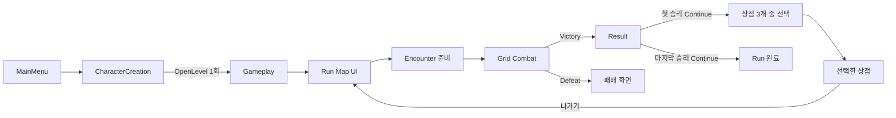

# ProjectA 구현 구조와 설정

기준일: 2026-09-14. 현재 모듈 책임·실행 절차·콘텐츠 설정을 정의한다.

기본 Combat는 [GAME_DESIGN 8절](GAME_DESIGN.md#8-라운드-계획과-시간차-자동-전투)의 행동 계획·시간차 실행으로 교체했다. 기존 순차 턴·AI 연속 행동·End Turn 실행은 제거했다. 순차 모드 보존용 진입점은 없으며 이전 Blueprint 참조용 클래스·프로퍼티만 남긴다. 기존 Run·상점·직업·원래 소유권과 비전투 저장은 유지한다. 새 실행·UI·네트워크의 작동 검증은 미실행이다.

T14의 이전 턴 복구·승계 성공은 과거 코드 이력이다. 현재는 이전 Combat 저장과 새 전투 중간 복구를 지원하지 않는다. Steam/PlayFab·MMR은 미구현이며 [TEST_REPORT](TEST_REPORT.md)의 최신 확인 범위를 따른다.

| 영역 | 기준 문서 |
|---|---|
| 게임 목표와 콘텐츠 방향 | [GAME_DESIGN](GAME_DESIGN.md) |
| 남은 작업과 완료 조건 | [TODO](TODO.md) |
| Snapshot·Co-op·저장/재개·온라인 계약 | [MULTIPLAYER](MULTIPLAYER.md) |
| 실제 검증 결과와 사용자 확인 항목 | [TEST_REPORT](TEST_REPORT.md) |
| 변경 과정과 과거 판단 | [HISTORY](HISTORY.md) |

## 기본 실행 흐름

실행 환경은 UE 5.7의 `ProjectA.uproject`다.

1. 기본 시작 맵인 `/Game/User_JeHoon/LEVEL/MainMenu`를 연다.
2. Play → New Game → CharacterCreation에서 1~4명의 캐릭터를 생성한다. 직업 화살표와 Edit로 직업·이름을 바꾼다.
3. Start Game → `/Game/User_JeHoon/LEVEL/Gameplay` → Run Map에서 첫 Combat 노드를 선택한다.
4. 계획 화면에서 조작할 아군·스킬·대상 유닛/공격 타일·접근 목적지를 선택하고 계획 적용한다. 각 소유 아군의 계획을 지정한 뒤 준비 완료한다.
5. 속도차 대기·이동·시전·피격·복귀를 관찰한다. 남은 유효 투사체까지 정리되면 다음 라운드 계획으로 돌아간다. 해결 중 새 행동을 입력할 수 없다.
6. 첫 Victory → Continue → 상점1·상점2·상점3 중 하나 선택 → 나가기 → 두 번째 Combat 노드를 진행한다. 두 번째 Victory 뒤 Continue는 완료된 Run Map을 표시한다.
7. 잔여 공격까지 정리된 단독 패배는 Defeat 화면을 유지한다. 양 팀 전멸은 정책 미확정으로 세션을 중단하며 결과 화면을 확정하지 않는다.

빌드 후 UE를 재시작하여 C++·리플렉션 변경을 반영한다. 이번 전환에는 새 맵·WBP 생성이나 Config 변경이 필요하지 않다.

Gameplay는 계속 유지하는 단일 레벨이며 두 Combat 노드는 `DefaultEncounter`를 재사용한다. 월드 진행은 CommonUI 노드 화면으로 표현한다. 물리적인 WorldMap 탐험과 전투별 CombatMap 전환은 현재 흐름에 없다.

## 모듈과 책임

런타임은 `Source/ProjectA`, 에셋 생성·에디터 도구·PIE 테스트는 `Source/ProjectAEditor`에 둔다. Editor 의존성을 런타임 모듈로 옮기지 않는다.

| 구성 | 책임과 수명 |
|---|---|
| `URunStateSubsystem` | GameInstance 수명. 파티·노드·결과 HP·Run/참가자/캐릭터 소유권 보존, 저장 검증과 관리 Run lease 소유. 영속 데이터에 Actor 참조를 넣지 않음 |
| `AGameplayGameModeBase` | 서버 월드의 Arena·EncounterManager·CombatManager 준비와 신뢰된 C++ 참가자 배정. 종료 시 전투를 멈춘 뒤 관리 lease 해제 |
| `AGameplayGameState` | 단계·파티·노드·결과와 전투/아레나 참조를 읽기 전용 뷰로 복제. Client RunState는 서버 권위의 대체물이 아님 |
| `AGameplayPlayerController` | `APartyPlayerController` 상속. 로컬 Root UI, 소유 연결의 전투 RPC, 현재 Host의 노드 선택·Continue 요청 |
| `UGameplayRootWidget` | 해당 플레이어 화면의 CommonUI Run/Combat/Modal 스택과 저장 실패·재시도 안내 |
| `URunMapWidget` | 노드와 진행 상태 표시, 선택 요청. 직접 Spawn하지 않음 |
| `URunEncounterWidget` | 상점 3개 선택·선택한 상점 이름·나가기 표시. 기존 RunLayer의 native CommonUI 화면 |
| `AEncounterManager` | Encounter 준비·스폰·라운드 전투 연결·종료 HP 추출·정리와 Run 전이. 순차 턴 저장/복원 훅 제거 |
| `ACombatArena` | 배치된 Grid, 슬롯별 좌표, 카메라, 타일 활성화 관리 |
| `ACombatManager` / `ACombatRoundCoordinator` | Run 전투 연결, 라운드 계획·시간표·실행·잔여 공격 정리·결과 확정. `UTurnManager`는 참조 호환용 외형만 유지 |
| `UCombatActionAuthority` | 기존 Run 식별·원래 소유권·서버 연결·관리 lease·Human/AI 검증 유지. 이전 즉시 순차 행동 실행은 제거 |
| `AUnitBase` / GAS / Grid | 서버 HP/AP·사망·실제 위치/복귀 칸·복제 표현. 라운드가 이동/피격을 소유하며 기존 ASC 데이터와 사망 표현 연결 |
| 적·아군 AI | Coordinator가 인간 초안 전에 한 명령씩 고정. 이전 EnemyUnit 연속 판단·PartyAutoCombat 실행 제거, 컴포넌트 참조용 외형 유지 |
| `ACombatRoundPlayerController` / `UCombatRoundPlanningWidget` | 소유 연결의 계획·준비 RPC와 CommonUI 계획 화면. `UCombatHUDWidget`은 이전 WBP 참조용 외형 |
| `UEncounterResultWidget` | Victory Continue / Defeat. 이후 보상 선택을 연결할 위치 |

실행 중 복제 뷰와 Actor 조회는 허용하되 Run/Party/Encounter/Command는 직렬화 가능한 값 데이터가 기준이다. GameInstance에 전투 Actor나 UI 동작을 집중시키지 않는다.

## 파티와 전투 규약

### 상점 인카운터

새 Run은 첫 승리 결과의 Continue에서 `EncounterChoice`, 선택 시 `Shop`, 나가기 시 `Map`으로 전환한다. 전투 노드 수는 2개를 유지하며 상점 방문을 전투 완료 수에 더하지 않는다. 선택하지 않은 상점은 방문할 수 없고 상품·재화·회복 효과는 없다. 레벨 이동·별도 Arena 스폰 없이 UI로 처리한다.

| 데이터 | 역할 |
|---|---|
| `URunEncounterPoolDataAsset` | `FixedOffers`에 상점 3개 정의. 현재는 고정 목록이며 추첨하지 않음 |
| `FRunEncounterOffer` | `EncounterId`·`DisplayName`·`Type`의 USTRUCT 값 데이터 |
| `FRunEncounterProgress` | schema·제시 목록·선택 ID·퇴장 완료 여부. Run 저장과 GameState 표시 뷰에 포함 |
| `UPartyDefinitionDataAsset::RunEncounterPool` | 새 Run에서 사용할 풀. 미지정 시 native 기본값 상점1·상점2·상점3 사용 |

풀을 직접 편집하려면 `Content/User_JeHoon/Blueprint/DataAsset` 아래에 `RunEncounterPoolDataAsset` 유형의 DataAsset을 만들고 `DA_VerticalSliceParty.RunEncounterPool`에 연결한다. 서로 다른 ID와 이름을 가진 Shop 3개가 필요하다. 기본 동작에는 에셋 생성·WBP 재생성이 필요 없다. 정의는 새 Run 초기화 시 값으로 복사하며 진행 중 풀 수정으로 저장된 선택지가 바뀌지 않는다.

향후 확률 제시는 정의와 별도의 `FRunEncounterPoolEntry` USTRUCT에 정의 ID/참조·상대 가중치·출현 구간·조건을 두는 구성을 권장한다. 에디터 중심 편집은 DataAsset의 배열, 대량 수치·CSV 편집이 필요하면 `FTableRowBase` 기반 DataTable을 사용한다. 추첨은 Host에서 확정하고 제시 결과를 Run에 저장한다. 현재 가중치 필드·추첨·재추첨 정책은 미구현이다.

전이 저장 실패 시 선택·퇴장 상태를 되돌리고 같은 버튼으로 재시도한다. 기존 저장의 schema 0은 상점 없는 경로를 유지하며 새 Run의 schema 1과 구분한다. 상점 내부 재개·관리 lease·Host 진행 권한은 [MULTIPLAYER](MULTIPLAYER.md), 사용자 확인은 [TEST_REPORT 10절](TEST_REPORT.md#10-상점-인카운터)을 따른다.

### 파티

- CharacterCreation은 네 슬롯 중 하나 이상 생성하면 시작한다. 빈 슬롯은 스폰하지 않으며 원래 `SlotIndex`를 Arena의 PlayerCoords에 대응한다.
- 슬롯은 이름·`ClassId`·생성 여부·현재 HP를 전달한다. 식별된 Run은 `CharacterId`와 원래 `OwnerAccountId`도 보존한다.
- 직업은 `StableHand`, `Scholar`, `Herbalist`, `Hunter`다. `UPartyDefinitionDataAsset::Professions`에서 정의를 찾는다.
- `CombatClass`가 없으면 기존 `PlayerUnitClasses`와 명시적인 `FallbackPlayerUnitClass`를 사용한다. 현재 네 직업은 공통 `BP_PlayerUnit`을 사용하는 임시 콘텐츠다.
- 수정하지 않은 이름은 직업 표시명과 슬롯 번호를 사용한다. 개별 이름 변경은 `SetSlotCharacterName`으로 반영한다.
- 첫 스폰은 직업 정의 HP 또는 클래스 기본 HP, 이후 전투는 저장한 결과 HP를 사용한다. HP 0인 멤버는 다음 전투에 스폰하지 않는다.

### 행동과 결과

`CanStartNode → BeginEncounter → PrepareArena → SpawnParty/Enemies → ConfigureCombatParticipants → MarkCombatStarted → StartCombat`으로 시작한다. 누락 클래스·잘못된 초기 배치·등록 실패는 부분 스폰을 정리하고 오류를 표시한다.

`ACombatRoundCoordinator`가 계획·준비·잠금·해결을 관리한다. 양 팀 생존자의 `CombatSpeed`로 시작 지연을 고정하며 라운드마다 AP/SubAP를 초기화한다. 서버가 명령의 소유권·전투 ID·라운드·수정 번호·부여 스킬·자원·대상·최종 배치를 검증하고 잠금 시 비용을 한 번 차감한다.

해결은 0.01초 서버 진행 단위에서 접근·시전·실제 거리 타격·투사체 sphere sweep·복귀를 처리한다. 느린 프레임의 누적 시간을 보존하지만 서버 순서·실시간 충돌을 사용하므로 원자적 동시 판정이나 전체 결정성 보장을 주장하지 않는다. 피해는 즉시 HP·사망에 반영하며 시전자 사망 후 이미 발사한 투사체는 유지한다.

UnitBase의 기존 순차 이동/행동 수명·유닛 체크포인트 capture/restore, UnitAIController의 경로 완료 루프와 기존 이동 BFS를 제거했다. 기존 GA/SkillActor의 즉시 실행과 순차 `StartSkill`·TurnManager·AI 연속 판단·End Turn을 실행하지 않는다. 모든 예약 행동과 복귀·잔여 투사체가 종료된 뒤에만 결과를 Encounter로 전달한다. 양 팀 전멸은 `Suspended`이며 정식 결과 정책 대기다. 현재 지원 범위와 임시 정책은 [GAME_DESIGN 8절](GAME_DESIGN.md#8-라운드-계획과-시간차-자동-전투)을 기준으로 한다.

Standalone은 결과 저장 성공 후 유닛·전투 상태를 정리한다. 네트워크는 Result 표시 동안 최종 상태를 유지하고 Continue/월드 종료 시 정리한다. 결과/Continue 저장 실패는 기존 단계와 파일을 보존하며 재시도할 수 있다.

### 입력

활성 CommonUI 화면이 입력 모드를 소유한다. 새 Combat 계획 화면과 RunMap/Result는 `Menu / NoCapture`를 사용한다. 좌표는 화면의 선택 목록으로 지정하며 이전 타일 클릭/End Turn HUD는 사용하지 않는다.

MainMenu·Gameplay GameMode는 `InitializeHUDForPlayer`에서 HUDClass가 있을 때만 엔진 기본 AHUD 초기화를 호출한다. HUDClass=None인 CommonUI 화면은 빈 클래스 생성 요청을 생략한다.

GameplayCue 검색은 `DefaultGame.ini`에 `GameplayAbilitiesDeveloperSettings.GameplayCueNotifyPaths=/Game/User_JeHoon`을 지정했다. 다만 ff22940의 실제 실행에서는 설정 배열이 비어 있고 `/Game` fallback 경고가 재발해 적용 원인 조사와 수정이 필요하다. 현재 `/Game`의 GameplayCueNotify 에셋은 0개이며 외부 Cue 도입 시 의존 경로도 등록한다. 검증 근거는 [TEST_REPORT 8절](TEST_REPORT.md#8-hudgameplaycue-경고-수정)을 따른다.

GameplayController에서 별도 `SetInputMode`를 추가하지 않는다. MainMenu의 UIOnly 상태에서 travel한 뒤 남는 viewport `IgnoreInput`과 로컬 포커스는 native 진입 코드가 복구한다. 이 입력 수정에는 WBP 재생성이 필요 없다.

## 콘텐츠·UI 설정

### 개발용 협동 진입

Non-Shipping MainMenu의 **개발용 협동**은 새 방 전용이다. Host는 `OpenLevel(..., listen?ProjectADevCoop=2~4)`, Client는 정규화한 IPv4:포트로 `ClientTravel`을 사용한다. 기본 포트는 7777이며 별도 세션 검색·온라인 인증은 없다.

`UDevelopmentCoopSubsystem`은 GameInstance 단위 연결 대기·실패 메시지를 관리한다. `ADevelopmentCoopLobby`가 참가 번호·연결·준비 상태를 복제하고, GameMode의 PreLogin/PostLogin에서 정원·시작 여부와 서버 배정을 확인한다. 준비 RPC는 요청한 연결에만 적용하며 시작·노드·Continue는 Host만 허용한다.

Host 1번, 최초 원격 접속 순서대로 2~4번이다. 전원 준비 후 서버가 LocalDevelopment 식별자·Hunter 한 명씩의 파티를 생성하고 기존 Run/Combat 흐름으로 연결한다. 이탈 시 번호를 재사용하지 않고 방을 닫으며 전투 중에는 기존 중단 처리를 적용한다. 대체 참가·자동 승계·AI 전환은 없다.

체크포인트는 `ProjectA_DevCoop_<RunId>`로 분리한다. 메뉴 복귀 시 메모리와 저장 슬롯 선택을 초기화하고 디스크 기록은 보존한다. 일반 `ProjectA_Run`과 관리 저장은 덮어쓰지 않는다. 개발용 방에는 저장 선택·협동 재접속·Host 승계 UI를 제공하지 않는다.

| 항목 | 현재 규칙 |
|---|---|
| 직업 편집 | Edit에서 이름 1~32자·직업 편집. 저장 시 적용, 취소 시 기존 값 유지. ClassInfo는 HP/AP/SubAP·시작 스킬 표시 |
| 직업 데이터 | `bUseUnitClassDefaults=true`는 클래스 기본값, false는 정의의 MaxHP/ActionPoints/SubActionPoints/StartingSkills 사용. CombatClass 미지정 시 기존 매핑·fallback 사용. 잘못된 직업·수치·중복 스킬 에셋 ID는 거절 |
| 회복약 | 기존 데이터 프로퍼티만 보존. 즉시 회복 실행과 이전 HUD 버튼은 제거했으며 새 라운드 소비 행동은 미구현 |
| 추가 스킬 | EncounterSkillPool에서 직업 설정 후 가중 추첨 1개를 부여·장착. 보유 스킬 에셋 ID·잘못된 라운드 정의·가중치 0 이하는 제외. 장착 최대 5개. 전투 계획/해결 중 장착 변경 거절 |
| 현재 추가 스킬 | DA_SweepingStrike: 이전 반경 1 정의를 실제 지점 반경 200의 GroundAttack으로 초기 변환, 피해 10·AP 1. 시작 스킬 유지 |
| 전투 간 이관 | HP 유지. 추가 스킬은 새 전투에서 추첨. 전투 중 복구는 미지원. Snapshot 적은 회복약·무작위 추가 스킬 제외 |
| 적·아군 AI | 인간 초안 이전 가까운 적과 실행 가능한 단일 명령을 고정. 초기 AI는 접근 타일 선택·지원/이동 복합 전술을 완성하지 않았으며 불가능하면 Wait |
| 메뉴 프리뷰 | MainMenuPreviewStage의 카메라·4개 앵커·ClassId별 BP_PartyMenuPreview 사용. 기존 메시 재사용, 전투 Pawn 생성 없음 |
| 생성 화면 종료 | Back/X는 초안·프리뷰 정리. 재진입 시 빈 4슬롯. 상세 패널이 열려 있으면 먼저 패널만 닫음. 최소 슬롯 높이로 ClassInfo 표시 유지 |
| 옵션·종료 | 적용 및 저장으로 그래픽 품질·VSync를 GameUserSettings.ini에 저장. 적용 전 닫기는 취소. Quit는 게임 종료 요청 |

### 타겟·행동 세부 규칙

- `CombatSpeed` 기본값은 20이며 이번 라운드 시작 지연에만 사용한다. 이동·투사체 속도 보정은 미구현이다.
- `SkillDefinitionDataAsset.bUseRoundDefinition`과 `RoundDefinition`으로 스킬별 실제 시간·범위·접근·복귀·목표 상실·투사체 정책을 편집한다. 미지정 장착 스킬은 [GAME_DESIGN 8-7](GAME_DESIGN.md#8-7-기본-전투-전환과-스킬-데이터)의 초기 변환을 사용한다.
- 기존 GAS 효과·모든 타일 범위·상태효과·회복약이 새 행동으로 완전 변환된 것은 아니다. 기본 시험 엄호/이동 사격/지점 공격/대기를 제공한다.
- 실제 위치로 피격을 검사하고 유닛 이동 충돌은 사용하지 않는다. 기본 공격 후 복귀하며 잔류 이동은 자기 진영으로 제한한다.
- 복귀 칸 예약 충돌 거절·같은 시각 서버 순서·팀 준비 초기화는 임시 정책이며 사용자 확정을 기다린다.

## 저장과 멀티플레이 연결 경계

기본 슬롯은 `ProjectA_Run`, 상대 Snapshot 슬롯은 `ProjectA_Opponent_` 접두사다. 새 게임·승패·Continue·상점 전이에서 비전투 진행을 저장한다. Preparing/Combat는 자동 저장하지 않는다. 전투 중 중단하면 마지막 비전투 확정 기록에서 해당 Encounter를 다시 시작하며 새 라운드 중간 복구는 미지원이다. 테스트 슬롯은 `-ProjectASaveSlot=...`로 분리한다.

| 저장 종류 | 현재 처리 |
|---|---|
| 일반 v1 | Identity 없는 LegacyOffline 비전투 호환. 소유자/Host 추정 이관 금지 |
| 일반 v2 | 비전투 파티·진행·식별/소유권 유지 |
| 일반 v3 | 이전 순차 Combat 본문. 구조를 읽어 식별하되 이어하기/로드 거절, 파일 보존 |
| 관리 v4 | 비전투 상태·영속 Human 목록·CAS·HostEpoch·lease 유지. 저장된 Combat 재개는 권한/본문 변경 전에 거절 |
| 상대 Snapshot v1 | 기존 별도 USaveGame·카탈로그 사용. Speed/Tactics/장비 실행 지원을 확대한 것은 아님 |

`CommitCombatCheckpoint`와 `RestoreSavedCombat`은 이전 호출을 명시적으로 거절하는 어댑터다. 턴 경계 builder·commit 바인딩·Actor 복원 실행은 제거했다. 기존 저장 버전을 임의로 낮추거나 내용을 삭제하지 않는다.

일반 Continue의 지원 계정 범위, 관리 메뉴의 신뢰 C++ 호출자/재개 대상, 현재 인간 참가자와 원래 소유권 조건을 유지한다. 저장·실행 권위는 [MULTIPLAYER](MULTIPLAYER.md), 새 저장 거절 테스트는 [TEST_REPORT 12절](TEST_REPORT.md#12-시간차-자동-전투-기획-검토)을 따른다.

## Gameplay 에셋과 배치

사용자·Codex의 모든 제작 에셋은 `Content/User_JeHoon/` 안에 둔다. 외부 리소스·템플릿 원본을 직접 수정할 때는 이 폴더에 작업 사본을 만든다. C++·설정·생성 명세는 기존 Source·Config 위치를 유지한다.

2026-09-11: 별도 `/Game/T12Validation`에 있던 메뉴 검증 위젯 3종을 `/Game/User_JeHoon/Validation/T12`로 이동했다. 일반 메뉴의 `UI/MainMenu` 원본과 구분하며 기존 검증 코드·문서·Saved의 T12 생성 명세도 새 경로를 사용한다. UI 생성 도구는 작업 폴더 밖의 assetPath를 거절한다.

기존 `/Game/Cursor` 4개는 직접 작업한 사본인지 외부 원본인지 사용자 확인 대기이므로 유지한다. TopDown과 외부 리소스 원본, TopDown의 External Actors/Objects도 기존 위치를 유지한다.

아래 에셋 경로는 모두 `/Game/User_JeHoon/` 기준이다. 디스크에서는 `Content/User_JeHoon/`에 대응한다. 기존 에셋에는 필수 수동 재연결 작업이 없다.

| 에셋 경로 | 클래스 / 저장된 연결 |
|---|---|
| `LEVEL/MainMenu` | 기본 시작 맵 |
| `LEVEL/Gameplay` | TestMap geometry·NavMesh·Grid를 복제한 기준 레벨, `BP_GameplayGameMode` Override |
| `Blueprint/Game/BP_GameplayGameMode` | `AGameplayGameModeBase`, PartyDefinition과 `EncounterDefinitions[DefaultEncounter]` 설정 |
| `Blueprint/Controller/BP_GameplayPlayerController` | `AGameplayPlayerController`, GameplayRootWidgetClass 설정 |
| `Blueprint/DataAsset/DA_VerticalSliceParty` | `UPartyDefinitionDataAsset`, 네 직업과 공통 `BP_PlayerUnit` fallback |
| `Blueprint/DataAsset/DA_DefaultEncounter` | `UEncounterDefinitionDataAsset`, `EnemyUnitClasses[0]=BP_EnemyUnit` |
| `UI/Gameplay/WBP_GameplayRootWidget` | `UGameplayRootWidget`, 기존 RunMap/Result와 native RoundPlanning 화면 연결 |
| `UI/Gameplay/WBP_RunMapWidget` | `URunMapWidget` |
| `UI/Gameplay/WBP_CombatHUDWidget` | 이전 순차 HUD 참조만 보존. 현재 Combat에서는 생성하지 않음 |
| `UI/Gameplay/WBP_EncounterResultWidget` | `UEncounterResultWidget` |

클래스는 런타임 Blueprint 문자열 경로 Load 대신 DataAsset과 Blueprint 기본값 참조로 연결한다.

| Gameplay 배치 대상 | 값 |
|---|---|
| `GameplayCombatArena` | `ACombatArena`, Grid는 배치된 `BP_CombatGridManager`, CameraAnchor는 `GameplayCamera` |
| Grid | TileClass=`BP_CombatGridTile`, Rows/Cols=`4`, Location Z=`5` |
| Arena PlayerCoords | 슬롯 0~3 → `(0,1), (1,1), (2,1), (3,1)` |
| Arena EnemyCoords | `(0,2), (1,2), (2,2), (3,2)`; 기본 Encounter는 첫 좌표 사용 |
| `GameplayCamera` | `ACameraActor`, 위치 `(-300,-1000,1500)`, Pitch `-46.97`, Yaw `90`, FOV `55` |
| 여러 Arena 배치 시 | 사용할 Arena의 Actor Tags에 `GameplayArena` 지정 |

### 설정 변경 또는 연결 복구 순서

1. `DA_VerticalSliceParty`의 Professions에서 직업별 CombatClass를 설정한다. 기존 PlayerUnitClasses 매핑과 FallbackPlayerUnitClass도 확인하고 Save한다.
2. `DA_DefaultEncounter`의 EnemyUnitClasses에 `AEnemyUnit` 자식 클래스를 지정한다.
3. `BP_GameplayGameMode` Class Defaults에서 PartyDefinition, EncounterDefinitions의 `DefaultEncounter`, CombatManagerClass=`ACombatManager`, EncounterManagerClass=`AEncounterManager`를 확인한다.
4. 같은 GameMode의 PlayerControllerClass는 `BP_GameplayPlayerController`, DefaultPawnClass/HUDClass는 None으로 설정하고 Compile → Save한다.
5. `BP_GameplayPlayerController`의 GameplayRootWidgetClass와 Root WBP의 RunMapWidgetClass/ResultWidgetClass를 위 표대로 연결한다. 새 계획 화면은 native 기본값을 사용하며 기존 CombatHUDWidgetClass를 다시 연결할 필요가 없다.
6. Gameplay의 World Settings에서 GameMode Override를 지정하고 Arena의 Grid/CameraAnchor/좌표를 위 표와 맞춘다.
7. Grid의 TileClass·크기·Z를 확인한다. P 키로 NavMesh가 바닥/스폰 위치를 덮는지 보고 필요할 때 Build → Build Paths 후 Save All한다.
8. `BP_MainMenuPlayerController`의 GameplayLevelName을 `/Game/User_JeHoon/LEVEL/Gameplay`로 지정한다. 제거된 옛 `StartGameLevelName=WorldMap` 필드는 실행에 사용하지 않는다.

### Designer 바인딩

| 화면 | 이름과 형식 |
|---|---|
| GameplayRoot | `RootOverlay`, `RunLayer`, `CombatLayer`, `ModalLayer`; 세 레이어는 `CommonActivatableWidgetStack` |
| RunMap | `Text_Progress`, `Text_Party`, `Text_FlowMessage`, `NodeList`(`VerticalBox`); 노드 버튼은 런타임 생성 |
| RoundPlanning | Native CommonUI에서 소유 아군·스킬·대상·목적지·계획 적용·준비/취소·의도 목록 생성. 필수 WBP 바인딩 없음 |
| Result | `Text_Result`, `Button_Continue` |

새 계획 화면의 스킬 목록은 서버가 부여한 라운드 프로필로 구성한다. 이전 HUD의 선택적 바인딩은 참조 호환용이다. Designer를 수정한 WBP를 덮어쓰기 전에 변경 내용을 확인한다. JSON spec 변경은 실제 생성·Compile·Save를 거쳐 반영하며 DryRun만으로 완료를 기록하지 않는다.

## 에셋 도구와 CLI

Development Editor / Win64 빌드를 사용한다. 초기 순서는 UI 생성 → Gameplay 생성 → Navigation Build → 저장 연결 검사다. 최초 생성 도구는 대상이 없는 환경에서만 실행하며 현재 TestMap 삭제 상태를 사전에 확인한다.

JSON 명세는 `Source/ProjectAEditor/UiScaffoldSpecs`에서 관리한다. Designer WBP가 화면 구조의 기준이며 자동 재생성하지 않는다. `-AddMissing`은 기존 속성·계층을 보존해 누락 위젯만 추가하며 `-Overwrite`와 병용할 수 없다. 현재 명세는 `generateNativeSource=false`다. 생성본은 실제 Compile·Save가 필요하며 DryRun은 구조 검사만 수행한다.

메뉴 WBP 3종은 `UI/MainMenu`, 검증 사본은 `Validation/T12`에 둔다. `ProjectA.Menu.AssetContracts -T12GeneratedAssets`로 생성본을 검사한다. 지원 위젯·명세·옵션은 [UI 명세](UI_README.md), 실행 명령·제약은 [에셋 도구](../Source/ProjectAEditor/Scripts/README.md)를 따른다.

## 현재 한계와 보존 대상

- 기본 콘텐츠는 두 노드와 공통 PlayerUnit을 사용한다. 네 직업의 고유 스킬/스탯 완성, 전투 사이 회복·부활·보상, 전체 인벤토리/장비와 여러 Act는 미구현이다.
- 4×4 Grid·ASC HP/AP·기존 외형/사망 표현을 연결한다. 순차 턴·AI·기존 몽타주 효과 실행은 기본 전투에서 제외하며 장착 스킬은 초기 라운드 변환을 사용한다. 미지원 이전 대상/범위/커스텀 능력은 명시 프로필을 요구하며 자동으로 다른 효과로 바꾸지 않는다. Streaming/Level Instance는 현재 흐름에 없다.
- 2026-09-11 작업 폴더의 TestMap과 기존 Blueprint 2개는 사용자 삭제 상태다. 자동 복원하지 않는다. WorldMap 레벨/native class는 deprecated 상태이며 실행 흐름에서 제외한다.
- WorldMap의 WorldSettings가 참조하는 WorldMapGameModeBase는 호환을 위해 보존한다.
- 로컬 Snapshot·Listen Server·개발용 관리 저장의 구현을 실제 계정 인증, Steam 연결, PlayFab 운영, 경쟁 결과 검증이나 MMR 완료로 기록하지 않는다.
- 빌드·자동화 결과와 사용자의 실제 조작 검증을 구분한다. 다음 구현 우선순위와 T14 잔여 조건은 [TODO](TODO.md), 최종 작동 확인은 [TEST_REPORT](TEST_REPORT.md)를 따른다.
