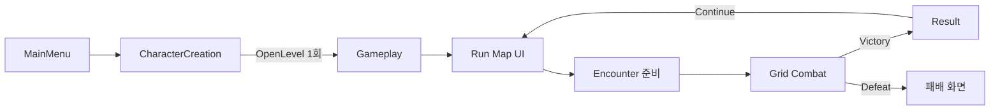

# ProjectA 구현 구조와 설정

기준일: 2026-09-11. 현재 모듈 책임·실행 절차·콘텐츠 설정을 정의한다.

기본 Run은 싱글플레이다. T14 1~6번은 로컬 범위 완료, 7번 최신 승계는 검증 대기, 8번 Steam/PlayFab·MMR은 미구현이다. 최신 2·4인 전투 결과는 [TEST_REPORT](TEST_REPORT.md)에 기록한다.

| 영역 | 기준 문서 |
|---|---|
| 게임 목표와 콘텐츠 방향 | [GAME_DESIGN](GAME_DESIGN.md) |
| 남은 작업과 완료 조건 | [TODO](TODO.md) |
| Snapshot·Co-op·저장/재개·온라인 계약 | [MULTIPLAYER](MULTIPLAYER.md) |
| 실제 검증 결과와 사용자 확인 항목 | [TEST_REPORT](TEST_REPORT.md) |
| 변경 과정과 과거 판단 | [HISTORY](HISTORY.md) |

## 기본 실행 흐름

실행 환경은 UE 5.7의 `ProjectA.uproject`다.

1. 기본 시작 맵인 `/Game/User_JeHoon/LEVEL/MainMenu`를 연다.
2. Play → New Game → CharacterCreation에서 1~4명의 캐릭터를 생성한다. 직업 화살표와 Edit로 직업·이름을 바꾼다.
3. Start Game → `/Game/User_JeHoon/LEVEL/Gameplay` → Run Map에서 첫 Combat 노드를 선택한다.
4. HUD의 스킬을 선택하고 대상 타일을 클릭한다. Move는 표시된 이동 가능 빈 아군 타일을 선택한다.
5. 행동 완료 후 End Turn으로 적 턴을 진행한다. 회복약은 전투 중 HUD에서 사용한다.
6. Victory → Continue → 두 번째 Combat 노드를 진행한다. 두 번째 Victory 뒤 Continue는 완료된 Run Map을 표시한다.
7. 파티 전멸 시 Defeat 화면을 유지하며 추가 전투 입력을 받지 않는다.

Gameplay는 계속 유지하는 단일 레벨이며 두 Combat 노드는 `DefaultEncounter`를 재사용한다. 월드 진행은 CommonUI 노드 화면으로 표현한다. 물리적인 WorldMap 탐험과 전투별 CombatMap 전환은 현재 흐름에 없다.

## 모듈과 책임

런타임은 `Source/ProjectA`, 에셋 생성·에디터 도구·PIE 테스트는 `Source/ProjectAEditor`에 둔다. Editor 의존성을 런타임 모듈로 옮기지 않는다.

| 구성 | 책임과 수명 |
|---|---|
| `URunStateSubsystem` | GameInstance 수명. 파티·노드·결과 HP·Run/참가자/캐릭터 소유권 보존, 저장 검증과 관리 Run lease 소유. 영속 데이터에 Actor 참조를 넣지 않음 |
| `AGameplayGameModeBase` | 서버 월드의 Arena·EncounterManager·CombatManager 준비와 신뢰된 C++ 참가자 배정. 종료 시 전투를 멈춘 뒤 관리 lease 해제 |
| `AGameplayGameState` | 단계·파티·노드·결과와 전투/아레나 참조를 읽기 전용 뷰로 복제. Client RunState는 서버 권위의 대체물이 아님 |
| `AGameplayPlayerController` | `APartyPlayerController` 상속. 로컬 Root UI, 소유 연결의 전투 RPC, 현재 Host의 노드 선택·Continue 요청 |
| `UGameplayRootWidget` | 해당 플레이어 화면의 CommonUI Run/Combat/Modal 스택과 저장 실패·재시도 안내 |
| `URunMapWidget` | 노드와 진행 상태 표시, 선택 요청. 직접 Spawn하지 않음 |
| `AEncounterManager` | Encounter 준비·스폰·전투 연결·HP 추출·정리와 Run 전이. 관리 참여 목록을 새 전투/복구에 적용 |
| `ACombatArena` | 배치된 Grid, 슬롯별 좌표, 카메라, 타일 활성화 관리 |
| `ACombatManager` / `UTurnManager` | 서버의 전투·턴·승패 확정. 전투 ID·턴·결과·유닛 식별/소유권의 실행 중 복제 뷰 제공 |
| `UCombatActionAuthority` | CombatManager 소유 서버 객체. 인간 연결/AI 세션 구분, 소유권·문맥·순번·실제 행동 데이터 검증 |
| `AUnitBase` / GAS / Grid | 서버만 행동·HP/AP·사망·점유 변경. Attribute RepNotify와 Actor 복제로 Client 표시 상태 전달 |
| `UPartyAutoCombatComponent` | PlayerUnit의 서버 AI. Tick 없이 턴 시작·행동 완료에서 회복약·스킬·이동·턴 종료 Command 선택 |
| `UCombatHUDWidget` | Move·Skill·회복약·End Turn·Cancel UI와 현재 조작 가능 상태 표시 |
| `UEncounterResultWidget` | Victory Continue / Defeat. 이후 보상 선택을 연결할 위치 |

실행 중 복제 뷰와 Actor 조회는 허용하되 Run/Party/Encounter/Command는 직렬화 가능한 값 데이터가 기준이다. GameInstance에 전투 Actor나 UI 동작을 집중시키지 않는다.

## 파티와 전투 규약

### 파티

- CharacterCreation은 네 슬롯 중 하나 이상 생성하면 시작한다. 빈 슬롯은 스폰하지 않으며 원래 `SlotIndex`를 Arena의 PlayerCoords에 대응한다.
- 슬롯은 이름·`ClassId`·생성 여부·현재 HP를 전달한다. 식별된 Run은 `CharacterId`와 원래 `OwnerAccountId`도 보존한다.
- 직업은 `StableHand`, `Scholar`, `Herbalist`, `Hunter`다. `UPartyDefinitionDataAsset::Professions`에서 정의를 찾는다.
- `CombatClass`가 없으면 기존 `PlayerUnitClasses`와 명시적인 `FallbackPlayerUnitClass`를 사용한다. 현재 네 직업은 공통 `BP_PlayerUnit`을 사용하는 임시 콘텐츠다.
- 수정하지 않은 이름은 직업 표시명과 슬롯 번호를 사용한다. 개별 이름 변경은 `SetSlotCharacterName`으로 반영한다.
- 첫 스폰은 직업 정의 HP 또는 클래스 기본 HP, 이후 전투는 저장한 결과 HP를 사용한다. HP 0인 멤버는 다음 전투에 스폰하지 않는다.

### 행동과 결과

`CanStartNode → BeginEncounter → PrepareArena → SpawnParty/Enemies → MarkCombatStarted → StartCombat` 순서로 시작한다. 누락 클래스·잘못된 좌표·중복 점유·빈 편성은 부분 스폰을 정리하고 Run Map에 오류를 표시한다.

이동·스킬·회복약·턴 종료는 값 Command를 서버가 검증한다. 스킬 AP 비용은 `USkillDefinitionDataAsset::ActionPointCost` 한 곳에서 표시·판정·차감하며 1 이상이어야 한다. 컨텍스트/GAS 커밋 뒤 한 번 차감한다.

타겟과 범위는 `CombatTargetingLibrary`를 공유하고 실행 직전에 다시 검사한다. 현재 범위는 Single/AroundTarget/AroundSelf이며 미지원 타입과 음수 반경은 실행 전에 거절한다.

행동 완료는 `EUnitActionResult`로 통일한다. GAS 종료 델리게이트는 활성화 전에 연결해 동기 완료도 받는다. 제자리 스킬은 복귀 이동을 하지 않으며 실패·취소는 원래 타일/위치로 복구한다. 이미 소비한 AP는 환불하지 않는다.

발사체 스킬은 몽타주와 impact 완료를 기다리며 미충돌 시간 제한·취소·사망 때 정리한다. 적 AI의 실패 처리는 다음 틱의 안전한 턴 종료로 이어진다.

`OnUnitDied → EvaluateCombatResult → StopCombat`에서 결과를 한 번 확정한다. 먼저 턴·행동·입력을 중단하고 사망 콜백 다음 틱에 HP를 추출한다. 현재 턴 유닛만 죽고 팀이 생존하면 다음 생존 유닛으로 한 번 전이한다.

Standalone은 결과 확정 후 TurnOrder·CombatUnits·ASC/이동·타이머·컨트롤러·스킬 Actor·Unit·타일 점유를 정리한다. 네트워크는 최종 HP·사망·점유 해제가 복제되도록 Result에서 유닛을 유지하고 Continue 또는 월드 종료 시 정리한다. 저장 실패 시 결과·Continue 전이를 확정하지 않는다.

### 입력

활성 CommonUI 화면이 입력 모드를 소유한다. CombatHUD는 `All / CaptureDuringMouseDown`, RunMap/Result는 `Menu / NoCapture`를 사용한다.

GameplayController에서 별도 `SetInputMode`를 추가하지 않는다. MainMenu의 UIOnly 상태에서 travel한 뒤 남는 viewport `IgnoreInput`과 로컬 포커스는 native 진입 코드가 복구한다. 이 입력 수정에는 WBP 재생성이 필요 없다.

## 콘텐츠·UI 설정

| 항목 | 현재 규칙 |
|---|---|
| 직업 편집 | Edit에서 이름 1~32자·직업 편집. 저장 시 적용, 취소 시 기존 값 유지. ClassInfo는 HP/AP/SubAP·시작 스킬 표시 |
| 직업 데이터 | `bUseUnitClassDefaults=true`는 클래스 기본값, false는 정의의 MaxHP/ActionPoints/SubActionPoints/StartingSkills 사용. CombatClass 미지정 시 기존 매핑·fallback 사용. 잘못된 직업·수치·중복 Ability는 거절 |
| 회복약 | 기본 1개/전투, HP 40 회복, 수량 1·SubAP 1 소비. 만피·재고 부족·잘못된 대상은 무소모 거절. HUD는 자기 회복, StartItemAction은 생존 아군 지원. HealingItemAmount/HealingItemCount로 조정 |
| 추가 스킬 | EncounterSkillPool에서 직업 설정 후 가중 추첨 1개를 부여·장착. 보유 Ability·잘못된 데이터·가중치 0 이하는 제외. 추가 슬롯 최대 4개 |
| 현재 추가 스킬 | DA_SweepingStrike: 대상 주변 체비셰프 반경 1, 적 피해 10, AP 1. 시작 스킬 유지 |
| 전투 간 이관 | HP 유지. 회복약·추가 스킬은 새 전투에서 재지급. 전투 중 복구는 저장된 장착·재고 유지. Snapshot 적은 회복약·무작위 추가 스킬 제외 |
| 적 AI | 유효 대상 수/AP·거리·HP 선호도로 스킬 비교. 동점은 기존 순서. 같은 영역·점유·범위의 후보 중 상대와 가까워지는 타일만 이동. 거리 점수는 200 Unreal 단위 기준. 성공 후 재판단, 실패 시 턴 종료, 유효 행동이 없으면 대기 |
| 메뉴 프리뷰 | MainMenuPreviewStage의 카메라·4개 앵커·ClassId별 BP_PartyMenuPreview 사용. 기존 메시 재사용, 전투 Pawn 생성 없음 |
| 생성 화면 종료 | Back/X는 초안·프리뷰 정리. 재진입 시 빈 4슬롯. 상세 패널이 열려 있으면 먼저 패널만 닫음. 최소 슬롯 높이로 ClassInfo 표시 유지 |
| 옵션·종료 | 적용 및 저장으로 그래픽 품질·VSync를 GameUserSettings.ini에 저장. 적용 전 닫기는 취소. Quit는 게임 종료 요청 |

### 타겟·행동 세부 규칙

- 전열 보호는 EnemyUnit 대상에 적용하며 `bIgnoreFront`로 예외 처리한다. 제자리 AllyUnit/AnyUnit은 자신도 선택 가능하고 타일 스킬은 유효 영역의 빈 타일을 지원한다. 접근 스킬은 다른 생존 유닛이 필요하다. 실행 전 대상 이동·교체를 재검사한다.
- 범위는 Single·AroundTarget·AroundSelf를 지원한다. 후자는 효과 시점 시전자 타일 기준이며 범위 계산은 체비셰프 반경을 사용한다. 범위 효과는 시전자 제외 후 진영·생존·점유를 검사한다. Row/Column/LeftAndTarget/RightAndTarget/DiagonalTarget/AllEnemies·음수 반경은 AP 소비 전 거절한다. 범위 능력은 GA_AreaAttack 계열이다.
- `GA_AttackBase`의 이전 비용 필드는 호환용이다. 실제 비용은 SkillDefinition의 ActionPointCost만 사용한다.
- 타일은 `PartyPlayerController::HandleTileClicked`, UI는 `RequestEndTurn`·`RequestHealingItem`, AI 내부 종료는 `CombatManager::RequestEndTurnForUnit`을 사용한다. 인자 없는 Blueprint 턴 종료는 deprecated이며 플레이어 검사를 거친다.
- 스폰 스킬은 SkillActorBase 계열을 사용한다. 몽타주가 없으면 impact만 대기하며, impact 이전 RequestFinish·Actor 소멸은 실패다. 미충돌 제한은 SpawnedActorTimeout 기본 10초다.
- 플레이어 AP/SubAP가 모두 0이면 행동 완료 다음 틱에 턴을 종료한다. 보조 자원이 남으면 이동·아이템을 허용한다.

## 저장과 멀티플레이 연결 경계

일반 기본 슬롯은 `ProjectA_Run`, 상대 Snapshot 슬롯은 `ProjectA_Opponent_` 접두사를 사용한다. 새 게임·확정 턴·결과·Continue에서 저장하며 새 파티 시작은 선택 슬롯을 갱신한다. 전투 중 종료는 마지막 확정 턴, 결과 화면 종료는 결과 단계로 복구한다. 패배·완료 Run은 일반 Continue 대상에서 제외한다. 테스트 슬롯은 `-ProjectASaveSlot=...`로 분리한다.

| 저장 종류 | 범위 |
|---|---|
| 일반 v1 | Identity 없는 LegacyOffline 호환, 소유자·Host 추정 이관 금지 |
| 일반 v2 | 전투 밖 파티·진행·식별/소유권 |
| 일반 v3 | 확정 턴 체크포인트, 새 Actor로 복구 |
| 관리 v4 | 영속 Human 목록·전 단계 본문, CAS revision·HostEpoch·단일 실행 lease |
| 상대 Snapshot v1 | 별도 USaveGame·고정 ID 카탈로그, 콘텐츠 버전 일치 |

일반 Continue는 LegacyOffline 또는 LocalDevelopment 단일 참가자만 지원한다. 협동·AccountProvider·관리 v4는 별도 재개 경로와 실제 로드 검증을 사용한다. 관리 메뉴는 신뢰된 C++ 호출자·재개 대상 설정이 필요하며 일반 협동 생성·로그인·저장 검색 UI는 미구현이다.

일반 v3 협동은 원래 참가자 전원, 관리 v4는 현재 Human 전원의 서버 배정 후 복구한다. 로컬 관리 저장은 Win64 개발 어댑터이며 온라인 인증·중앙 권위를 제공하지 않는다. 버전·재개·실패·종료·AI 계약과 명령줄 옵션은 [MULTIPLAYER](MULTIPLAYER.md)를 따른다.

## Gameplay 에셋과 배치

사용자·Codex의 모든 제작 에셋은 `Content/User_JeHoon/` 안에 둔다. 외부 리소스·템플릿 원본을 직접 수정할 때는 이 폴더에 작업 사본을 만든다. C++·설정·생성 명세는 기존 Source·Config 위치를 유지한다.

2026-09-11: 별도 `/Game/T12Validation`에 있던 메뉴 검증 위젯 3종을 `/Game/User_JeHoon/Validation/T12`로 이동했다. 일반 메뉴의 `UI/MainMenu` 원본과 구분하며 기존 검증 코드·문서·Saved의 T12 생성 명세도 새 경로를 사용한다. UI 생성 도구는 작업 폴더 밖의 assetPath를 거절한다.

기존 `/Game/Cursor` 4개는 직접 작업한 사본인지 외부 원본인지 사용자 확인 대기이므로 유지한다. TopDown과 외부 리소스 원본, TopDown의 External Actors/Objects도 기존 위치를 유지한다.

아래 에셋 경로는 모두 `/Game/User_JeHoon/` 기준이다. 디스크에서는 `Content/User_JeHoon/`에 대응한다. 기존 에셋에는 필수 수동 재연결 작업이 없다.

| 에셋 경로 | 클래스 / 저장된 연결 |
|---|---|
| `LEVEL/MainMenu` | 기본 시작 맵 |
| `LEVEL/Gameplay` | TestMap geometry·NavMesh·Grid를 복제한 기준 레벨, `BP_GameplayGameMode` Override |
| `Blueprint/Game/BP_GameplayGameMode` | `AGameplayGameModeBase`, PartyDefinition과 `EncounterDefinitions[DefaultEncounter]` 설정 |
| `Blueprint/Controller/BP_GameplayPlayerController` | `AGameplayPlayerController`, GameplayRootWidgetClass 설정 |
| `Blueprint/DataAsset/DA_VerticalSliceParty` | `UPartyDefinitionDataAsset`, 네 직업과 공통 `BP_PlayerUnit` fallback |
| `Blueprint/DataAsset/DA_DefaultEncounter` | `UEncounterDefinitionDataAsset`, `EnemyUnitClasses[0]=BP_EnemyUnit` |
| `UI/Gameplay/WBP_GameplayRootWidget` | `UGameplayRootWidget`, RunMap/CombatHUD/Result 화면 클래스 |
| `UI/Gameplay/WBP_RunMapWidget` | `URunMapWidget` |
| `UI/Gameplay/WBP_CombatHUDWidget` | `UCombatHUDWidget`; 기존 `UI/Combat/WBP_CombatHUDWidget`과 별도 |
| `UI/Gameplay/WBP_EncounterResultWidget` | `UEncounterResultWidget` |

클래스는 런타임 Blueprint 문자열 경로 Load 대신 DataAsset과 Blueprint 기본값 참조로 연결한다.

| Gameplay 배치 대상 | 값 |
|---|---|
| `GameplayCombatArena` | `ACombatArena`, Grid는 배치된 `BP_CombatGridManager`, CameraAnchor는 `GameplayCamera` |
| Grid | TileClass=`BP_CombatGridTile`, Rows/Cols=`4`, Location Z=`5` |
| Arena PlayerCoords | 슬롯 0~3 → `(0,1), (1,1), (2,1), (3,1)` |
| Arena EnemyCoords | `(0,2), (1,2), (2,2), (3,2)`; 기본 Encounter는 첫 좌표 사용 |
| `GameplayCamera` | `ACameraActor`, 위치 `(-300,-1000,1500)`, Pitch `-46.97`, Yaw `90`, FOV `55` |
| 여러 Arena 배치 시 | 사용할 Arena의 Actor Tags에 `GameplayArena` 지정 |

### 설정 변경 또는 연결 복구 순서

1. `DA_VerticalSliceParty`의 Professions에서 직업별 CombatClass를 설정한다. 기존 PlayerUnitClasses 매핑과 FallbackPlayerUnitClass도 확인하고 Save한다.
2. `DA_DefaultEncounter`의 EnemyUnitClasses에 `AEnemyUnit` 자식 클래스를 지정한다.
3. `BP_GameplayGameMode` Class Defaults에서 PartyDefinition, EncounterDefinitions의 `DefaultEncounter`, CombatManagerClass=`ACombatManager`, EncounterManagerClass=`AEncounterManager`를 확인한다.
4. 같은 GameMode의 PlayerControllerClass는 `BP_GameplayPlayerController`, DefaultPawnClass/HUDClass는 None으로 설정하고 Compile → Save한다.
5. `BP_GameplayPlayerController`의 GameplayRootWidgetClass와 Root WBP의 RunMapWidgetClass/CombatHUDWidgetClass/ResultWidgetClass를 위 표대로 연결하고 Compile → Save한다.
6. Gameplay의 World Settings에서 GameMode Override를 지정하고 Arena의 Grid/CameraAnchor/좌표를 위 표와 맞춘다.
7. Grid의 TileClass·크기·Z를 확인한다. P 키로 NavMesh가 바닥/스폰 위치를 덮는지 보고 필요할 때 Build → Build Paths 후 Save All한다.
8. `BP_MainMenuPlayerController`의 GameplayLevelName을 `/Game/User_JeHoon/LEVEL/Gameplay`로 지정한다. 제거된 옛 `StartGameLevelName=WorldMap` 필드는 실행에 사용하지 않는다.

### Designer 바인딩

| 화면 | 이름과 형식 |
|---|---|
| GameplayRoot | `RootOverlay`, `RunLayer`, `CombatLayer`, `ModalLayer`; 세 레이어는 `CommonActivatableWidgetStack` |
| RunMap | `Text_Progress`, `Text_Party`, `Text_FlowMessage`, `NodeList`(`VerticalBox`); 노드 버튼은 런타임 생성 |
| CombatHUD | `CommandPanelBackground`(`Border`), `Text_Turn`, `Text_Action`, `SkillList`(`HorizontalBox`), `Button_Move`, `Button_EndTurn`, `Button_Cancel` |
| Result | `Text_Result`, `Button_Continue` |

스킬 버튼은 장착 정의에서 생성한다. native fallback은 같은 `BindWidgetOptional` 이름을 사용한다. Designer를 수정한 WBP를 덮어쓰기 전에 변경 내용을 확인한다. JSON spec 변경은 실제 생성·Compile·Save를 거쳐 반영하며 DryRun만으로 완료를 기록하지 않는다.

## 에셋 도구와 CLI

Development Editor / Win64 빌드를 사용한다. 초기 순서는 UI 생성 → Gameplay 생성 → Navigation Build → 저장 연결 검사다. 최초 생성 도구는 대상이 없는 환경에서만 실행하며 현재 TestMap 삭제 상태를 사전에 확인한다.

JSON 명세는 `Source/ProjectAEditor/UiScaffoldSpecs`에서 관리한다. Designer WBP가 화면 구조의 기준이며 자동 재생성하지 않는다. `-AddMissing`은 기존 속성·계층을 보존해 누락 위젯만 추가하며 `-Overwrite`와 병용할 수 없다. 현재 명세는 `generateNativeSource=false`다. 생성본은 실제 Compile·Save가 필요하며 DryRun은 구조 검사만 수행한다.

메뉴 WBP 3종은 `UI/MainMenu`, 검증 사본은 `Validation/T12`에 둔다. `ProjectA.Menu.AssetContracts -T12GeneratedAssets`로 생성본을 검사한다. 지원 위젯·명세·옵션은 [UI 명세](../Source/ProjectA/UI/UI_README.txt), 실행 명령·제약은 [에셋 도구](../Source/ProjectAEditor/Scripts/README.md)를 따른다.

## 현재 한계와 보존 대상

- 기본 콘텐츠는 두 노드와 공통 PlayerUnit을 사용한다. 네 직업의 고유 스킬/스탯 완성, 전투 사이 회복·부활·보상, 전체 인벤토리/장비와 여러 Act는 미구현이다.
- 기존 4×4 Grid, GAS 피해·몽타주·스킬 Actor, 적 AI, AP/보조 AP를 재사용한다. Streaming/Level Instance는 현재 흐름에 없다.
- 2026-09-11 작업 폴더의 TestMap과 기존 Blueprint 2개는 사용자 삭제 상태다. 자동 복원하지 않는다. WorldMap 레벨/native class는 deprecated 상태이며 실행 흐름에서 제외한다.
- WorldMap의 WorldSettings가 참조하는 WorldMapGameModeBase는 호환을 위해 보존한다.
- 로컬 Snapshot·Listen Server·개발용 관리 저장의 구현을 실제 계정 인증, Steam 연결, PlayFab 운영, 경쟁 결과 검증이나 MMR 완료로 기록하지 않는다.
- 빌드·자동화 결과와 사용자의 실제 조작 검증을 구분한다. 다음 구현 우선순위와 T14 잔여 조건은 [TODO](TODO.md), 최종 작동 확인은 [TEST_REPORT](TEST_REPORT.md)를 따른다.
