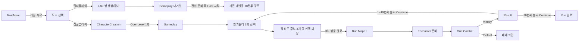

# ProjectA 구현 구조와 설정

기준일: 2026-10-06. 현재 모듈 책임·실행 절차·콘텐츠 설정을 정의한다. 엔진 기준은 UE 5.8.3이며 현재 검수와 제한은 [최신 실행 이력](HISTORY.md#9-17-2026-10-04-ue-58-todo-실행-검수)을 따른다. UE 5.7 결과와 아래의 기존 실행 결과는 당시 코드의 이력으로 보존한다. HP 화면 보완과 데이터 읽기 검사를 포함한 native 회귀 175개·Development 패키지 검수는 목표 Run·회복 소모품 도입 전 결과이며 이번 변경의 검증을 대신하지 않는다.

기본 Combat는 [GAME_DESIGN 8절](GAME_DESIGN.md#8-라운드-계획과-시간차-자동-전투)의 행동 계획·시간차 실행으로 교체했다. 기존 순차 턴·AI 연속 행동·End Turn 실행은 제거했다. 순차 모드 보존용 진입점은 없으며 이전 Blueprint 참조용 클래스·프로퍼티만 남긴다. 기존 Run·상점·직업·원래 소유권과 비전투 저장은 유지한다. 2026-09-18 UE 5.7 위임 실행은 당시 두 전투 경로의 싱글 Run·같은 PC 2/4인 PIE와 저장·전투 예외 회귀 결과다. 2026-10-01 UE 5.7의 당시 코드로 1인·같은 PC 2/4인 PIE에서 각 10전투·9상점 선택/퇴장·개인 보상과 저장 재로드를 확인했다. 진행용 HP fixture이며 정상 난이도·실제 서비스·다중 PC·지연/손실 검증은 별도다. 2026-10-04 UE 5.8.3에서도 1/2/4인 PIE의 10전투·9상점·개인 보상·Host Continue를 확인했다. [과거 이력](HISTORY.md#9-15-2026-10-01-todo-재검증과-구현-이관)·[현재 검수](HISTORY.md#9-17-2026-10-04-ue-58-todo-실행-검수)

T14의 이전 턴 복구·승계 성공은 과거 코드 이력이다. 새 라운드는 저장된 준비 완료 경계에서 복구하며 이전 순차 Combat 저장은 계속 거절한다. 진행 중 시전·투사체의 임의 시점 복원은 지원하지 않는다. Steam 480 연결 시제품은 별도 개발 설정으로 구현했으며 실제 다중 PC 접속·인증은 미확인이다. PlayFab·온라인 Run·MMR의 미구현 범위는 [멀티플레이 계약](MULTIPLAYER.md#9-steamplayfab와-남은-서비스-정책)을 따른다.

| 영역 | 기준 문서 |
|---|---|
| 게임 목표와 콘텐츠 방향 | [GAME_DESIGN](GAME_DESIGN.md) |
| 목표 Run·온라인·신규 에셋 도입 | [TODO](TODO.md) |
| Snapshot·Co-op·저장/재개·온라인 계약 | [MULTIPLAYER](MULTIPLAYER.md) |
| 완료 구현과 검증 범위 | [재검증 이력](HISTORY.md#9-15-2026-10-01-todo-재검증과-구현-이관) |
| 변경 과정과 과거 판단 | [HISTORY](HISTORY.md) |

## 1 기본 실행 흐름

실행 환경은 UE 5.8의 `ProjectA.uproject`다. 게임·Editor 타깃은 `BuildSettingsVersion.V7`·`EngineIncludeOrderVersion.Unreal5_8`을 사용한다.

1. 기본 시작 맵인 `/Game/User_JeHoon/LEVEL/Core/MainMenu`를 연다.
2. 게임 시작 → 싱글플레이 → CharacterCreation에서 1~4명의 캐릭터를 생성하고 직접 조작할 한 명을 선택한다. 생성 버튼은 기본값으로 즉시 생성하며 직업 화살표와 Edit로 직업·이름·몸체를 바꾼다. 멀티플레이는 기존 같은 PC·LAN 개발용 방으로 연결한다.
3. Start Game → `/Game/User_JeHoon/LEVEL/Core/Gameplay` → 후보 3개 중 하나를 고르는 인카운터를 세 번 방문한 뒤 Run Map의 첫 Combat 노드를 선택한다.
4. 전장에서 적 또는 스킬이 요구하는 타일을 클릭하고 하단의 실제 장착 스킬 버튼으로 계획을 적용한 뒤 준비 완료한다. 스킬 미선택 준비 완료는 행동 비용 없이 턴을 넘기며 선택한 스킬은 취소할 수 있다. 위치 이동은 이동 예약 → 아군 빈칸 한 번 클릭으로 예약하며 스킬 없이 이동만 예약하면 SAP 1만 소모한다. 전원 준비 후 SAP 이동을 먼저 끝내고 선택한 AP 행동을 실행한다. 나머지 생성 동료는 서버 AI가 계획·실행한다.
5. 속도차 대기·이동·시전·피격·복귀를 관찰한다. 남은 유효 투사체까지 정리되면 다음 라운드 계획으로 돌아간다. 해결 중 새 행동을 입력할 수 없다.
6. 새 싱글 Run은 PvE와 로컬 Snapshot을 번갈아 20전투 진행한다. PvE 승리에서는 저장된 골드 후보 3개 중 하나를 수령하고 Snapshot 승리에는 골드·성장을 지급하지 않는다. Continue 뒤 다음 전투 전 인카운터를 세 번 방문하며 20번째 승리 뒤 완료된다. 화면 진행 수는 60선택과 20전투를 합한 80단계다. 시험 편성·성장·회복 규칙은 [5-1절](#5-1-목표-run과-회복-시험-데이터)을 따른다.
7. 잔여 공격까지 정리한 뒤 양 팀 전멸을 포함한 패배는 Defeat 화면을 표시하고 Run을 종료한다. 승리 보상은 지급하지 않는다.

빌드 후 UE를 재시작하여 C++·리플렉션 변경을 반영한다. 라운드 계획 전환에는 새 맵·WBP 생성이나 Config 변경이 필요하지 않다.

2026-09-16 일반 플레이 보고는 당시 두 전투 경로의 관찰 범위에 한정한다. 현행 1/2/4인 시험 Run 진행과 검증 제한은 [재검증 이력](HISTORY.md#9-15-2026-10-01-todo-재검증과-구현-이관)을 따른다.

```mermaid
flowchart LR
    A[MainMenu] -->|게임 시작| M[모드 선택]
    M -->|싱글플레이| B[CharacterCreation]
    M -->|멀티플레이| L[LAN 방 생성/참가]
    B -->|OpenLevel 1회| C[Gameplay]
    L --> R[Gameplay 대기실]
    R -->|전원 준비 후 Host 시작| P[기존 개발용 10전투 경로]
    C --> I[인카운터 3회 선택]
    D[Run Map UI] --> E[Encounter 준비]
    E --> F[Grid Combat]
    F -->|Victory| G[Result]
    G -->|1~19번째 승리 Continue| I
    I --> J[각 방문 후보 3개 중 선택·퇴장]
    J -->|3회 방문 완료| D
    G -->|20번째 승리 Continue| K[Run 완료]
    F -->|Defeat| H[패배 화면]
```

Gameplay는 계속 유지하는 단일 레벨이며 새 싱글의 `TargetCombat_01`~`TargetCombat_20`은 저장된 목표 정의의 PvE 편성과 로컬 Snapshot을 번갈아 사용한다. 기존 `Combat_01`~`Combat_02/10` 저장과 개발 협동·명시적 `-ProjectAPrototypeRun`의 10전투 경로는 보존한다. 원본 몬스터 구성은 [4-5절](#4-5-몬스터-콘텐츠), 목표 편성은 [5-1절](#5-1-목표-run과-회복-시험-데이터)을 따른다. CommonUI 지도는 완료 수/전체 노드 수를 표시하고 알려진 `ContentBox` 직계 `NodeList`를 최대 높이 300의 스크롤 목록으로 감싼다. 기존 바인딩·슬롯 배치·완료/잠금 표시와 별도 사용자 계층은 보존한다. 물리적인 WorldMap 탐험과 전투별 CombatMap 전환은 현재 흐름에 없다.

## 2 모듈과 책임

런타임은 `Source/ProjectA`, 에셋 생성·에디터 도구·PIE 테스트는 `Source/ProjectAEditor`에 둔다. Editor 의존성을 런타임 모듈로 옮기지 않는다.

| 구성 | 책임과 수명 |
|---|---|
| `URunStateSubsystem` | GameInstance 수명. Run/소유권·관리 lease와 저장 성공 후 상태 반영 조율. 경로/진행 검사는 `RunProgressRules`, 저장 버전 해석은 `RunSaveFormat` 사용 |
| `AGameplayGameModeBase` | 서버 월드의 Arena·EncounterManager·CombatManager 준비와 신뢰된 C++ 참가자 배정. 종료 시 전투를 멈춘 뒤 관리 lease 해제 |
| `AGameplayGameState` | 단계·파티·노드·결과와 전투/아레나 참조를 읽기 전용 뷰로 복제. Client RunState는 서버 권위의 대체물이 아님 |
| `AGameplayPlayerController` | `APartyPlayerController` 상속. 로컬 Root UI, 소유 연결의 전투 RPC, 현재 Host의 노드 선택·Continue 요청 |
| `UGameplayRootWidget` | 해당 플레이어 화면의 CommonUI Run/Combat/Modal 스택과 저장 실패·재시도 안내 |
| `URunMapWidget` | 전체 노드·진행 분모·완료/잠금 상태와 높이 300 상한 스크롤 목록 표시, 선택 요청. 직접 Spawn하지 않음 |
| `URunEncounterWidget` | 태그로 분류한 후보 3개 선택·진행 수·본인 골드와 상품 표시. 스킬 61후보/아이템 진열·리롤·구매 및 목표 Run의 회복·소모품·부활 서비스 제공. 기존 RunLayer의 native CommonUI 화면 |
| `AEncounterManager` | Encounter 준비·스폰·라운드 전투 연결·종료 HP/소모품 재고 추출·정리와 Run 전이. 순차 턴 저장/복원 훅 제거 |
| `ACombatArena` | 배치된 Grid, 슬롯별 좌표, 카메라, 타일 활성화 관리 |
| `ACombatManager` / `ACombatRoundCoordinator` | Run 전투 연결, 라운드 계획·시간표·실행·잔여 공격 정리·결과 확정. `UTurnManager`는 참조 호환용 외형만 유지 |
| `UCombatActionAuthority` | 기존 Run 식별·원래 소유권·서버 연결·관리 lease·Human/AI 검증 유지. 이전 즉시 순차 행동 실행은 제거 |
| `AUnitBase` / GAS / Grid | 서버 HP/AP·사망·실제 위치/복귀 칸·복제 표현. 라운드가 이동/피격을 소유하며 기존 ASC 데이터와 사망 표현 연결 |
| 적·아군 AI | `CombatAIPlanning`이 장착 순서와 태그 조건으로 후보를 선택하고 Coordinator가 인간 초안 전에 한 명령씩 고정. 이전 AI 컴포넌트는 참조 호환 유지 |
| `ACombatRoundPlayerController` / `UCombatRoundPlanningWidget` | 소유 연결의 계획·준비 RPC와 CommonUI 계획 화면. `UCombatHUDWidget`은 이전 WBP 참조용 외형 |
| `UEncounterResultWidget` | 보상 대상 승리의 골드 3택1·개인 잔액·수령 상태·Continue, 목표 Snapshot의 무보상 결과 및 패배 Run 종료 안내 |

실행 중 복제 뷰와 Actor 조회는 허용하되 Run/Party/Encounter/Command는 직렬화 가능한 값 데이터가 기준이다. GameInstance에 전투 Actor나 UI 동작을 집중시키지 않는다.

## 3 파티와 전투 규약

### 3-1 시작 장비와 장착

`UProfessionBase.StartingEquipment`가 전사 한손검+방패·궁수 활·마법사 양손 스태프·도적 단검의 원본 경로와 기준 슬롯을 정의한다. 새 Run에서 `Items`에 지급하고 `FRunEquipmentState`의 기준 슬롯·개별 아이템 인덱스·Revision으로 장착한다. `Items`는 추가 전용 배열이며 같은 에셋 여러 개도 서로 다른 사본이다. 원본이 없으면 지급·장착을 생략하고 슬롯을 비운다. 현재 5개 시작 원본은 CSV와 콘텐츠에 모두 존재하며 복제하지 않는다.

`URunEquipmentCatalog`는 `GameplayTagQuery`·에셋별 선택 설정·허용/점유 슬롯·소켓/상대 변환을 작성 가능한 native CDO 데이터로 관리한다. 특정 에셋 프로필이 일반 태그 프로필을 우선하며 이름·직업 분기로 장착 종류를 판정하지 않는다. 단검 20·방패 15·활 11·명시 한손/양손검 2·시작 스태프 1개를 지원한다. `RunEquipmentRules`가 중복 점유·사본·호환 교체를 공통 검증한다. 활은 왼손, 시작 스태프와 양손검은 오른손을 기준으로 두 손을 점유한다.

`ChangeEquipment`는 상점 단계·신뢰 소유자·생존 Human·아이템 인덱스·Revision과 원본 메시를 검증하고 저장 후보를 원자 반영한다. 실패하면 파티·Revision·원본 파일·상태 알림을 유지한다. `CharacterEquipmentComponent`는 선택 몸체의 소켓에 원본 Static/Skeletal Mesh를 붙이며 명시 장비 상태의 기존 스킬 검 표시는 숨긴다. 검 스킬의 기존 판정 컴포넌트·GAS·스킬·능력치는 유지한다. 손잡이 위치·회전·배율은 프로필의 에셋별 `Attachments.RelativeTransform`으로 조정한다.

이전 저장의 누락된 장비 상태는 과거 스킬 외형을 유지하며 첫 명시 장착부터 새 상태를 적용한다. 시작 아이템을 재지급하거나 저장 카탈로그를 바꾸지 않는다. 비무기 슬롯 콘텐츠·나머지 240개 분류·능력치/부여 스킬·Snapshot `EquipmentIds` 연결은 후속 기획 대상이다. 아이템·장비 조작과 새 에셋 부착 재생은 사용자 지시로 이번 실행에서 제외했다. [구현·검증 이력](HISTORY.md#9-15-2026-10-01-todo-재검증과-구현-이관)

### 3-2 상점 인카운터

**전투 승리 보상**

`FRunGoldRewardState`의 노드·골드 선택지 3개·캐릭터별 수령 기록을 저장하고 복제 뷰로 표시한다. 기존 10전투 경로는 `RunEncounterPoolDataAsset.GoldRewardMin/GoldRewardMax` 기본값 5/15 사이에서 각 선택지를 독립 추첨한다. 새 목표 Run은 [5-1절](#5-1-목표-run과-회복-시험-데이터)의 PvE 골드 후보와 성장 규칙을 저장한다. 서버가 연결 소유자·현재 Human·노드·선택 인덱스·미수령·잔액 범위를 검증하고 골드와 수령을 함께 저장한다. 파티 승리 시 사망한 직접 조작 캐릭터도 수령할 수 있으며 AI는 제외한다. 현재 인간 참가자가 모두 선택해야 Host가 Continue한다. 보상 대상 전투는 수령 후 Continue를 허용하며 목표 Run의 Snapshot과 패배에는 보상을 지급하지 않는다.

선택지와 수령은 재개 시 복원한다. 기존 보상 필드가 없는 Result는 그대로 Continue하고 스킬 상점 schema 1 저장의 다음 승리부터 보상을 적용한다. 상점 도입 전 저장은 기존 골드·장착 규약을 유지한다. [구현·검증 이력](HISTORY.md#9-15-2026-10-01-todo-재검증과-구현-이관)

새 목표 Run은 첫 전투를 포함해 각 전투 전에 `EncounterChoice`에서 후보 하나를 선택해 `Shop`으로 방문한다. 나가기 두 번은 다음 선택으로, 세 번째는 `Map`으로 전환한다. 기존 10전투 경로는 1~9번째 승리 후 한 번씩 방문하고 10번째 승리 뒤 완료하는 규칙을 보존한다. 전투 완료 수와 선택 완료 수를 분리 저장하며 선택하지 않은 인카운터는 방문할 수 없다. 레벨 이동·별도 Arena 스폰 없이 UI로 처리한다.

반복 방문의 `FRunEncounterProgress.AfterCompletedNodeCount`에 해당 방문 직전의 완료 전투 수를 저장하며 목표 schema 2는 `VisitIndex`와 완료 선택 수를 함께 검증한다. 다음 Continue의 저장 후보에서 회차·선택 ID·퇴장 상태를 함께 초기화하며 실패 시 이전 결과·보상·상점 상태를 유지한다. 상점 선택 시 해당 상점의 저장된 카탈로그·조건으로 새 진열을 확정하고 스킬 리롤 비용은 1G로 초기화한다. 골드·보유 스킬/아이템·장비·소유권과 다른 상점의 저장 상태는 유지하며 이어하기는 현재 선택·진열·비용을 그대로 복구한다.

기존 상점1은 **스킬상점**, 상점2는 **아이템상점** 인카운터로 관리한다. `FRunEncounterOffer.EncounterTag`의 `Encounter.Shop.Skill`·`Encounter.Shop.Item` 분류로 UI·구매·리롤 실행을 판정하며 표시 이름과 저장 ID를 분리한다. 저장 호환을 위해 `Shop_01/02/03` ID를 유지하고 상점3은 스킬상점과 같은 구매·리롤 규칙을 사용한다. 분류 태그가 없는 이전 정의·저장은 공통 해석에서 기존 Shop ID를 분류하며, 기본 이전 이름만 새 이름으로 표시하고 사용자 지정 이름과 저장 원본은 보존한다.

아군 네 직업은 비무장 공격 하나로 시작하고 직접 조작 캐릭터별 개인 10G, AI 동료 0G를 사용한다. 새 Run의 스킬상점·상점3은 근접 공격 1종·신규 VFX 스킬 60종의 61후보에서 최대 5개를 1G에 판매한다. 신규 후보 확인은 새 Run을 기준으로 하며 기존 저장의 확정 카탈로그·진열·가격은 보존한다. 상품 수는 가용 후보 수와 최대 5개 중 작은 값이며 같은 진열 안에서 중복하지 않는다. 리롤은 전체 진열을 다시 추첨하고 이전 상품의 재등장을 허용한다. 비용은 입장 때 1G로 초기화한 뒤 성공할 때마다 1G씩 증가하며 이어하기에서는 현재 비용을 복원한다.

본인 생존 인간 캐릭터만 구매·리롤하고 같은 스킬의 재구매와 비무장 공격을 포함한 총 일반 스킬 5개 초과 구매를 거절한다. 회복 소모품은 [5-1절](#5-1-목표-run과-회복-시험-데이터)의 별도 태그·재고 경로를 사용한다. 습득 즉시 Run 장착 목록에 추가하며 다음 전투부터 사용한다. HP 전체 회복은 1G로 유지하고 직업 설정의 최대 HP까지 즉시 적용하며 만피 구매를 거절한다. 시작 골드·상품 가격·리롤 증가량은 시험값이며 최종 밸런스·확률 가중치는 미확정이다.

`RunEncounterPoolDataAsset.StartingGold/FixedSkillOffers/Recovery/SkillShopPool/SkillShopQuery`에서 시작 골드·기본 상품·회복·추가 풀·태그 조건을 관리한다. 현재 기본 파티는 `DA_DrGameRunEncounterPool`의 `DA_DrGameSkillShopPool`을 사용한다. 기존 고정 스킬 진열은 새 풀에서 비우고 근접 공격 1종·신규 60종을 가중치 1의 시험 후보로 제공한다. 새 Run의 schema 1 `FRunSkillShopState.Catalog/Offers/Query/Revision/RerollPrice`에 값을 고정하며 `OfferCount`는 가용 후보 수와 최대 5개 중 작은 값이다. 공통 후보 추첨은 저장된 태그 조건·기본 가중치를 사용하되 최종 수치와 태그별 가중치 보정 정책은 미확정이다. 신규 도입·원본 설치 전제는 [4-9절](#4-9-구입-vfx와-sfx-도입)을 따른다.

2026-10-04 `SkillShopUI`는 기존 61후보를 보존한 격리 진열 5개에서 근접·번개 Chain·치유·보호막 4종의 원래 카드 delegate 구매를 통과했다. 비무장 포함 5개 스킬 탭·저장과 네 번의 실제 메뉴 Continue → 상점 나가기 → Combat_02 지도 카드 요청 → 공개 전투 실행을 확인했다. 각 스킬의 원래 시전자·GAS 1회·AP 1과 능력치 변화, 근접의 실제 몽타주·나머지 Niagara 및 화면 10장을 확인했다. 최초 승리는 공개 상태 fixture로 구성하고 치유의 현재 HP만 일시 조정했으며 원본 DA·위력·태그·Chain 대상 1명은 유지했다. 원본 저장/설정 50파일의 SHA와 소유 검수 슬롯 정리를 통과했다. 물리적 카드 클릭·첫 전투 난이도·다중 PC 검수는 별도다. [검수 이력](HISTORY.md#9-17-2026-10-04-ue-58-todo-실행-검수)

`FRunPartyMember.Gold/Skills/bHasSkillLoadout/CurrentHP`를 저장 기준으로 사용한다. 서버가 신뢰 연결의 소유자·상점 단계·생존 Human·잔액·스킬 중복·보유 한도·부족 HP와 모든 구매·회복·리롤 요청의 Revision을 검사한다. 골드·습득 스킬·HP·진열·현재 리롤 비용·Revision을 하나의 저장 후보에 반영하고 성공한 변경만 공개한다. 실패하면 메모리와 기존 파일을 보존하며 재개 시 저장된 카탈로그·진열·비용을 복원한다.

2026-10-03 사용자 요청으로 몬스터 전용 공격을 보존하고 비무장·근접 공격 외 기존 VFX 스킬을 제거한다. 기존 Run·Snapshot·전투 체크포인트는 로드 후보의 보유 스킬·상점 후보/진열과 해당 예약에서 삭제된 VFX 스킬을 제거하고 해당 인간의 준비 완료를 해제한다. 두 기본 공격·골드·보유품·진행·소유권과 독립 이동 예약은 보존한다. 삭제 후 명시 스킬 목록이 비는 기존 Run·체크포인트는 기존 비무장 공격을 복구하며 Snapshot의 빈 스킬 목록은 기존 DefaultAttack 별칭을 사용한다. 남은 상품의 가격·가중치·태그·리롤비는 유지하며 후보가 모두 삭제된 사용자 지정 스킬상점은 회복만 제공하고 리롤을 비활성화한다. 원본 저장을 일괄 덮어쓰지 않고 후보 검증 후 반영하며 이후 정상 저장에 남긴다. [에셋 정리 범위](#4-8-기본-공격-외-스킬-정리) · [사용자 확인](TODO.md#18-기본-공격-외-스킬-정리-확인)

카탈로그가 없는 기존 schema 1은 고정 상품에서 삭제 스킬을 제외하고 두 기본 공격·골드를 유지하며 새 리롤 규칙을 소급 적용하지 않는다. 회복 필드 누락은 기본값 1G로 읽는다. schema 0에는 상품·골드를 소급 지급하지 않으며 명시 장착이 없는 기존 파티의 직업 기본값도 남은 두 기본 공격으로 제한한다. RunSaveGame에는 전체 상태를 저장하고 GameState 표시 뷰에는 현재 진열·비용·Revision 등 표시 상태를 전달하여 후보 `Catalog/Query`를 복제하지 않는다. 이전 상점 실행 결과는 [과거 검증 이력](HISTORY.md#9-15-2026-10-01-todo-재검증과-구현-이관)을 따른다.

2026-09-25 아이템상점 시험: [WEAPON_ASSETS.csv](../DataCatalogs/WEAPON_ASSETS.csv)의 방패·탄환·화살·기타를 포함한 현재 289개를 사용하고 `가격(G)`은 모두 1이다. 새 Run은 마지막 열 `게임 내 이름`을 표시하며 첫 입장과 1G 리롤마다 중복 없는 5개를 추첨한다. 같은 이름을 시작 장비·인벤토리·장비창에서도 사용하며 기존 저장의 고정 카탈로그·상품·보유 사본은 저장 당시 이름을 유지한다. 이전 4열 CSV는 원본 이름을 사용하고, 새 5열 CSV의 빈 이름은 오류로 처리한다. 표시명은 식별자가 아니며 경로 기반 ID·GameplayTag 분류·장착 프로필은 유지한다. 이전 진열·구매 상품은 다음 리롤에서 다시 등장할 수 있다. 구매한 슬롯은 판매 완료로 바뀌고 `FRunPartyMember.Items`의 개인 보유 사본으로 추가한다. 구매와 장착은 별도 명령이다.

프로젝트 루트 `DataCatalogs/`에 무기·스킬 이펙트·스킬 생성 현황·SFX·인카운터 풀·몬스터 CSV를 함께 보관한다. 런타임 아이템 카탈로그는 `DataCatalogs/WEAPON_ASSETS.csv`를 읽고 빌드의 UFS RuntimeDependency에도 같은 경로를 지정한다. VFX·SFX CSV는 원본 설치·퇴역 이력과 새 생성 상태를 기록하는 목록이다. 기존 카탈로그 생성 도구는 폐기 상태를 유지하고 새 생성 입력은 `DrGameSkillSpecs.json`을 사용한다.

CSV 가격은 필드 전체가 `1~2,147,483,647`의 정수일 때만 수용한다. 앞뒤 공백·선행 `+`·선행 0은 허용하며 소수·접미 문자·쉼표·지수 표기·범위 초과는 카탈로그 전체를 거절하고 기존 출력을 보존한다. 기존 4/5열 CSV와 저장된 카탈로그는 유지한다.

`FRunItemDefinition`의 원본 경로·표시명·GameplayTag·가격과 `FRunItemShopState`의 `Catalog/Offers/Revision/RerollPrice`를 값 데이터로 관리한다. 새 Run에서 카탈로그를 고정하고 아이템상점 진입 시 진열을 확정한다. 구매·리롤은 서버의 소유자·생존 Human·단계·잔액·진열 Revision 검증을 거쳐 골드·아이템·진열을 한 저장 후보로 처리한다. 성공한 변경만 공개하며 재개 시 판매 완료와 리롤 결과를 복원한다. RunSaveGame·GameState에 같은 상태를 전달한다. 같은 PC 2/4인 진행·보상은 확인했으나 상점 구매·리롤 조작은 이번 실행 범위에 포함되지 않았다. 아이템 상점 schema 1은 새 Run에만 부여하고 기존 schema 0 저장은 보존하여 새 Run 안내를 표시한다. [구현·검증 이력](HISTORY.md#9-15-2026-10-01-todo-재검증과-구현-이관)

| 데이터 | 역할 |
|---|---|
| `URunEncounterPoolDataAsset` | 기존 경로의 `FixedOffers`에 인카운터 3개, `FixedSkillOffers/SkillShopPool/SkillShopQuery`에 스킬 후보·태그 조건, `Recovery`에 전체 회복 가격, `StartingGold`에 개인 시작 골드 정의. 인카운터 후보 3개는 고정 제시 |
| `FRunSkillShopState` | schema 1의 `Catalog/Offers/Query/Revision/RerollPrice`에 스킬 후보·가용 후보 최대 5개 진열·태그 조건·변경 버전·현재 리롤 비용 저장. 새 Run은 근접 공격 1종·신규 60종의 61후보. 이전 고정 상품·확정 카탈로그 저장 보존 |
| `FRunEncounterOffer` | `EncounterId`·`DisplayName`·`Type`·`EncounterTag`의 USTRUCT 값 데이터. `GetResolvedTag/IsSupportedEncounter/IsService/IsItemShop/GetDisplayName`으로 태그 분류·표시 이름 해석 |
| `FRunEncounterProgress` | schema·제시 목록·선택 ID·퇴장 완료 여부·`AfterCompletedNodeCount` 방문 회차. Run 저장과 GameState 표시 뷰에 포함 |
| `UPartyDefinitionDataAsset::RunEncounterPool` | 일반 상점 상품·태그 조건·시작 골드 정의. 기존 경로의 인카운터 기본값은 스킬상점·아이템상점·상점3이며 목표 Run 후보는 `TargetRunDefinition`에서 별도로 고정 |

기존 경로의 상점 풀을 직접 편집하려면 `Content/User_JeHoon/Blueprint/DataAsset` 아래에 `RunEncounterPoolDataAsset` 유형의 DataAsset을 만들고 `DA_VerticalSliceParty.RunEncounterPool`에 연결한다. 서로 다른 ID와 이름을 가진 Shop 인카운터 3개에 `Encounter.Shop.Skill` 또는 `Encounter.Shop.Item` 태그를 지정한다. 기본 동작에는 에셋 생성·WBP 재생성이 필요 없다. 정의는 새 Run 초기화 시 분류 태그·표시 이름을 포함한 값으로 복사하며 진행 중 풀 수정으로 저장된 선택지가 바뀌지 않는다.

[ENCOUNTER_POOL.csv](../DataCatalogs/ENCOUNTER_POOL.csv)는 기존 상점 3개·미연동 속성별 상점 10개와 목표 Run의 실제 `TargetOffer_01`~`TargetOffer_05`를 기록한 18행 목록이다. 기존 13행과 미정 속성·빈 가중치를 보존하며 추가 5행은 native 정의의 ID·분류 태그·시험 가격·서비스 규칙과 대응한다. 목표 후보는 저장된 정의와 태그 조건에 따라 고정 순환으로 제시하며 CSV 자체를 런타임에 읽지 않는다. 속성별 상품 필터·확률 가중치 제시는 미구현이다. [확정 범위와 미정 항목](GAME_DESIGN.md#2-3-속성별-상점-인카운터)

향후 인카운터 후보의 확률 제시는 정의와 별도의 `FRunEncounterPoolEntry` USTRUCT에 정의 ID/참조·상대 가중치·출현 구간·조건을 두는 구성을 권장한다. 에디터 중심 편집은 DataAsset의 배열, 대량 수치·CSV 편집이 필요하면 `FTableRowBase` 기반 DataTable을 사용한다. 추첨은 Host에서 확정하고 제시 결과를 Run에 저장한다. 인카운터 후보의 가중치·추첨은 미구현이며 스킬·아이템상점 상품의 시험 추첨·리롤과 구분한다.

전이는 후보 저장 객체에 계산하고 저장 성공 후 선택·퇴장 상태를 반영한다. 실패하면 기존 상태를 유지하며 같은 버튼으로 재시도한다. 기존 schema 0의 상점 없는 경로와 schema 1의 10전투 상점 흐름을 유지하며 새 목표 Run의 인카운터 schema 2와 구분한다. 상점 내부 재개·관리 lease·Host 진행 권한은 [MULTIPLAYER](MULTIPLAYER.md), 진행·저장 검증 범위는 [구현·검증 이력](HISTORY.md#9-15-2026-10-01-todo-재검증과-구현-이관)을 따른다.

### 3-3 파티

- CharacterCreation은 생성 버튼에서 슬롯 기본 직업·기본 몸체·자동 이름으로 즉시 생성하고 Edit에서만 상세 편집을 연다. 네 슬롯 중 하나 이상 생성하고 직접 조작할 한 명을 선택해야 시작한다. 각 생성 카드의 `직접 조작` 버튼으로 선택하며 선택한 카드를 삭제하면 다시 선택해야 한다. 직업·이름 편집은 선택을 유지하고 화면 재진입은 초안과 선택을 초기화한다.
- 빈 슬롯은 스폰하지 않으며 원래 `SlotIndex`를 Arena의 PlayerCoords에 대응한다. 슬롯은 이름·`ClassId`·생성 여부·현재 HP와 `bPlayerControlled` 선택을 전달한다. 식별된 Run은 `CharacterId`와 원래 `OwnerAccountId`도 보존한다.
- 일반 싱글의 매 전투에서 선택한 슬롯만 `Human`, 나머지 생성 동료는 `ServerAI`로 설정한다. 선택이 사망한 멤버를 가리키면 생존자로 조작권을 옮기지 않는다. 남은 AI가 자동으로 계획·준비하며 전체 아군 생존 상태로 결과를 판정한다.
- 직업은 전사 `Warrior`·마법사 `Mage`·궁수 `Archer`·도적 `Rogue` 순서다. `UProfessionBase`의 native 자식 클래스 4개를 `UPartyDefinitionDataAsset::Professions`의 `ProfessionClass`로 연결한다. 직업 정의는 UObject이며 전투 Actor와 분리한다.
- `CombatClass`가 없으면 기존 `PlayerUnitClasses`와 명시적인 `FallbackPlayerUnitClass`를 사용한다. 전사 `BP_WarriorUnit`·마법사 `BP_MageUnit`·도적 `BP_RogueUnit`·궁수 `BP_PlayerUnit`은 공통 외형 카탈로그의 Primitive 남자·여자 몸체를 사용한다. Blueprint의 이전 기본 스킬과 별개로 새 Run은 비무장 스킬만 시작한다.
- 외형은 `FCharacterAppearanceSelection.BodyId`로 선택하고 기존 appearance 구조를 통해 Run·Snapshot·체크포인트·복제에 전달한다. `UCharacterAppearanceCatalog.BodyVariants` 배열의 원본 메시를 공통 `UCharacterAppearanceComponent`가 적용하며 기존 저장에 `BodyId`가 없으면 남자 기본값을 사용한다. ROG 의상 UI·착용은 중지하고 `ItemIds`·103개 항목·원본 에셋은 향후 아이템용으로 보존한다. 마법사 Blueprint의 고정 스태프 표시는 제거하고 실제 시작 장비로 표시한다. 기존 `LegacyEnemyClasses` 체크포인트 호환·래그돌을 유지하며 장비 능력치 연결과 개발용 협동 로비의 캐릭터 생성 UI는 이번 범위에 포함하지 않는다.
- 수정하지 않은 이름은 직업 표시명과 슬롯 번호를 사용한다. 개별 이름 변경은 `SetSlotCharacterName`으로 반영한다.
- 네 직업의 현재 시작값은 HP 100·힘/민첩/지능 각 10이다. 첫 스폰은 직업 정의의 HP와 능력치를 사용하고 이후 전투는 저장한 결과 HP를 유지한다. HP 0인 멤버는 다음 전투에 스폰하지 않는다. 목표 Run은 [5-1절](#5-1-목표-run과-회복-시험-데이터)의 시험 성장을 공통 직업 해석에 적용하며 최종 밸런스·피해 보정 공식은 별도다.
- 전투 속도는 현재 GAS 민첩과 1:1이다. 기본 아군 속도는 10이며 일반 `AEnemyUnit`의 시작 힘/민첩/지능은 각각 5·속도 5다. 일반 적 HP 150·AP 2는 유지하고 Snapshot 적은 스폰 후 저장된 세 능력치로 설정한다.

`UPartyDefinitionDataAsset::IsDataValid`는 Unreal Data Validation에서 동일한 `ResolveProfession` 검사를 사용한다. 에셋 경로·직업 ID와 함께 누락 또는 Abstract/Deprecated 클래스, 유효하지 않은 HP/AP와 힘·민첩·지능, 빈·누락·중복 시작 스킬과 잘못된 라운드 프로필을 보고한다. 전투 Actor의 `CombatClass` → `PlayerUnitClasses` → 명시 fallback 순서를 유지한다. 직업 정의용 `ProfessionClass`는 별도로 필수이며 목록의 ClassId와 일치해야 한다. 실제 선택된 전투 클래스만 검사하며 잘못된 명시 클래스를 fallback으로 대체하지 않는다. 제작 파티 에셋을 Content Browser에서 선택해 **Validate Assets**로 사전 확인할 수 있으며, 전투 실행 검증과 구분한다.

### 3-4 행동과 결과

`CanStartNode → BeginEncounter → PrepareArena → SpawnParty/Enemies → ConfigureCombatParticipants → MarkCombatStarted → StartCombat`으로 시작한다. 누락 클래스·잘못된 초기 배치·등록 실패는 부분 스폰을 정리하고 오류를 표시한다.

준비 취소의 지도 저장이 실패하면 `AEncounterManager`가 취소 대기와 원래 준비 오류를 보존한다. `URunStateSubsystem::AbortEncounter`는 일반·관리 Run 모두 저장 실패 시 기존 단계·노드를 복구한다. Host의 기존 **저장 다시 시도**로 취소를 반복하며 저장 성공 후 Map으로 돌아간다. 저장 중 동기 Map 통지와 취소 대기 중 새 노드 시작·중복 스폰은 허용하지 않는다. 화면의 전투 입력은 Combat 단계뿐 아니라 실제 전투 활성 상태도 요구한다. 로컬·복제 표시 모두 준비·저장 오류를 중복 없이 함께 유지한다. 이전 실행 결과는 [완료 이력](HISTORY.md#9-3-전투-준비-취소와-저장-실패), Ready 값 데이터 검사와 Actor 재구성 제외 범위는 [구현·검증 이력](HISTORY.md#9-15-2026-10-01-todo-재검증과-구현-이관)를 따른다.

`ACombatRoundCoordinator`가 계획·준비·잠금·해결을 관리한다. 서버가 Planning 진입 시 양 팀 생존자의 `GetCombatSpeed()`로 현재 GAS 민첩을 읽어 속도·시작 지연을 고정하며 라운드마다 AP/SubAP를 초기화한다. 복제용 `RoundView.Speed`는 float로 소수 값을 유지한다. 서버가 명령의 소유권·전투 ID·라운드·수정 번호·부여 스킬·자원·대상·최종 배치를 검증한다. 이동 SAP 1과 공격 SubAP 비용을 합산하고 준비 완료 상태 저장 성공 뒤 Ready Phase 종료 시 AP/SAP를 즉시 한 번 차감한다. 이후 불발·실패·사망에도 환불하지 않는다. 예약·변경·취소와 저장 실패는 비용을 차감하지 않는다.

계획·이동 예약을 수정한 소유자의 준비만 해제하며 다른 팀원의 준비는 유지한다. `SkillId == NAME_None`은 인간·AI 공통 내부 대기로 처리하며 별도 스킬을 부여하지 않는다. 스킬 미선택 Ready도 기존 schema 3의 계획·준비 상태로 저장·복구한다. 첫 라운드·다음 라운드 Planning과 준비 완료·수정·취소는 복구 상태를 먼저 저장한 뒤 공개한다. 저장 실패 시 기존 준비·계획·파일을 보존하고 전투 시작을 확정하지 않는다. 저장된 Ready 경계는 비용 차감 전 상태이며 복구 후 정상 잠금 경로에서 비용을 한 번 차감한다.

근접 접근·복귀는 DA `MoveSpeed`와 Planning에 고정한 `RoundView.Speed`로 [초기 속도 튜닝](GAME_DESIGN.md#8-4-공격-접근과-복귀)을 적용한다. 실행 중 민첩 변경은 다음 라운드부터 반영한다. 비근접 시전·이동과 투사체의 민첩 연동은 보류하며 투사체 공통 비행 감속은 [4-1절](#4-1-스킬-이펙트-에셋-목록)을 따른다. SAP 이동은 아래의 고정 속도를 사용한다.

`CanPlanCommand`는 Planning 단계에서 서버의 `ValidateCommand`와 같은 명령 조건을 검사한다. UI는 적용 전 AP/SubAP·타일·대상을 검사하고, 자신에게 인간 조작이 허용된 모든 생존 유닛에 적용된 계획이 유효한지 확인한 뒤 준비 요청을 허용한다. 이 사전 검사는 소유권·수정 번호·관리 lease·최종 목적지 예약 충돌에 대한 서버 검증을 대체하지 않는다.

해결은 0.01초 서버 진행 단위에서 접근·시전·공격 충돌·복귀를 처리한다. 일반 단일 근접은 전방 sphere sweep, 근접 범위 공통 기능은 전방 박스, 검은 활성 구간의 칼날 궤적 sweep을 사용한다. 지점 공격은 3D sphere overlap과 벽 차폐, 투사체는 이동 구간 sphere sweep을 사용한다. 현재 전투에 등록된 생존 적의 Capsule을 검사하며 대상 선택이나 중심점 거리만으로 피해를 확정하지 않는다. 세부 범위·장애물 조건은 [GAME_DESIGN 8-5절](GAME_DESIGN.md#8-5-발동과-피격)을 따른다. 느린 프레임의 누적 시간을 보존하지만 서버 순서·실시간 충돌을 사용하므로 원자적 동시 판정이나 전체 결정성 보장을 주장하지 않는다. 피해는 즉시 HP·사망에 반영하고 선행 사망자의 미발동 공격은 취소하며 이미 발사한 투사체는 유지한다. 최신 충돌 판정의 사용자 직접 작동 확인은 미실행이며 자동화·진행용 PIE 범위는 [재검증 이력](HISTORY.md#9-15-2026-10-01-todo-재검증과-구현-이관)을 따른다.

UnitBase의 기존 순차 이동/행동 수명·유닛 체크포인트 capture/restore와 UnitAIController의 경로 완료 루프는 제거했다. Coordinator의 `CanMoveUnit → SubmitMove`는 SAP 이동 예약·변경이며 `CancelMove`는 예약 취소다. 캐릭터별 목적지 하나를 복제하고 예약 단계에서는 위치·자원을 유지한다. 기존 8방향 BFS·MoveRange·빈 아군 칸 조건과 다른 출발/예약 칸 중복 금지를 유지한다. 복귀형 공격의 임시 타일 접근 목적지도 예약에 포함한다. 잠금 후 서버가 모든 예약 SAP 이동을 처리하고, 도착 위치·방향을 AP 행동의 새 복귀점으로 저장한 뒤 AP 시간차 실행을 시작한다. AP 시계는 SAP 단계 뒤 0초부터 시작한다. 실행 중 입력을 막고 실패·중단 시 생존자를 출발점으로 복원하며 잠금 시 차감한 자원은 환불하지 않는다.

SAP 이동은 Coordinator의 `SAPMoveSpeed=350cm/s`를 사용하며 민첩·`RoundView.Speed`·CharacterMovement의 `MaxWalkSpeed`와 무관하다. 예약·비용·경로·실행 순서는 유지한다.

`AUnitBase`의 기본 CharacterMovement는 `UUnitCharacterMovementComponent`를 사용한다. 조정자의 수동 이동이 SAP·접근·복귀에서 속도와 보행용 가속도를 함께 공급하고 정지·시전·중단·사망에서 초기화한다. 기존 `ABP_Unarmed`의 속도/가속도 조건을 유지하며, 클라이언트 `MOVE_None`의 생략된 가속도 갱신은 기존 복제 속도로 보완한다. 엔진 보간과 서버 위치 권위는 유지한다. 이전 싱글·2/4인 실행 결과는 [완료 이력](HISTORY.md#9-11-전장-대상-선택과-sap-이동-예약), 현행 진행용 fixture의 범위는 [구현·검증 이력](HISTORY.md#9-15-2026-10-01-todo-재검증과-구현-이관)를 따른다.

기존 GA/SkillActor의 즉시 실행과 순차 `StartSkill`·TurnManager·AI 연속 판단·End Turn은 실행하지 않는다. 모든 예약 행동과 복귀·잔여 투사체가 종료된 뒤에만 결과를 Encounter로 전달한다. 양 팀 전멸은 패배·Run 종료이며 승리 보상을 지급하지 않는다. 엄호의 계획·실행·피해 흡수는 제거하고 상태이상은 후순위로 둔다. 확정 규칙은 [GAME_DESIGN 8절](GAME_DESIGN.md#8-라운드-계획과-시간차-자동-전투)을 기준으로 한다.

Standalone은 결과 저장 성공 후 유닛·전투 상태를 정리한다. 네트워크는 Result 표시 동안 최종 상태를 유지하고 Continue/월드 종료 시 정리한다. EncounterManager는 최종 파티 HP와 소모품 재고를 슬롯별 값으로 수집하여 결과·보상·단계와 같은 저장 후보에 전달하며 저장 성공 후 Run 파티에 공개한다. 결과/Continue 저장 실패는 기존 Run 파티·단계·파일을 보존하며 재시도할 수 있다. Continue 재시도 성공 시 이전 오류를 동기 상태 전이 통지 전에 제거하여 상점 선택 화면에 남기지 않는다.

### 3-5 입력

활성 CommonUI 화면이 입력 모드를 소유한다. Combat 계획은 `All / CaptureDuringMouseDown`으로 최초 한 번 클릭부터 전장 유닛·타일을 선택하고 RunMap/Result는 `Menu / NoCapture`를 유지한다. Controller는 실제 게임 뷰포트에 닿은 로컬 클릭만 전달하며 UI 패널 뒤 월드 선택·실행 중 입력·타인 조작을 막는다. 이전 타일 즉시 행동/End Turn HUD는 사용하지 않는다.

`DefaultGame.ini`의 `CommonInputSettings.InputData`는 엔진의 `/CommonUI/GenericInputData.GenericInputData_C`를 참조한다. 기본 뒤로가기 입력 정의가 없어서 게임 모드 선택 화면을 열 때 발생하던 action binding 오류를 해소했으며 Enhanced Input 사용 설정은 유지한다.

MainMenu·Gameplay GameMode는 `InitializeHUDForPlayer`에서 HUDClass가 있을 때만 엔진 기본 AHUD 초기화를 호출한다. HUDClass=None인 CommonUI 화면은 빈 클래스 생성 요청을 생략한다.

GameplayCue 검색은 `DefaultGame.ini`의 `GameplayAbilitiesDeveloperSettings`와 `AbilitySystemGlobals`에 `GameplayCueNotifyPaths=/Game/User_JeHoon`을 지정한다. 설치된 UE 5.8.3의 `AbilitySystemGlobals.cpp`에서 두 배열을 `TSet`으로 중복 없이 합치는 동작을 정적 확인했으며 설정은 유지한다. DeveloperSettings 배열이 비었던 이전 실행에 대비한 공식 호환 설정 보완이며 최초 빈값 원인은 미확정이다. 2026-09-18 UE 5.7에서 실제 Game 설정·설정 객체·Globals 경로 일치와 전체 `/Game` fallback 경고 소멸을 확인했다. UE 5.8 경고 소멸과 실제 Cue 발동은 미검증이며 GameplayCueNotify 에셋도 아직 작성하지 않았다. 외부 Cue 도입 시 의존 경로도 등록한다. [완료 이력](HISTORY.md#9-2-gameplaycue-설정과-경고). 새 GameplayCue 에셋을 채택하면 [도입 계획](TODO.md#6-신규-에셋-선정과-도입)에 따라 검색 경로와 표현을 확인한다.

GameplayController에서 별도 `SetInputMode`를 추가하지 않는다. MainMenu의 UIOnly 상태에서 travel한 뒤 남는 viewport `IgnoreInput`과 로컬 포커스는 native 진입 코드가 복구한다. 이 입력 수정에는 WBP 재생성이 필요 없다.

## 4 콘텐츠·UI 설정

### 4-1 스킬 이펙트 에셋 목록

[SKILL_EFFECT_ASSETS.csv](../DataCatalogs/SKILL_EFFECT_ASSETS.csv)는 퇴역·공유 원본 이력 577행과 새 구입 Niagara 123행을 합친 700행 목록이다. 기존 577행의 모든 셀·바이트를 보존하여 삭제 전 원본 VFX·17개 최상위 폴더 이력을 유지한다. 당시 효과 시스템 489개(NiagaraSystem 343·ParticleSystem 146)와 스킬 구성 Blueprint 88개를 조사했다. 현재 삭제 대상 572행은 `확인 사항`에 삭제 상태·이력 경로를 표시하고 공유 원본 5행은 유지한다. `계열, 세부 분류, 속성·테마, 에셋 형식, 원본 팩, 위치, 에셋 이름, 분류 근거, 확인 사항, 게임 내 이름, 스킬 방식, 방식 분류 기준`의 12개 열·UTF-8 BOM을 보존하며 삭제된 경로를 설치 상태로 해석하지 않는다. 재질·텍스처·메시·하위 NiagaraEmitter·모듈·데모 재생 도구는 이 CSV에 포함하지 않는다.

기존 577행의 `스킬 방식`은 투사체 95·범위형 91·근접공격 28·지원형 68·이동형 5·보조 효과 257·보류 33개였다. 신규 123행은 생성 명세의 범위형 24·체인 5·투사체 14·근접공격 4·지원형 13과 미생성 보조 63개다. 과거 생성 프로필의 `slash/spin`은 근접공격, `projectile`은 투사체, `area/beam`은 범위형, `heal/shield`는 지원형으로 기록한다. 현재 원본 VFX 목록과 분류를 보존하며 이 목록의 항목을 게임 스킬에 자동 편입하지 않는다. Trail·피격·부착·시전·공용 표시·환경 연출은 보조 효과이며 방식이 불분명한 항목은 보류한다. CSV는 목록이며 태그·에셋을 변경하지 않는다. 신규 `link` 5종의 체인 분류는 [4-9절](#4-9-구입-vfx와-sfx-도입)의 실제 태그와 대응한다.

[5속성·복합 허용 정책](GAME_DESIGN.md#8-7-기본-전투-전환과-스킬-데이터)에 따라 `속성·테마` 열에 기획 배정안을 기록한다. 복합 표기는 `물리 + 불 + 냉기 + 번개 + 카오스` 순서에서 배정한 속성만 연결한다. 커서·조준·레벨업 등 공용 표시·지원 표현과 공통 기반 BP의 공란은 속성 미배정이며 별도 속성이 아니다.

| 기획 배정 속성 | 원본 테마·용도 대응 |
|---|---|
| 물리 | 바람·대지·모래·수정·자연·벚꽃·음악·일반 파동·중립 검흔 |
| 불 | 화염·불사조 |
| 냉기 | 얼음·물 |
| 번개 | 번개·사이버·SF·라이트세이버·빛·신성·에너지·빛/기도 공격 |
| 카오스 | 암흑·독·부식·저주·죽음·악마·영혼·Whisp·비전·신비·마법·매트릭스·왜곡·잉크·은하·블랙홀·혼돈 |
| 물리 + 불 | 마그마·일반 운석 |
| 물리 + 카오스 | 혈액·어둠 바위·마력 운석 |
| 불 + 냉기 + 번개 | 원소 혼합·무지개/광채 |

대응표는 카탈로그 활용안이며 원본의 실제 시각 표현·피해 속성 확인 결과가 아니다. 이름·경로·용도로 개별 예외를 구분하며 Phoenix 폴더의 `P_SpeedLines`는 물리로 배정한다. 원본 에셋·게임 내 이름은 유지한다. 새 카탈로그의 속성 태그는 아래 명세로 GAS Spec에 연결하며 속성별 피해 공식·저항·상태이상은 별도 구현 대상이다.

두 에셋 CSV의 `게임 내 이름`은 원본 이름을 보존한 한국어 표시명이다. 무기는 종류·원본 단서를 바탕으로 작명하고, 이펙트는 테마와 시전·투사체·피격 등 시각적 용도를 구분한다. 무기 CSV의 중복 표시명 번호는 기존 행 순서대로 유지한다. 이펙트 CSV의 퇴역 577행·번호는 고정하고 신규 설치 목록 안에서 중복 표시명을 구분한다. 신규 주효과는 생성 명세의 한국어 스킬 이름을 사용한다. 같은 효과의 Niagara/Cascade/Blueprint 구현도 이 규칙을 따르며 원본 에셋 이름·경로는 변경하지 않는다. 번호는 등급·강화 단계를 뜻하지 않고, 표시명은 희귀도·능력치·피해 속성·손 점유를 확정하지 않는다. 이펙트 이름은 향후 스킬 구성에 사용할 목록 데이터이며 기존 GAS 스킬 이름·실행 효과를 자동 변경하지 않는다. [기존 검증 이력](HISTORY.md#9-14-csv-분류와-표시명-정적-검증)

기존 577행의 클래스·객체명은 엔진을 실행하지 않고 uasset의 AssetRegistry 및 최상위 Export 메타데이터로 확인했다. 신규 123행은 원본 AssetRegistry·Niagara의 읽기 전용 엔진 감사와 생성 명세를 기준으로 기록한다. 시각 형태의 이름·폴더 기반 분류와 실제 재생·지속 피해·유도 이동·능력치 연결을 구분한다. 마법진과 장판, 투사체 본체와 Trail, 시스템과 Blueprint 및 Niagara/Cascade 변형은 별도 항목이다. 동명 에셋은 전체 경로로 구분하고 원본 오타·Old/Charged 변형을 보존한다. `P_Warrior_Swipe`의 패키지 파일명 `P_Warrior_sWIPE` 차이는 확인 사항에 남겼다. [기존 검증 이력](HISTORY.md#9-14-csv-분류와-표시명-정적-검증)

2026-10-03 신규 VFX 도입 준비를 위해 CSV 기반 스킬 176개·카탈로그 풀·방향 보정 Niagara 7개와 사용한 원본 VFX 팩을 정리한다. [SKILL_CREATION_STATUS.csv](../DataCatalogs/SKILL_CREATION_STATUS.csv)의 생성 176행은 `삭제 완료`로 전환하고 삭제 전 BPDA·원본 경로를 이력으로 남긴다. 미생성 보류 401행 중 원본이 삭제된 396행은 `보류(원본 삭제)`, 공유 원본 5행은 기존 `보류`다. 기존 생성 명세·생성 도구는 폐기하여 실행만으로 스킬이 다시 만들어지지 않도록 한다. 과거 생성·타이밍·방향 보정의 상세와 검증은 [이력](HISTORY.md#9-15-2026-10-01-todo-재검증과-구현-이관)을 따른다.

범위·투사체·치유·보호막의 공통 C++·GAS·GameplayTag 조건은 유지한다. 실제 장착 스킬의 VFX 사전 준비·효과 발동 지연·수명·최초 차단 충돌·공통 속도 배율과 자연 재생 종료 기능도 신규 콘텐츠의 공식 연결 지점으로 남긴다. 남은 두 기본 공격·몬스터 전용 공격은 이 VFX 카탈로그를 사용하지 않는다. 신규 6팩의 스킬 수치·VFX 파라미터·판정 프로필은 [4-9절](#4-9-구입-vfx와-sfx-도입)의 새 명세로 작성했으며 실제 방향·접촉 시점·사운드는 사용자 확인 대상이다. [도입 기준](TODO.md#6-신규-에셋-선정과-도입)

### 4-2 전투 디버그 레벨

`/Game/User_JeHoon/LEVEL/Development/DebugCombat`은 프로젝트 소유 Gameplay 맵의 배치·카메라·Grid를 Unreal API로 복제한 독립 개발 레벨이다. `BP_CombatDebugGameMode`는 기존 Party·Enemy 정의를 참조하고 전사 1명과 기존 적 목록의 첫 번째 적 1명을 생성한다. 초기·수동 추가 생성 모두 직업·클래스 초기화 이후 GAS 현재·최대 HP를 각각 10000으로 설정하며 전투 초기화도 같은 구성으로 복원한다. 공용 Party·Enemy 정의와 일반 Run의 편성·체력은 유지한다. `ACombatDebugPlayerController`와 기존 라운드 계획 UI를 사용하며 일반 인카운터 진행·결과·저장 경로에는 연결하지 않는다. 로컬 Standalone·비 Shipping에서만 동작하고 활성 관리 Run이 있으면 시작을 거절한다.

`UCombatDebugLoadout`은 Skills 하위의 유효 DataAsset 74종(기본 2·몬스터 전용 12·신규 60)과 태그 장착 프로필이 있는 장비 49종을 제공한다. 몬스터 공격도 개발용 일반 카탈로그에 포함되며 새 Run의 상점 후보 61종과 구분한다. `Item.Consumable` 태그의 회복약은 일반 카탈로그·스킬 5칸·상점 스킬 풀에서 제외하고 목표 Run의 별도 재고에서만 사용한다. 장비 후보는 기존 `RunEquipmentRules`로 검증하고 임시 보유 상태에만 기록한다. 획득은 지정 슬롯에 즉시 장착하며 밀려난 장비는 임시 보유 목록에 남는다. 제거는 장착 해제·보유 삭제·참조 인덱스 보정을 함께 수행한다. 장비는 현재 외형만 바꾸며 능력치·스킬은 부여하지 않는다.

스킬 목록은 기존 `ResolveRoundSkill` 결과의 `EffectTags`를 카탈로그 캐시에 보관하여 속성 8탭과 방식 7탭을 이름/에셋명 검색과 교차 적용한다. 속성은 전체·물리·화염·냉기·번개·카오스·복합·미분류이며 방식은 전체·투사체·범위형·체인·근접공격·지원형·미분류다. `FGameplayTagQuery`로 지원 효과를 우선 분류하고 `Skill.Shape.Chain`이 있는 공격은 기존 Beam 태그를 유지해도 체인으로 분류하여 범위형에서 제외한다. 비무장·근접 공격 2종은 태그가 없어 미분류로 제공하고 신규 60종은 저장된 속성·효과·형태 태그로 분류한다. 몬스터 전용 공격 12개는 원래 몬스터 장착을 유지한다. 삭제한 생성 스킬과 CSV의 미생성 보류 항목은 구입 목록에 추가하지 않는다. 체인 5종은 최근접 생존 미타격 적을 연결하는 다중 연쇄 실행을 지원하며 수치·진행·보존 계약은 [4-9절](#4-9-구입-vfx와-sfx-도입)을 따른다. [UI 기준](UI_README.md#7-2-전투-디버그-도구)

스킬 0~5개 변경은 `ACombatRoundCoordinator`에서 소유·생존·Planning·정지 상태를 확인하고 실제 Unit·실행 스킬 캐시를 함께 갱신한다. 해당 유닛의 계획·이동 예약 및 자신의 준비를 해제하며 HP/AP/보호막은 초기화하지 않는다. 전투 초기화는 유닛·투사체·효과를 정리하고 처음 장착으로 다시 생성한다. 일반 Run 메모리·체크포인트는 디버그 변경에 사용하지 않는다.

별도 스킬 타이밍 탭은 보유 스킬을 선택하여 `WindupSeconds`·`EffectHitDelaySeconds`·`EffectDuration`·`ProjectileSpeed`·`WeaponTraceDuration`을 임시 재정의한다. 같은 `SkillId`를 사용하는 아군·적군 전체와 실행 캐시에 공통 적용하고 해당 스킬을 사용하는 인간 아군의 계획·준비만 해제한다. 적의 기존 고정 Command는 보존하여 새 수치로 실행한다. 장착·캐릭터 생성으로 캐시가 갱신되어도 임시값을 유지하며 원본 복원 또는 전투 초기화 시 제거한다. 원본 DataAsset·일반 Run 저장은 변경하지 않고 설정값 복사는 후속 데이터 반영을 위한 수치 전달만 수행한다. 타이밍 편집은 정지된 디버그 Planning에서 사용하며 원본 태그 조건·GAS 효과와 소유권 규칙을 유지한다. [편집 UI](UI_README.md#7-2-전투-디버그-도구)

디버그 부활은 사망한 소유 아군을 같은 액터로 복구한다. Planning 또는 모든 행동이 정리된 Finished에서만 허용하며, 원래 복귀 칸이나 점유·예약이 없는 아군 칸에 배치한다. 기존 SAP 이동의 유효 경로 중간칸도 부활 후보에서 제외한다. 래그돌 이전 메시·충돌을 복원하고 HP·AP·SAP를 최대치로, 보호막을 0으로 설정한다. 스킬·장비·전투 식별자·소유권을 유지하며 Planning에서는 해당 계획·자신의 준비를 해제한다. Finished에 생존한 적이 있으면 임시 결과를 지우고 다음 라운드를 연다. 적이 없으면 종료 상태를 유지하며 전투 초기화를 안내한다. 일반 Run 부활 기능이나 멀티플레이 부활 정책은 추가하지 않는다.

캐릭터 추가는 기존 Party의 직업 정의와 Enemy 정의의 중복 없는 전투 클래스를 사용한다. 아군은 비무장 시작 스킬·빈 장비·로컬 조작, 적은 원래 클래스 장착·기존 AI 계획 경로를 사용한다. Planning 또는 정리된 Finished에서 점유·복귀·AP/SAP 예약을 피한 진영 칸에 추가하며 사망자를 포함한 총 8명 제한을 유지한다. 기존 전투·유닛 식별자·HP·장착·행동 계획은 보존하고 아군 준비를 해제한다. Finished에서 양 진영이 살아 있으면 결과를 초기화하고 다음 라운드를 연다. 생성·구성 실패 시 새 액터와 점유만 정리하며 전투 초기화 시 추가 액터도 제거한다.

`SetDebugUnitHealth`는 등록된 생존 아군·적군의 최대/현재 HP를 GAS 기본 속성으로 변경한다. 로컬 개발 전투의 Planning·정지·소유/적 등록 상태와 `1 ≤ 현재 HP ≤ 최대 HP ≤ 1,000,000`을 검증한다. 장착·AP/SAP·행동 계획·고정 AI 명령은 보존하고 인간 참가자의 준비를 해제하며 Revision과 뷰를 갱신한다. 사망·전투 종료 상태의 HP 편집은 거절하고 아군 부활은 기존 별도 경로를 사용한다. 확대 패널과 생성·체력 조작은 [UI 7-2절](UI_README.md#7-2-전투-디버그-도구)을 따른다.

[ConfigureCombatDebugLevel.py](../Source/ProjectAEditor/Scripts/ConfigureCombatDebugLevel.py)는 위 맵·모드 생성, Party의 테스트 풀 참조 해제, 참조가 없는 테스트 풀 에셋 제거를 Unreal API로 수행한다. `-CombatDebugVerifyOnly`는 저장하지 않고 연결·배치·원본 보존을 재검사한다. 당시 `DA_VerticalSliceParty.RunEncounterPool`은 미지정이었으며 현재는 [4-9절](#4-9-구입-vfx와-sfx-도입)의 DrGame 풀·61후보를 사용한다. 이전 저장의 `Encounter.Shop.Skill.Test`는 호환 태그로만 남겨 일반 스킬상점·1G 상품으로 해석하고 무료 목록은 더 이상 사용하지 않는다. [구현·검증 이력](HISTORY.md#9-15-2026-10-01-todo-재검증과-구현-이관)

### 4-3 지하 던전 비교 레벨

`/Game/User_JeHoon/LEVEL/Environment/Dungeon/DungeonFantasy`와 `/Game/User_JeHoon/LEVEL/Environment/Dungeon/DungeonStone` 두 비교 맵을 사용한다. 기존 `LEVEL/` 직속 던전 2개는 실제 중복 맵이 아닌 호환용 ObjectRedirector였으며 이번 경로 정리에서 제거했다. 폴더 정리와 이전 경로 호환은 [4-10절](#4-10-레벨-폴더와-이전-경로-호환)을 따른다. 각각 FANTASTIC의 `/Game/Fantastic_Dungeon_Pack`과 Modular Dungeon Collection의 `/Game/Dungeon_Modular_V1`을 직접 참조한다. 두 원본 팩은 기존 원본 경로에 임포트했으며 합계 약 4.03GiB다. Git에서 무시되는 원본을 강제로 추가하지 않으므로 다른 환경에서도 해당 팩 설치가 필요하다.

| 비교 맵 | 장식 메시·조명·불꽃 FX (최초 생성) |
|---|---|
| `DungeonFantasy` | 108·9·6 |
| `DungeonStone` | 101·8·6 |

`ConfigureDungeonLevels.py`는 프로젝트 소유 Gameplay 맵을 Unreal 기능으로 복제하여 기존 전장·Grid·GameplayCamera를 보존하고 신규 맵에 환경 장식을 배치한다. 두 비교 맵만 기존 `/Game/User_JeHoon/Blueprint/Game/BP_CombatDebugGameMode`를 지정하여 관리 Run이 없는 로컬 1인 Standalone·Non-Shipping Play에서 전사 1명·적 1명, 양쪽 현재·최대 HP 10000의 독립 전투를 시작하도록 구성한다. 메시·Material·텍스처는 외부 팩 원본을 직접 참조하며 `User_JeHoon`으로 복제하지 않는다. 기존 GameMode Blueprint·Gameplay·DebugCombat과 기본 Run의 레벨 전환은 유지한다.

기본 명령은 신규 맵을 작성하고, `-DungeonVerifyOnly`는 저장본을 읽기 전용으로 검사한다. `-DungeonRebuild`는 기존 비교 맵의 장식을 다시 구성하는 명시적 재작성 옵션으로 수동 장식 수정을 덮어쓴다. `DungeonFantasySpec.json`·`DungeonStoneSpec.json`이 원본 에셋·배치 명세를 관리하며 결과는 `Saved/Automation/Dungeons/Configuration.json`·`Reload.json`에 기록한다.

생성·navigation 저장·독립 재로드 검사는 카메라 시선 48표본·전장 여백·장식 충돌 비활성·navigation 영향 제외·원본 참조·저장된 변환과 설정·독립 전투 모드를 통과했다. 보호 대상 7,732개 파일의 SHA 불변과 읽기 전용 재로드 전후 새 맵 해시 보존도 확인했다. 2026-10-04 UE 5.8.3 Standalone PIE에서 두 던전의 실제 Windows 창 4:3·16:9·21:9 화면과 Slate 좌표 클릭→delegate 1회→공개 SAP 예약·이동 요청·자원·점유 갱신을 확인했다. 두 던전과 환경 12맵의 실제 Windows 창에서 동일 품질·1280×720·맵별 연속 180프레임을 표본으로 기록했다. wall 간격의 맵별 평균은 8.374~11.688ms·p95는 10.153~18.312ms이며 CPU/GPU·화면 제시 시각·변경 전후 FPS 비교를 측정하지 않는다. [검수 이력](HISTORY.md#9-17-2026-10-04-ue-58-todo-실행-검수)·[추가 확인](TODO.md#10-지하-던전-비교-레벨-확인)

UE 5.8에서 폐기된 `DefaultEngine.ini`의 `r.Mobile.VirtualTextures`를 제거하여 엔진 ensure를 해소했으며 기존 `r.VirtualTextures=True`는 유지한다.

### 4-4 환경 비교 레벨

UE 5.8에서 `/Game/User_JeHoon/LEVEL/Environment/` 아래 초원·숲·사막·얼음·여름 계열 12개 맵을 생성·저장했다. 원본 경로는 `/Game/Orasot_Bundle`·`/Game/InfinityBladeIceLands`·`/Game/Kobo_Nature`이며 Git에 포함하지 않으므로 다른 PC에서도 해당 팩 설치가 필요하다. 배치 메시 합계는 3,240개이며 각 맵은 ISM 9~17개 그룹으로 구성한다.

| 테마 | `Environment/` 기준 경로 | 원본 팩 | 배치 메시 | ISM 그룹 |
|---|---|---|---:|---:|
| 꽃 초원 | `Grassland/MeadowBloom` | Orasot | 333 | 10 |
| 소나무 능선 | `Forest/PineRidge` | Orasot | 287 | 15 |
| 대나무 정원 | `Forest/BambooGarden` | Orasot | 300 | 11 |
| 붉은 숲 | `Forest/CrimsonForest` | Orasot | 341 | 12 |
| 사막 협곡 | `Desert/DesertCanyon` | Orasot | 216 | 12 |
| 여름 오아시스 | `Desert/DesertOasis` | Orasot | 263 | 9 |
| 어두운 습지 | `Forest/DarkMarsh` | Orasot | 312 | 9 |
| 사바나 숲 | `Grassland/SavannahGrove` | Orasot | 329 | 9 |
| 얼어붙은 고개 | `Ice/FrozenPass` | Infinity Blade Ice Lands | 216 | 17 |
| 눈 덮인 요새 | `Ice/IceCitadel` | Infinity Blade Ice Lands | 206 | 16 |
| 한낮의 야자 해안 | `Summer/PalmCoast` | Kobo Nature·Orasot | 214 | 12 |
| 노을빛 수정 석호 | `Summer/SunsetLagoon` | Kobo Nature·Orasot | 223 | 12 |

Gameplay의 전장·Grid·GameplayCamera·물리 바닥·NavBounds를 복제하여 보존하고 새 맵만 기존 `BP_CombatDebugGameMode`로 구성한다. 반복 메시를 원본 메시·재질·그림자·거리 설정별 ISM으로 묶으며 모든 장식의 충돌과 navigation 영향을 끈다. 기존 Gameplay·DebugCombat·던전 맵과 기본 Run 전환은 유지한다.

원본 메시·텍스처·재질 부모는 직접 참조한다. Orasot의 RVT 의존성과 Landscape 전용 지면은 평면에 그대로 적용할 수 없어 원본 텍스처의 월드 XY UV 표면 Material과 RVT 사용을 해제한 자식 MI를 `/Game/User_JeHoon/Materials/Environment/` 아래 원본 팩·하위 구조대로 새로 작성했다. 얼음 팩은 원본 Material의 usage flag를 보존하고 새 자식 MI의 UE 5.8 Material usage override로 ISM을 지원한다. ISM 배치 전에 `has_material_usage`로 실제 지원을 검사하며 원본 기본 재질의 자동 수정에 의존하지 않는다. 새 표면 Material 9개·자식 MI 44개는 모두 비교 맵에서 사용한다. 원본 메시·텍스처·Material을 복제하거나 변경하지 않는다. 지면은 `/Engine/BasicShapes/Plane`의 10000×9000 평면, 중심 `(-300,400)`, Z=1로 구성한다.

`EnvironmentLevelSpecs.json`의 `levels`·`surfaces`·`instances`를 `ConfigureEnvironmentSurfaces.py`와 `ConfigureEnvironmentLevels.py`가 사용한다. 재질을 먼저 작성한 뒤 맵을 생성하며, 별도 읽기 전용 재로드에서 원본 참조·SHA·저장된 ISM 변환·지면 빈틈·전장 시선 48표본과 XY60/Z20 여백을 검사한다. 기본 예산은 맵별 LOD0 삼각형 500만·그림자 삼각형 200만·그림자 메시 256개·LOD0 section 배치 256개·메시별 재질 슬롯 8개이며 초과 시 작성을 중단한다. 생성 결과의 맵별 LOD0 삼각형은 43,081~241,358개다. Sun 1개·고정 cubemap SkyLight·단순 안개와 EV100 13.3~14.2의 물리 수동 노출을 사용한다. 이 정적 예산은 실제 FPS 검증을 대체하지 않는다.

12개 맵의 생성·navigation 저장·최종 독립 재로드와 재질의 독립 재로드 정적 검사를 통과했다. 작성·navigation 저장·재로드 전후 보호 대상 8,176개 파일의 SHA 불변과 읽기 전용 재로드 전후 새 맵 해시 보존을 확인했다. 재질 최초 작성의 보호 대상은 8,123개 파일이다. 2026-10-04 UE 5.8.3 Standalone PIE에서 12맵의 실제 Windows 창 4:3·16:9·21:9 화면과 Slate 좌표 클릭→delegate 1회→공개 SAP 예약·이동 요청·자원·점유 갱신을 확인했다. 프레임 표본의 범위는 [4-3절](#4-3-지하-던전-비교-레벨)을 따르며 변경 전후 FPS 비교는 미검증이다. 명령은 [에셋 도구 20번](../Source/ProjectAEditor/Scripts/README.md)을 따른다. [검수 이력](HISTORY.md#9-17-2026-10-04-ue-58-todo-실행-검수)·[추가 확인](TODO.md#11-환경-비교-레벨-확인)

### 4-5 몬스터 콘텐츠

[MONSTER_ASSETS.csv](../DataCatalogs/MONSTER_ASSETS.csv)는 현재 카탈로그 13개의 이름·구분·기본 편성 순서·원본 팩·Blueprint·메시·교체 재질 경로를 정리한 UTF-8 BOM 목록이다. 명세와 저장 재로드 기록을 대조하고 에셋 파일 존재를 확인했다. 기본 편성 순서의 빈칸은 미포함, 교체 재질 경로의 빈칸은 별도 지정 없음이다. 기존 `BP_EnemyUnit`의 ‘스켈레톤 검병’은 목록용 설명명이며 원본 메시 기준은 [WarriorContentPaths.py](../Source/ProjectAEditor/Scripts/WarriorContentPaths.py)의 `ENEMY_SOURCE`다. CSV 편집은 게임 설정에 자동 반영되지 않는다.

[MonsterContentSpecs.json](../Source/ProjectAEditor/Scripts/MonsterContentSpecs.json)은 오크 망치병·동굴 트롤·늑대인간·바위 골렘과 늑대·곰·멧돼지·거미·악어·두꺼비 10종, 설원 늑대·설원 곰 재질 변형 2개의 프로젝트 전용 Blueprint를 정의한다. `DA_DefaultEncounter`의 신규 기본 편성은 `Orc`·`Troll`·`Wolf`·`Golem` 4개다. 기존 `BP_EnemyUnit`과 근접 공격은 보존하고 디버그 적군 목록의 13번째 항목으로 제공한다. 별도 확률 추첨·종별 밸런스 정책은 추가하지 않는다.

원본 `/Game/Fantasy_Pack`·`/Game/StylizedCreaturesBundle`의 메시·Skeleton·PhysicsAsset·재질·시퀀스를 직접 참조한다. 새 생물 팩은 약 661MiB이며 Git에서 무시되는 원본은 다른 PC에서도 설치가 필요하다. 새 Blueprint·BlendSpace·AnimBlueprint·몽타주는 `/Game/User_JeHoon/` 아래 원본 팩·하위 구조를 유지하고, 공격 Skill DataAsset은 `Blueprint/DataAsset/Skills/Monsters/`에 작성한다. 늑대인간·골렘의 Manny 비무장 공격 2개만 필수 리타깃 결과로 작성하며 원본 메시·재질·애니메이션을 복제하지 않는다. 설원 변형은 해당 늑대/곰의 애니메이션을 공유한다.

`UMonsterAnimInstance.GroundSpeed`는 라운드가 제공하는 실제 수평 속도로 Idle/Walk/Run을 선택하고 `DefaultSlot`으로 공격을 표시한다. 미등록 슬롯은 UE 기본 `DefaultGroup` 해석을 사용하며 원본 Skeleton 패키지를 저장하지 않는다. `ResolveRoundSkill`의 기존 기본 비무장 공격 피해 50·AP 1·GAS 효과와 태그/Query 조건을 유지하고 몬스터별 몽타주·발동 시간만 연결한다. 적 HP 150·AP 2·능력치 각 5, 서버 이동·발동·피격과 기존 래그돌을 유지한다. 생성 위치는 각 캡슐 반높이에 맞춰 타일에 배치한다.

`EnemyCatalogClasses`는 소프트 클래스 13개를 보관하며 기존 2/10전투 경로는 `EnemyUnitClasses`의 기본 편성 4개를 로드하고 새 목표 Run은 저장한 묶음별 편성을 사용한다. 디버그 목록 조회 시 유효한 소프트 카탈로그와 기본 편성을 중복 없이 해석한다. `ConfigureMonsterContent.py`가 명세를 적용하고 `-MonsterVerifyOnly`는 저장본을 읽기 전용으로 검사한다. Development Editor / Win64 컴파일과 작성·저장·독립 재로드 정적 검사를 통과했다. 작성 근거는 `Saved/Automation/Monsters/Configuration.json`·`Reload.json`이다. 2026-10-04 UE 5.8.3 실제 PIE에서 13종의 접근·몽타주·대상 방향·복귀·원래 GAS 피해/AP와 사망/래그돌/타일 해제·기본 편성 초기화를 통과했다. 초기 52장·사망 2.5초 후 13장의 총 65장에서 크기·재질·지면 접촉·공격 방향을 직접 확인했다. 2.5초의 엔진 수면 표본은 깨어 있는 몸체 12종·수면 1종이며 최종 안착 판정은 아니다. 원본 물리를 유지한 8초 추가 13장의 총 78장 검수를 통과했다. 8초에는 수면 9종·깨어 있는 몸체 4종이었으며 전체 최종 안착은 미확인이다. [최신 검수 이력](HISTORY.md#9-17-2026-10-04-ue-58-todo-실행-검수)·[추가 확인](TODO.md#12-몬스터-콘텐츠-확인)

신규 uasset 62개는 Blueprint 12·AnimBlueprint/BlendSpace/몽타주 각 10·스킬 12·IK Rig 4·Retargeter 2·리타깃 시퀀스 2개이며 합계 1,673,195바이트(약 1.6MiB)다. 약 661MiB의 설치된 생물 원본 팩과 구분한다. 원본 5개 루트의 1,574파일 SHA가 유지됐고 기존 추적 에셋 5,973개 중 의도한 `DA_DefaultEncounter`만 변경했다. Gameplay 읽기 전용 로드에서 혼합 편성 4개·앞열 2/뒷열 2 배치를 확인했으며 읽기 전용 재로드 전후 신규 62개와 변경 인카운터의 63개 SHA도 동일하다. 근거는 같은 보고서 폴더의 `FinalFileAudit.json`이다.

### 4-6 미사용 프로젝트 에셋 정리

미사용 여부는 Asset Registry의 하드·소프트·관리·검색 참조, Source/Config의 경로와 동적 콘텐츠 선택, 생성 명세·제작용 자료, 기존 SaveGame 호환을 함께 검토한다. 원본 Fab 팩·FBX·사용자 수정본은 보존하며 검토한 `/Game/User_JeHoon/`의 애니메이션 결과만 Unreal 기능으로 삭제한다. 폴더 이름이나 직접 참조 수만으로 삭제하지 않는다.

첫 미사용 애니메이션 정리에서 AnimSequence 5,528·몽타주 19·AnimBlueprint 6·BlendSpace 6의 5,559개, 4,592,948,479바이트(약 4.28GiB)를 삭제해 당시 프로젝트 에셋 461개를 남겼다. 원본 Paragon FBX 5,385개, IK Rig·Retargeter 27개, Kwang 검 공격 9개, 몬스터 Blueprint 12개·환경 맵 12개와 당시 Runtime/FX/UI, 구형 Snapshot의 실제 클래스·저장 경로 별칭, T12 위젯을 보존했다. 이후 VFX 스킬·팩 정리는 [4-8절](#4-8-기본-공격-외-스킬-정리)을 따른다.

삭제 후 빈 Registry 조회 처리 오류를 수정하고 독립 재로드에서 생존 패키지 23,729개의 삭제 대상 참조 없음과 몬스터 12개·디버그 카탈로그 13개·네 직업·자세 138표본을 확인했다. 기본 Paragon 2개도 별도 명령에서 검사했으며 두 프로세스 모두 종료 0이다. 삭제 파일 집합은 계획과 일치하고 남은 Content 20,655파일은 SHA256이 동일하다. 근거는 `Saved/Automation/AssetCleanup/Apply.json`·`Verify.json`·`FileVerification.json`이다. 게임 동작은 사용자 확인 대기다.

`CleanupUnusedProjectAssets.py`는 검토한 `Saved/Automation/AssetCleanup/DeletionPlan.json`을 검사하며 기본 실행은 감사만 수행한다. 적용은 계획의 HEAD·파일 SHA·크기·클래스·참조가 일치해야 하며 커밋 전에 별도 프로세스로 삭제 결과를 검사한다. 계획을 자동 생성하거나 이전 커밋의 계획을 재사용하지 않는다. Paragon 임포트 기본 범위는 현재 Kwang 공격·복귀 2개이며 전체·개별 임포트는 명시적 옵션으로 선택한다. [실행 명령](../Source/ProjectAEditor/Scripts/README.md)·[사용자 확인](TODO.md#13-에셋-정리-후-확인)

### 4-7 렌더링 설정과 비교 레벨 밝기

`DefaultEngine.ini`에서 GI를 None(0), 반사를 SSR(2)로 지정하고 `r.Lumen.Supported=0`으로 프로젝트 지원을 차단한다. Nanite는 `r.Nanite.ProjectEnabled=False`·`r.Nanite=0`으로 끄고 `r.Nanite.ProxyRenderMode=0`으로 기존 일반 메시 대체 LOD를 사용한다. UE 5.8.3의 VSM은 Nanite 지원에 의존하므로 `r.Shadow.Virtual.Enable=0`으로 일반 그림자를 사용한다. 원본 메시의 Nanite 설정·페이로드는 변경하지 않는다. 지원 설정 변경에는 에디터 재시작·셰이더 재컴파일이 필요하다. 기존 거리장과 독립 RayTracing·PathTracing 설정은 유지하며 SSR는 화면 정보에 제한되고 낮은 반사 품질에서는 비활성화된다.

환경 12맵은 수동 노출 보정 +1EV(2배)·SkyLight 강도 +35%를 적용하며 Sun 강도는 유지한다. 두 던전은 노출 보정 +1EV·vignette 0.12·중성색 보조광 강도 Fantasy 5,200/Stone 10,500과 그림자 없는 SkyLight 각 1개·강도 0.35를 사용한다. 생성 명세·작성기에 같은 값을 반영했다. [ConfigureLevelLighting.py](../Source/ProjectAEditor/Scripts/ConfigureLevelLighting.py)는 기존 14맵의 조명·노출만 수정하고 전장·장식·navigation을 보존한다.

UE 5.8.3에서 실제 렌더링 CVar 7개와 던전 Redirector를 확인했으며 MainMenu·Gameplay·DebugCombat·WorldMap에는 PostProcessVolume 재정의가 없다. 14맵의 조명·navigation 저장·최종 읽기 전용 재로드 모두 종료 0이며 오류 0·기존 commandlet CrowdManager와 navigation 변환 경고가 있다. 작성 시 보호 대상 20,643파일의 SHA와 비조명 설정을 보존했고 재로드 전후 Content 전체 20,657파일의 SHA도 동일하다. 근거는 `Saved/Automation/Lighting/{Inspection,Configuration,Reload}.json`이다. 2026-10-04 실제 PIE 렌더링과 세 화면 비율의 42장 검수에서 전장·유닛 가시성을 확인했다. 변경 전후 FPS 비교는 미확인이다. [작성·검사 명령](../Source/ProjectAEditor/Scripts/README.md)·[추가 확인](TODO.md#14-렌더링과-밝기-확인)

### 4-8 기본 공격 외 스킬 정리

2026-10-03 사용자 요청으로 비무장 `BPDA_DefaulatAttack`·근접 공격 `BPDA_swoard_attack`과 몬스터 전용 공격 12개·기존 공격 애니메이션을 유지했다. [RetiredSkillContent.json](../Source/ProjectAEditor/Scripts/RetiredSkillContent.json)의 생성 스킬 176개·VFX 팩 13루트의 패키지 2,585개·전용 외부 의존 43개·방향 파생 Niagara 7개·카탈로그 풀 1개·테스트 투사체 1개로 총 2,813개·2,430,314,679바이트(약 2.26GiB)를 삭제했다. 참조 감사를 통해 UI 커서·JumpPad·횃불·환경·무기·몬스터의 공유 원본과 두 기본 공격을 보호했다.

패키지는 Unreal 기능으로 삭제하고 잔존 파일이 없는지 검사한 뒤 VFX 13루트·Free_Magic External Actors/Objects 2루트·프로젝트 방향 파생 RPGEffects/Free_Magic 2루트의 빈 하위 폴더만 제거한다. 다른 Content 폴더는 정리 대상에 포함하지 않는다. [작성·감사 명령](../Source/ProjectAEditor/Scripts/README.md)

퇴역 정리 직후 스킬상점은 근접 공격 1종을 제공했고 디버그 일반 카탈로그는 보존한 기본·몬스터 공격을 읽는다. 이후 신규 60종과 새 상점 풀 도입은 [4-9절](#4-9-구입-vfx와-sfx-도입)을 따른다. 기존 저장의 삭제 스킬·예약을 제거하고 인간의 해당 준비 완료를 해제하되 남은 상품 메타데이터·골드·보유품·진행·소유권을 유지한다. 사용자 지정 상점의 후보가 모두 사라지면 회복만 제공하고 리롤을 비활성화한다. 몬스터 Blueprint·전용 공격 12개·애니메이션과 두 기본 공격의 경로·ID·타격값은 보존한다.

UE 5.8.3 Development Editor / Win64 최종 컴파일·링크 4.74초, 엔진 삭제·17폴더 루트 제거와 독립 읽기 전용 재로드 모두 종료 0으로 통과했다. 남은 스킬 14개·생존 Registry 패키지 20,963개의 삭제 대상 참조 없음, 추적 Content 293파일 SHA와 남은 Content 17,844파일 메타데이터 보존을 확인했다. 적용에는 폐기 데모·Transient 경고 11개가 있었으나 독립 재로드는 오류·경고 0이다. 근거는 `Saved/Automation/SkillReset/Apply.json`·`Reload.json`이다. CSV의 상태·삭제 경로 이력·무관 셀·UTF-8 BOM과 문서 링크 정적 검사를 통과했다. 게임·PIE·자동화 테스트는 실행하지 않았으며 [TODO 18절](TODO.md#18-기본-공격-외-스킬-정리-확인)에서 사용자가 확인한다.

### 4-9 구입 VFX와 SFX 도입

2026-10-03 Fab 라이브러리의 아래 6팩을 원본 루트에 설치했다. 원본 1,900파일·1,355,489,933바이트는 공식 캐시와 동일하며 기본 파티의 Run 풀 참조 변경 1개를 제외하고 기존 Content 17,844파일 메타데이터·추적 293파일 SHA를 보존했다. 이 외부 콘텐츠는 기존 Git 제외 정책을 유지하므로 다른 PC에서도 같은 팩 설치가 필요하다. 프로젝트 전용 스킬과 필요한 파생 결과만 `/Game/User_JeHoon/`에 작성한다.

| 구입 팩 | 원본 루트 |
|---|---|
| [AOE and Spell Decal VFX ( with SFX )](https://www.fab.com/listings/8908c188-5b4d-4131-94dd-701c1c200c52) | `/Game/__AoeVFX` |
| [Ground Attack VFX ( with SFX )](https://www.fab.com/listings/c6b26012-37e3-4807-b55d-b410c99c808d) | `/Game/__GroundAttackVFX` |
| [Interactive LinkChain VFX ( with SFX )](https://www.fab.com/listings/5e6daae7-7e14-467c-aa27-e9698b116b05) | `/Game/___LinkChainVFX` |
| [Level Up and Spawn VFX ( with SFX )](https://www.fab.com/listings/a77fc805-8e31-43ce-b613-17bd39ebf9cd) | `/Game/_LevelUpSpawn` |
| [ProjectileVFX with Hit and Launch VFX ( with SFX )](https://www.fab.com/listings/4f4de421-d1dc-49c3-b66d-fb22fa8d015e) | `/Game/ProjectileHitVFX` |
| [Slash and Hit VFX (with SFX)](https://www.fab.com/listings/f6bf529f-6db4-43a5-a5f1-2ff5b8d9a0f4) | `/Game/SlashHitVFX` |

[DrGameSkillSpecs.json](../Source/ProjectAEditor/Scripts/DrGameSkillSpecs.json)의 NiagaraSystem 123개 중 주효과 60개를 새 `DrGame_` ID·프로젝트 전용 DA로 작성하고 피격·Trail·Decal·버전/Fluid 대안 63개는 독립 스킬 미생성으로 보존한다. 프로필은 area 15·line 9·link 5·projectile 14·slash 4·heal 6·shield 7개다. Level Up/Spawn 표현은 회복·보호막에 연결하며 경험치 증가·소환 기능을 추가하지 않는다. 투사체 14개는 기존 서버 최초 차단 충돌의 직선 비행을 사용한다. `link` 5종은 기존 `Skill.Shape.Beam`과 `Skill.Shape.Chain`을 유지하며, Chain 태그 쿼리와 다중 대상 설정으로 전용 연쇄 실행기에 연결한다. 구입 원본 연결 VFX를 각 구간에서 직접 참조하고 신규 복제 에셋을 만들지 않는다. 피해·치유·흡수량 25·AP 1·후보 가중치 1과 선딜·판정 기간·범위는 시험 설정이며 최종 밸런스·확률 정책이 아니다.

새 `DA_DrGameSkillShopPool`은 근접 공격 1종·신규 60종의 61후보를 제공하고 `DA_DrGameRunEncounterPool`을 기본 파티의 `RunEncounterPool`에 연결했다. 신규 패키지는 스킬 60개·풀 2개이며 기존 변경은 파티의 Run 풀 참조다. 시작 비무장 공격·몬스터 전용 공격 12개·기존 공격 애니메이션과 [퇴역 명세](#4-8-기본-공격-외-스킬-정리)를 보존한다. 기존 저장에 확정한 카탈로그·진열·가격은 유지하므로 신규 후보는 새 Run에서 확인한다.

[이펙트 목록](../DataCatalogs/SKILL_EFFECT_ASSETS.csv)·[생성 현황](../DataCatalogs/SKILL_CREATION_STATUS.csv)은 각각 기존 577행의 셀·바이트를 보존하고 신규 123행을 추가한 700행이다. 별도 [SFX 목록](../DataCatalogs/SKILL_SOUND_ASSETS.csv)은 SoundCue 120개·SoundWave 114개의 팩·원본 objectpath·VFX/스킬 단계·전이 참조·길이/looping을 기록한다. 원본 AudioPlayer SoundToPlay와 파괴/looping/재생 제한 플래그·Audio 사용자 파라미터를 확인하고 빈 바인딩을 별도로 표시한다. 신규 스킬의 원본 Niagara 내부 SFX를 유지한다. PoisonCarousel은 원본 카메라 거리 2,000cm 오디오 컬링을 피하도록 프로젝트의 User.AudioOn을 끄고 동일한 원본 SoundCue를 외부 Sound로 직접 참조한다. Volume/Pitch 1·시작 0초·상한 5초로 원본 큐 볼륨 0.75와 2.143초의 반복 없는 Wave를 유지하며 중복 재생을 차단한다. 기존 DA의 두 필드 작성·독립 재로드와 공식 생성기 검증 전용 실행을 통과했다. 스킬 60개·상점 후보 61개를 확인했고 추가 생성·수정·저장 없이 Content 19,807파일의 상태와 대상 SHA를 보존했다. 수정 후 네 카메라/리스너 조건에서 WAV 신호·최대 동시 오디오 1개와 원본 큐의 자연 종료를 확인했다. 원본 큐 Pitch 1.2를 반영한 재생 길이는 약 1.786초이며 WAV 마지막 0.2초는 무음이었다. 청취 품질과 다른 효과의 전체 오디오 수명은 별도 검수다. 지원되는 파라미터에 AudioOn·최적화 모드를 적용하고 부가 잔류·동적 조명·LevelUp 텍스트 표현을 끈다. 목록의 참조·바인딩 확인은 실제 재생·청취 결과가 아니다.

Line_Lava의 프로젝트 StepDistance 250 재정의를 제거하여 원본 1,400을 사용한다. 원본 Count 5·GapTime 0.3초와 피해·AP·판정 범위·시점은 유지했고 정확한 기존 DA만 저장·독립 재로드하여 다른 전체 필드와 원본 해시 보존을 확인했다. 수정 후 0.6초의 분리된 기둥과 실제 1.256초의 다섯 번째 연출이 시전자에서 적 방향으로 진행하는 화면을 확인했다.

Spawn_Ninja_Root의 원본과 두 높이 대안은 3조건·15장으로 비교했다. 기본 0.610초에는 연막이 없고 프로젝트 상대 높이 +30cm·User.HeightOffset 20 대안의 0.607/0.609초에는 시전자 발 주변 연막을 확인했다. 같은 렌더러·MID·Emitter 소스 모드·품질을 유지한 근거로 기존 프로젝트 DA의 Vfx.RelativeTransform.Z만 -90→-60으로 변경했다. 기존 DA 한 개의 저장·독립 재로드·전체 round 역재구성과 공식 생성기의 60스킬/61후보 검사를 통과했다. 원본 Niagara와 User.HeightOffset -20·피해/AP/태그/시점·다른 Content 파일은 유지했다. 적용 후 집중 검수 7시전·30장의 실제 화면에서 약 0.606초의 시전자 발 주변 회색 연기를 확인했다. 초기/0.12초 표본은 희미하고 별도 0.08초 표본은 관측 보류했으며 최종 표현 선호는 대기한다. 최신 패키지의 실제 로드에서 저장된 Z=-60과 원본 참조를 확인했다.

프로젝트에서 NiagaraFluids·ChaosNiagara를 활성화하며 원본 Niagara를 수정하지 않는다. Development Editor / Win64 컴파일, 에셋 작성·독립 읽기 전용 재로드·DataValidation, 원본 1,900파일·보존 스킬 14개 해시와 CSV·문서 정적 검사를 통과했다. 원본 설치 감사에는 사용하지 않는 데모 Blueprint의 InputAction 경고 20개가 있으며 작성·재로드는 오류·경고 0이다. NullRHI의 IsReadyToRun 값은 렌더 실행 검증으로 사용하지 않는다. 설치·작성 당시 게임·PIE·자동화 테스트·VFX/SFX 재생은 미실행이었다. 후속 위임 검수의 범위는 [TODO 19절](TODO.md#19-구입-vfxsfx-스킬-확인)과 최신 실행 이력을 따른다. 근거: `Saved/Automation/DrGameSkills/Inventory.json`·`Author.json`·`Reload.json`·`FinalPreservation.json`·`CsvValidation.json`.

2026-10-04 체인 분류 추가는 별도 `Saved/Automation/ChainSkillFilter/Author.json`·`Reload.json`으로 저장·읽기 전용 재로드·DataValidation을 통과했다. 기존 링크 DA 5개에 분류 태그만 추가하고 나머지 신규 55개·보존 공격 14개·원본 1,900파일 해시를 보존했다. CSV 2개는 해당 5행만 갱신했다. 당시 실제 체인 탭의 전체 5종과 미보유 항목 필터를 확인했다. 후속 다중 설정과 검수 범위는 아래 구현 및 [TODO 23절](TODO.md#23-다중-체인-공격-확인)을 따른다.

2026-10-04 다중 체인 실행은 `CombatRoundRules::UsesChain`의 `FGameplayTagQuery`와 `Chain.MaxTargets > 1`로 전용 `ACombatChainEffectActor`를 선택한다. 현재 지원 조합은 Chain·Damage 태그, Heal/Shield 제외, EnemyUnit·단일 대상 효과 충돌이며 기존 고정 Melee 실행 종류는 지원 지오메트리를 제한한다. 최초 피격은 기존 범위·피격 대기·태그 조건·벽 차단을 유지한다. 이후에는 직전 피격 위치에서 점프 거리 안의 최근접 생존 미타격 적을 선택하고 동거리에서는 작은 UnitId를 우선한다. 각 점프의 실제 피격 시점에도 생존·태그·거리·시야 차단을 다시 검사하며 같은 적은 한 번만 타격한다. 시전자 또는 대기 중 대상의 사망·후보 소진·최대 수 도달 시 종료하고, 이미 피격된 적의 사망은 저장된 피격 위치에서 다음 연결을 계속한다.

`FCombatChainSettings`는 첫 대상을 포함한 `MaxTargets`·cm 단위 `JumpDistance`·`JumpIntervalSeconds`·점프별 누적 `DamageMultiplierPerJump`를 관리한다. 구조체 기본값 1·0·0·1은 기존 단일 연결을 유지한다. 현재 링크 5종의 개발 시험값은 `MaxTargets=4`, `JumpDistance=600cm`, `JumpIntervalSeconds=0.4`, `DamageMultiplierPerJump=0.8`이다. 연결 가시성 조정 요청에 따라 2026-10-06 점프 간격을 기존 0.15초에서 0.4초로 늘렸으며 최종 밸런스와 구분한다. 원래 시전자의 GAS·효과/조건 태그를 그대로 사용하고 기존 행동 비용은 한 번만 차감한다. 원본 연결 Niagara 5종을 구간마다 직접 참조하며 연결 구간 SFX는 최초 구간에서 한 번, 피격 VFX/SFX는 대상마다 재생한다. 다음 연결이 시작될 때 이전 구간 Niagara·Cascade 컴포넌트를 즉시 제거하여 최신 구간만 표시한다. 누적 복제 이력도 가장 최신의 유효한 Sequence만 생성하며 이미 처리한 구간은 다시 표시하지 않는다. 최초 수신에 여러 구간이 포함되어도 처음 표시하는 연결에서 주 사운드를 한 번 요청한다. 마지막 적 타격·후보 소진·연쇄 중단 시 마지막 연결 파티클도 즉시 제거한다. 복제되는 완료 상태가 이후 구간 이력의 재생을 차단하며 별도 AudioComponent는 기존 수명 안에서 자연 완료한다. Niagara 내부 오디오는 해당 파티클 제거와 함께 종료될 수 있다. 판정 종료 시 기존 라운드 잠금을 해제한다. `FCombatChainRuntimeData`는 진행을 UnitId·시간·좌표로 보관하며 구간 표현을 복제한다. 기존 확정 Ready 경계 저장 범위는 유지하고 진행 중 연쇄의 별도 복구는 추가하지 않는다. 초기 구현 당시 UE 5.8.3 Development Editor / Win64 컴파일과 74스킬 읽기 전용 해석·원본 보존 검사, Actor·Coordinator·GAS 회귀 6개 및 임시 3대상·4방향/LWC 화면을 확인했다. 이 결과는 현재 4대상 설정 검수와 구분하며 새 작성·독립 재로드·실행 결과는 TODO에 기록한다. 다중 PC 협동 동기화는 별도다. [TODO 23절](TODO.md#23-다중-체인-공격-확인)

2026-10-04 VFX 방향 보정은 Niagara 파라미터의 자료형과 그래프에서 소비하는 좌표 공간을 분리한다. `FCombatSkillVfx.StartPositionSpace`·`EndPositionSpace`의 기본 `ParameterType`은 기존 Vec3 로컬·Position 월드 해석을 보존한다. 체인 5종의 `User.EndPos_V`는 월드 공간 이미터의 원점과 직접 연결하므로 `World`, 화염 화살비·우박 폭격의 `User.Launch_Position`은 Position 자료형이지만 로컬 이미터의 위치·속도 오프셋이므로 `ComponentLocal`로 지정한다. 활성화 전에 상대 위치·회전·크기와 Niagara LWC 타일 변환을 반영하고 원본 Niagara·피해·대상·태그·GAS·판정·SFX·시점·풀·파티는 보존한다.

가시엄니 원본 `NS_BrambleTusk`의 `GPU_Fang`은 월드 공간 이미터의 `AddVelocity` 좌표 공간이 Simulation(0)이어서 속도 +X가 시전자 회전에 따라 돌지 않았다. 해당 모듈 입력은 외부 User 파라미터로 공개되지 않아 단순 참조·자식 Blueprint·컴포넌트 회전으로 보정할 수 없다. 원본 팩과 하위 구조를 유지한 `/Game/User_JeHoon/__GroundAttackVFX/NS/NS_BrambleTusk`의 필수 Niagara 파생본 1개(12,648,343바이트·약 12.1MiB)에서 검증된 좌표 공간 입력 하나만 Local(2)로 변경했다. 월드 이미터·속도 수치·렌더러·회전·SFX·원본 모듈 참조는 보존한다. 작업 편의를 위한 원본 복제는 계속 금지하며 이 파생본은 대상 방향으로 표시하기 위한 필수 결과다.

신규 60종과 비무장·근접·몬스터 공격 14종의 전체 74스킬을 읽기 전용으로 검수했다. 시전·투사체·효과 충돌·피격 방향, 원본 Niagara 79종의 그래프·주효과/피격 83슬롯과 저장된 끝점 공간을 대조했다. 기본·몬스터 공격 14종에는 직접 VFX·ImpactVFX가 없으며 기존 대상 방향의 애니메이션 경로를 유지한다. UE 5.8.3 Development Editor / Win64 컴파일, 기존 DA 8개(끝점 7개·가시엄니 VFX 참조 1개)와 필수 Niagara 파생본 1개 작성·독립 재로드·DataValidation·전체 에셋 감사를 오류·경고 없이 통과했다. 파생본의 다른 좌표 입력·시각 설정·원본 모듈 참조와 작성/재로드 해시가 일치했다. 나머지 신규 52개·기본/몬스터 14개·원본 1,900파일과 읽기 전용 검사 전후 스킬 74파일 해시를 보존했다. 근거는 `Saved/Automation/SkillVfxDirection/`의 작성·재로드·원본 그래프·최종 보존 보고서다. 작성 당시 화면·게임·PIE·자동화 테스트는 미실행이었다. 후속 위임 검수의 범위는 [TODO 22절](TODO.md#22-스킬-vfx-방향-확인)과 최신 실행 이력을 따른다.

2026-10-04 사용자 위임으로 실제 PIE·게임·화면 검수를 진행했다. 몬스터·외형 에디터 도구의 동일한 내부 함수명을 구분해 동작 변경 없이 Unity 컴파일 충돌을 해소했다. 후속 인벤토리 검수 fixture의 뷰포트 종료 수명 보완을 포함한 Editor 컴파일·링크 8.90초를 통과했으며 별도 native 회귀 175개를 12.445초에 통과했다. 이전 cooked 패키지 저장/이어하기/종료는 해당 코드의 이력이다. HP의 창·NativePaint 크기/위치 결함을 보완하고 실제 Windows 창 검수 15개를 통과했다. 14맵·42장의 세 화면 비율에서 유닛 5개의 HP 위치 오차는 최대 0.585px였으며 사망/부활 5→4→5개 표시와 창 X/Y 37/29px 이동 시 Paint 위치 유지도 확인했다. 최신 Development 패키지의 BuildCookRun 80.10초와 cooked CSV 289개·스킬 61후보/세 보완 DA 읽기 검사를 통과했다. 동일 실행 파일·빌드·컨테이너 5개의 격리 writer 저장을 별도 프로세스에서 Continue → 보상 → Shop_02 → Combat_02로 복원했고 실제 Quit 버튼의 자연 종료도 확인했다. Editor 작성 저장의 cooked 재개는 FText 직렬화 크기 차이로 실패한 이력을 유지하며 동일 패키지 writer 결과와 구분한다. 모든 검수 종료 후 Content 19,804파일의 SHA/크기 동일과 승인한 프로젝트 DA 3개의 정확한 변경을 확인했다. 원본 저장 49개·GameUserSettings·외부 EditorKeyBindings의 SHA를 보존했고 검수 소유 임시 파일을 정리했으며 예상 밖 Content·저장 추가는 없었다. 몬스터·메뉴·환경·스킬·인벤토리의 결과와 제한은 [최신 실행 이력](HISTORY.md#9-17-2026-10-04-ue-58-todo-실행-검수)을 따른다. 이 결과는 후속 체인 4대상 설정·목표 Run·회복 소모품·Steam 연결 시제품 도입 전 이력이며 현재 검수와 서비스 준비 조건은 TODO를 따른다.

### 4-10 레벨 폴더와 이전 경로 호환

[LevelFolderLayout.json](../Source/ProjectAEditor/Scripts/LevelFolderLayout.json)은 당시 18개 고유 맵의 이동 명세로 보존한다. 2026-10-06 기존 사용자 변경인 `Legacy/WorldMap` 삭제를 반영하여 현재 맵은 17개이며 해당 맵의 옛 PackageRedirect와 현행 감사 로드 목록을 정리했다. 아래 18맵·20경로 검증은 삭제 전 이력이고 당시 이동 도구의 검증 대상에도 삭제된 맵이 포함된다. `name`은 기존 맵 이름, `old_path`는 이동 전 경로, `path`는 현재 경로이며 `legacy_redirectors`는 먼저 존재하던 별칭이다. 원본 Fab 팩·맵 배치·게임 모드·navigation·필수 파생 재질은 보존하고 폴더만 용도와 테마로 나눈다.

| `LEVEL/` 기준 폴더 | 맵 |
|---|---|
| `Core` | `MainMenu`, `Gameplay` |
| `Development` | `DebugCombat` |
| `Legacy` | `WorldMap` — 2026-10-06 기존 사용자 삭제 반영, 현행 맵에서 제외 |
| `Environment/Dungeon` | `DungeonFantasy`, `DungeonStone` |
| `Environment/Grassland` | `MeadowBloom`, `SavannahGrove` |
| `Environment/Forest` | `PineRidge`, `CrimsonForest`, `BambooGarden`, `DarkMarsh` |
| `Environment/Desert` | `DesertCanyon`, `DesertOasis` |
| `Environment/Ice` | `FrozenPass`, `IceCitadel` |
| `Environment/Summer` | `PalmCoast`, `SunsetLagoon` |

이동 전 프로젝트 341파일·43,833,372바이트를 SHA-256으로 비교했으며 완전 동일한 파일은 없었다. 외부 원본 중 같은 크기인 29파일과의 비교에서도 동일 사본은 없었다. 실제 맵 18개를 Unreal AssetTools로 이동하고 맵 상태 스냅샷 동일성을 확인했다. 기존 `LEVEL/DungeonFantasy`·`LEVEL/DungeonStone`의 Redirector 2개를 Unreal 기능으로 삭제했으며 이번 맵 18개는 이동 과정에서 Redirector 없이 옛 경로가 정리됐다. 옛 물리 경로·Registry 항목 20개의 부재와 디스크 패키지 13,963개의 전방 의존 참조에 옛 경로가 없음을 확인했다. 메뉴 Blueprint의 Gameplay 이름 참조를 갱신·컴파일·저장하고 기본 시작·쿠킹 경로 및 이전 경로 CoreRedirect를 반영했다. 검 소켓 수정본·가시엄니 방향 수정본·리타깃 제작 자료·환경 재질 53개는 삭제 대상이 아니다.

[OrganizeLevelFolders.py](../Source/ProjectAEditor/Scripts/OrganizeLevelFolders.py)의 기본 실행은 사전 감사, `-LevelFoldersApply`는 이동·참조 갱신·Redirector 정리, `-LevelFoldersVerifyOnly`는 독립 읽기 전용 검사다. 적용 전에 기본 시작·쿠킹 경로와 로컬 에디터의 최근 맵/맵별 뷰 키를 갱신하고 로컬 설정의 원본 바이트·카메라 좌표를 보존한다. CoreRedirect는 이동·Redirector 정리 후 추가한다. 이후 환경 14맵의 navigation을 공식 `ResavePackages -BuildNavigationData`로 재빌드·저장하고 독립 검증을 실행한다. 삭제 개수와 무관하게 새 World 18개·옛 물리 경로 20개 부재·이전 Package/Object 해석을 검사한다. UE 5.8.3 Development Editor / Win64 컴파일은 38.89초·오류/경고 0으로 완료했다. 적용과 새 프로세스의 읽기 전용 검증은 모두 종료 0이며 18맵의 상태 스냅샷·옛 SoftObjectPath 20개의 정확한 새 World 해석·옛 경로 부재·13,963패키지의 전방 의존 참조를 확인했다. 보호 Content 19,786파일과 원본 저장 49개·GameUserSettings·외부 EditorKeyBindings의 크기/SHA를 보존했다. 최종 Content 19,805파일에 예상 밖 추가는 없으며 로컬 에디터 설정은 검토된 맵 경로와 컴파일 모듈 시각 2개 외에 동일하고 카메라 좌표를 유지했다. Navigation 재빌드 후 환경 14맵의 각 64타일과 native Recast payload SHA가 원본과 정확히 일치했으며 모든 18맵에서 삭제된 export는 없었다. Gameplay·DebugCombat은 기존 0타일을 유지하며 저장 버전이 27→28로 정규화됐고, Legacy WorldMap에는 원본 로드 때 엔진이 생성하던 빈 Recast·SceneComponent 2개가 저장됐다. 이후 독립 재로드와 보호 파일 전체 SHA를 다시 확인했다. 근거는 `Saved/Automation/LevelFolders/{Audit,Apply,Verify,ProtectedFinal,EditorMapPaths.Final,Payloads.AfterNavigationRepair}.json`, `InspectMapPayloads.py`, `Build.Editor.log`·`Navigation.Build.log`다. 이번 이동 후 PIE·게임·자동화 테스트는 실행하지 않았으며 [TODO 24절](TODO.md#24-레벨-폴더-정리-후-확인)의 사용자 새 게임·이어하기 확인을 남긴다. 기존 생성·화면 검수의 성공은 당시 경로와 코드 기준의 이력이다.

### 4-11 개발용 협동 진입

Non-Shipping MainMenu의 **게임 시작 → 멀티플레이**는 같은 PC·LAN의 새 2~4인 개발용 방으로 연결한다. 첫 화면의 별도 개발용 협동 버튼은 제거했다. `UGameModeSelectionWidget`은 싱글플레이 선택 시 기존 CharacterCreation, 멀티플레이 선택 시 `UDevelopmentCoopWidget`을 연다. Host는 `OpenLevel(..., listen?ProjectADevCoop=2~4)`, Client는 정규화한 IPv4:포트로 `ClientTravel`을 사용한다. 기본 포트는 7777이며 이 LAN 경로에는 별도 세션 검색·온라인 인증이 없다. `-CustomConfig=SteamDev -ProjectASteamDev`를 명시하면 같은 메뉴에 Steam 480 친구 연결·공식 인증 관측용 시제품 UI를 표시한다. Run·관리 저장은 연결하지 않으며 실제 접속·인증 검수는 [온라인 계약](MULTIPLAYER.md#9-steamplayfab와-남은-서비스-정책)을 따른다.

`UDevelopmentCoopSubsystem`은 GameInstance 단위 연결 대기·실패 메시지를 관리한다. `ADevelopmentCoopLobby`가 참가 번호·연결·준비 상태를 복제하고, GameMode의 PreLogin/PostLogin에서 정원·시작 여부와 서버 배정을 확인한다. 준비 RPC는 요청한 연결에만 적용하며 시작·노드·Continue는 Host만 허용한다.

Host 1번, 최초 원격 접속 순서대로 2~4번이다. 전원 준비 후 서버가 LocalDevelopment 식별자·궁수 `Archer` 한 명씩의 파티를 생성하고 기존 Run/Combat 흐름으로 연결한다. 이탈 시 번호를 재사용하지 않고 방을 닫으며 전투 중에는 기존 중단 처리를 적용한다. 대체 참가·자동 승계·AI 전환은 없다.

체크포인트는 `ProjectA_DevCoop_<RunId>`로 분리한다. 메뉴 복귀 시 메모리와 저장 슬롯 선택을 초기화하고 디스크 기록은 보존한다. 일반 `ProjectA_Run`과 관리 저장은 덮어쓰지 않는다. 개발용 방에는 저장 선택·협동 재접속·Host 승계 UI를 제공하지 않는다.

| 항목 | 현재 규칙 |
|---|---|
| 직업 편집 | Edit에서 이름 1~32자·직업 편집. 저장 시 적용, 취소 시 기존 값 유지. ClassInfo는 HP·힘/민첩/지능·민첩에서 구한 전투 속도·AP/SubAP·시작 스킬 표시 |
| 직업 데이터 | `bUseUnitClassDefaults`의 능력치/AP 해석과 CombatClass fallback 유지. 새 Run은 `UnarmedStartingSkill`을 사용하고 다음 전투는 파티에 저장된 습득 목록을 사용. 명시 스킬 목록이 없는 기존 저장만 과거 직업 기본값 해석 유지. 미지원 직업·잘못된 수치·중복 스킬 ID 거절 |
| 회복약 | 기존 즉시 회복 프로퍼티는 호환용이며 이전 HUD 실행은 제거 상태 유지. 새 목표 Run만 태그 기반 GAS 소모 행동·별도 재고를 사용하며 수치·저장 경계는 [5-1절](#5-1-목표-run과-회복-시험-데이터) 적용 |
| 추가 스킬 | 전투 진입 시 EncounterSkillPool 자동 추첨·장착 제거. 실제 시작/명시 장착 DA만 사용하며 장착 최대 5개·계획/해결 중 변경 거절 유지. 기존 풀 에셋과 명시 획득 API는 보존 |
| 전투 간 이관 | HP·소모품 재고 유지. 새 전투의 추가 스킬 자동 추첨 없음. 전투 복구는 저장된 Ready 경계 사용. Snapshot 적은 저장된 스킬 구성 사용 |
| 적·아군 AI | 실제 장착 스킬 순서·가까운 적 기준으로 인간 초안 전에 단일 명령 고정. 장착된 복귀형 Tile 공격은 적 HomeCoord를 공격/접근 좌표로 선택 가능. 합법 공격이 없으면 목록에 노출되지 않는 내부 대기 처리 |
| 사망 표현 | 아군·적·Snapshot 모두 기존 Ragdoll 충돌 프로필·본 물리·서버 생성 사망 충격량 사용. 캡슐 충돌 해제·타일 해제·행동 취소 유지. 단발 사망 애니메이션 분기와 설정 제거. [에셋 도입 계획](TODO.md#6-신규-에셋-선정과-도입) |
| 메뉴 프리뷰 | 초기 카메라 X `-500`·4개 앵커 Yaw `90°`를 기준으로 실제 몸체 투영과 가로 여백에 맞춰 파티 구도를 조정한다. 화면 크기·파티·외형 변경은 초기 기준에서 다시 계산하고 상세 편집 종료 시 파티 구도를 복원한다. 네 직업은 Primitive 몸체·공통 Idle을 표시하며 마법사 기본 스태프와 전투 Pawn 생성은 없다. [수치 조절](UI_README.md#4-화면프리뷰)·[최신 검수 이력](HISTORY.md#9-17-2026-10-04-ue-58-todo-실행-검수) |
| 생성 화면 종료 | Back/X는 초안·프리뷰 정리. 재진입 시 빈 4슬롯. 상세 패널이 열려 있으면 먼저 패널만 닫음. 최소 슬롯 높이로 ClassInfo 표시 유지 |
| 모드 선택 | 게임 시작 → 싱글플레이/멀티플레이. 캐릭터 생성·접속 시작 전 멀티 화면에서 돌아오면 모드 선택 복원, 모드 선택의 뒤로가기는 첫 화면 복원. 연결 이후 나가기는 기존 세션 정리/메뉴 복귀 |
| 싱글 여정 항복 | 이어하기 옆 104×40 버튼·`URunSurrenderWidget` 확인창. 돌아가기 기본 포커스, 확인된 현재 일반 싱글 저장만 삭제. 취소·실패·저장 변경은 원본/현재 Run 보존 |
| 옵션·종료 | MainMenu의 native `UOptionsWidget`에서 해상도·화면 모드·품질·VSync를 편집. 화면 변경은 15초 확인 후 `GameUserSettings.ini`에 저장하며 취소·시간 초과·미확인 종료 시 전체 변경 복원. 품질·VSync만 변경하면 적용 시 저장. Quit는 게임 종료 요청 |
| 공통 UI 외형 | `UDemonicUITheme`이 기존 DemonicUI 텍스처를 참조하여 메뉴·설정·캐릭터 생성·협동·Run·상점·결과·라운드 계획과 저장/협동 안내를 꾸민다. 기존 입력·바인딩·권한 조건 유지 |
| 공통 UI 배율 | `UserInterfaceSettings`의 1920×1080 기준 `ScaleToFit`·`ApplicationScale=1` 사용. 화면별 추가 축소 제거, 전투는 화면 가장자리의 정보·조작 패널과 중앙 전장으로 구성 |

2026-10-01 `SavedMenuLifecycle -ProjectAFlowOnly`에서 4슬롯 생성·실제 저장 버튼·선택/교체·수정/취소·삭제와 프리뷰 정리를 확인했다. 프리뷰 재생·루프와 에셋 캡처는 제외했으며 전체 메뉴의 idle 루프 경계 4건 실패는 당시 실제 Tick·재생 시각 확인까지 보류했다. 독립 게임 창의 실제 Quit·자연 종료와 Continue의 저장 결과·보상·다음 노드 개방을 확인했다. 저장 표시명은 `FText` key 동일성 대신 공통 값 비교를 사용하고 표시명·Asset·Tags·Price의 무결성 검사를 유지한다. 최종 보완 후 에디터 7개·게임 6개의 대상 저장 검사가 통과했으며 앞선 자동화 166개는 전체 재실행하지 않았다. [실행 근거](HISTORY.md#9-15-2026-10-01-todo-재검증과-구현-이관)

2026-10-04 전체 메뉴 검수는 네 직업 몸체·4:3/16:9/21:9의 생성·Edit 저장/취소·우클릭 드래그 입력과 원본 카메라 복원·실제 프리뷰 루프를 통과했다. 당시 제외했던 프리뷰/화면 검수와 구분하며 [최신 실행 이력](HISTORY.md#9-17-2026-10-04-ue-58-todo-실행-검수)을 따른다.

설정은 Unreal `UGameUserSettings`의 화면·Scalability API를 사용한다. 테두리 없는 전체 화면은 게임 창 기준 모니터의 바탕 화면 해상도로 고정하고 기존 혼합 품질은 프리셋을 선택하기 전까지 보존한다. 미확인 화면의 전체 화면 단축키 전환을 차단하고 정상 창 종료 전 복원한다. 새 제작 에셋·Config 변경은 필요하지 않다. 상세 계약은 [UI_README 8절](UI_README.md#8-시작-메뉴-설정)을 따른다. 독립 게임 창의 옵션 저장·복원 자동화 범위는 [재검증 이력](HISTORY.md#9-15-2026-10-01-todo-재검증과-구현-이관)에 기록했다.

공통 테마는 [UI/Theme](../Source/ProjectA/UI/Theme)의 native 클래스 기본 객체가 `UPROPERTY` 텍스처 참조를 유지하고 기존 Designer·native 컨트롤에 브러시·글자색을 적용한다. `/Game/DemonicUI` 원본은 무변경 참조하며 새 WBP·JSON 생성이나 에셋 복사는 필요하지 않다. MainMenu의 메뉴·관리 이어가기 패널은 가로 배치를 유지하고 다른 화면과 동일한 공통 DPI를 적용한다. 프리뷰 투명 영역과 전투 중앙 월드 입력을 유지한다. 적용 기준은 [UI_README 9절](UI_README.md#9-demonicui-공통-테마)을 따른다. 테마의 시각·패키지 품질은 2026-10-01 실행 범위에 포함되지 않았다.

공통 DPI는 [DefaultEngine.ini](../Config/DefaultEngine.ini)에 설정한다. 메뉴·설정·협동·지도·결과는 공통 배율을 사용하며 상점·인벤토리의 다열 패널만 공간 부족 시 추가 축소한다. `CombatArena`의 활성 카메라는 고정 화면 비율을 해제하고 세로 시야각을 유지한다. 에셋 생성 스크립트도 같은 카메라 기본값을 사용하며 기존 맵·WBP를 다시 생성하지 않는다. 배율 공식·카메라 적용 범위는 [UI_README 10절](UI_README.md#10-공통-dpi와-전투-화면-배치)을 따른다. 실제 화면 비율·카메라 배치 평가는 2026-10-01 자동화 범위에 포함되지 않았다.

Gameplay 인벤토리·설정은 `GameplayRootWidget`의 독립 CommonUI 레이어에서 표시한다. `I`는 개인 골드·스킬·아이템과 실제 장착 상태를 조회하며 상점에서도 동일한 장비·인벤토리 패널을 상품 양쪽에 표시한다. 상점 페이즈의 본인 생존 Human은 지원 프로필 49종을 드래그 장착·교체·해제한다. `Esc`와 `O`는 기존 Options 화면의 같은 열기·닫기·확인 복원 경로로 연결하며 별도 창이 열린 동안 로컬 전장 입력을 차단한다. 키·복구 계약은 [UI 단축키](UI_README.md#8-2-gameplay-인벤토리와-설정-단축키), 장착 지원·후속 범위는 [3-1절](#3-1-시작-장비와-장착)을 따른다.

`UCharacterInventoryPanel`은 포더킹 참고 이미지의 가방 목록을 상점과 `I` 창에 공통 적용한다. 전체·무기·방패·탄약·기타·스킬 탭의 아이콘/개수, 미장착 사본의 분류 아이콘·저장된 이름·`(1)`, 선택 상세를 native 위젯으로 구성한다. 분류는 기존 GameplayTag 조건을 사용하고 같은 에셋의 개별 `ItemIndex`와 현재 장비 `Revision`, 빈 가방 Drop·서버 권한 검사를 유지한다. 상세는 저장 카탈로그 참고 가격·장착 지원·허용 슬롯을 표시하며 능력치·희귀도·효과를 생성하지 않는다. 스킬 탭은 실제 장착 목록과 권위 Run의 이전 저장 해석을 유지한다. 기존 장비 슬롯·원본 에셋·저장 형식·네트워크 권위는 유지하며 WBP 재생성은 필요 없다. 2026-10-04 검수 4개·27장에서 세 화면 비율의 실제 Slate 구매/장착·저장·권한 거절과 O/Esc 설정 복귀를 확인했다. 해제·권한 거절 Drop은 합성 `NativeOnDrop`이며 실제 드래그 시작·다중 PC 검수는 별도다. [검수 이력](HISTORY.md#9-17-2026-10-04-ue-58-todo-실행-검수)·[추가 확인](TODO.md#8-목록형-인벤토리-확인)을 따른다.

### 4-12 타겟·행동 세부 규칙

- `GetCombatSpeed()`는 현재 GAS 민첩을 그대로 사용하며 독립 `CombatSpeed=20` 값은 제거했다. 시작 지연은 `(최고 속도 − 해당 속도) × 0.1초`이고 기본 아군 10·일반 적 5에서는 적이 0.5초 늦게 시작한다. Planning에서 고정한 속도는 근접 접근·복귀에도 적용한다. [이전 검증](HISTORY.md#9-9-민첩-기반-전투-속도)
- 현재 검·비무장은 `Approach=Unit`으로 대상 Actor의 현재 월드 위치를 추적하며 타일은 배치·복귀 기준이다. 접근 범위에 들어오면 즉시 `Casting`으로 전환하고 검의 접근 거리 105cm보다 가까워도 간격을 맞추려고 후퇴하지 않는다. 상호 접근·시전 전환의 화면 품질은 2026-10-01 자동화 범위에 포함되지 않았다. [검증 범위](HISTORY.md#9-15-2026-10-01-todo-재검증과-구현-이관)
- 현재 사용자 스킬은 두 기본 공격·신규 VFX 60종이며 몬스터 전용 공격 12개도 유지한다. 새 Run의 상점은 근접 공격·신규 60종의 61후보이고 개발용 일반 카탈로그는 유효 DA 74종이다. 새 목표 Run의 회복 DA 1개는 `Item.Consumable` 태그로 이 일반 목록과 분리한다. 범위·투사체 공통 C++·GAS·FX와 `RoundDefinition.bUseMeleeAreaCollision`·`MeleeAreaHalfExtent`, 타일 기반 `TargetAndSides` 계산·타일 범위 라이브러리는 신규 스킬 도입을 위한 기능으로 보존한다.
- `SkillDefinitionDataAsset.bUseRoundDefinition`과 `RoundDefinition`으로 스킬별 실제 시간·범위·접근·복귀·투사체 정책을 편집한다. 근접·투사체의 발동 전 대상 사망은 가장 가까운 유효 생존 적 재선택으로 공통 해석한다. 공격자의 현재 위치로 거리를 계산하고 `IsValidUnitTarget` 조건을 재사용하며, 유닛 접근형은 접근·미발동 시전·칼날 궤적을 다시 시작한다. 후보가 없으면 불발 후 복귀하고 추가 비용은 차감하지 않는다. 지점 공격·발사 후 투사체·기존 저장 프로필 값은 유지한다. 미지정 장착 스킬은 [GAME_DESIGN 8-7](GAME_DESIGN.md#8-7-기본-전투-전환과-스킬-데이터)의 초기 변환을 사용한다.
- 시전 표현은 명시 프로필의 `RoundDefinition.CastMontage`를 우선하며 비어 있으면 `AbilityClass`의 기존 `AttackMontage`를 사용한다. 소모품은 명시 몽타주만 사용해 공격 몽타주 fallback을 적용하지 않는다. 서버가 시전 진입 시 한 번 재생을 전달한다. 몽타주 재생 인스턴스의 루트 모션과 유닛의 기존 `AN_SkillRelease` 효과 발동은 차단하며, `WindupSeconds`·충돌·AP 계산과 발동 1회는 유지한다. 발동 후 `Recovery`에서 서버의 실제 몽타주 인스턴스가 블렌드 아웃까지 끝날 때까지 기다린 뒤 복귀한다. 서버의 재생 인스턴스를 사용할 수 없으면 에셋 길이/RateScale·블렌드 아웃·여유 시간 0.25초를 사용하며 시전 시작 기준 최대 60초로 제한한다. 반복·자동 종료 누락·잘못된 길이/속도로 무한 대기하지 않으며 시간 초과 시 남은 표현을 즉시 정리한다. 사망·중단·발동 전 취소·다음 행동 시작도 해당 인스턴스를 정리한다. [이전 검증](HISTORY.md#9-5-da-시전-몽타주-연결)
- 몽타주 대기 시간은 서버가 받은 `DeltaSeconds`를 프레임당 한 번 누적하며 고정 간격 시뮬레이션의 미처리 시간과 분리한다. 프레임 지연 뒤 누적 시뮬레이션을 처리할 때 시전 대기까지 중복 차감하여 조기에 복귀하지 않도록 한다.
- 이전 GAS 효과·모든 타일 범위·상태효과를 새 행동으로 완전 변환한 것은 아니다. 회복 소모품은 [5-1절](#5-1-목표-run과-회복-시험-데이터)의 명시 프로필과 재고만 지원한다. 새 Run의 아군은 비무장 공격 1개로 시작하고 상점에서 근접 공격·신규 VFX 60종을 습득할 수 있다. 기존 Blueprint·Snapshot·저장에서는 삭제 VFX 스킬만 제외하고 두 기본 공격·몬스터 전용 공격을 유지한다. 기존 `BP_EnemyUnit`의 근접 공격과 신규 몬스터의 기존 전용 공격을 유지한다. [몬스터 구성](#4-5-몬스터-콘텐츠) · [지원 변환](GAME_DESIGN.md#8-7-기본-전투-전환과-스킬-데이터)
- `RoundMontageOverrides`는 공통 DA를 변경하지 않고 유닛의 Skeleton에 맞는 몽타주로 바꾼다. 전사의 검·비무장과 적의 검 표현에 적용하며 Root Motion·서버 발동 권위·몽타주 종료 후 복귀 규칙을 유지한다. 검은 `hand_r`에 하나만 부착한다.
- 검만 `bUseWeaponTrace=true`를 사용한다. 서버가 최종 몽타주의 에셋 포즈·메시·무기 부착·소켓을 `GetAnimationPose`로 계산하고 0.23~0.43초를 0.005초 간격·반경 4cm로 검사한다. 렌더 메시 갱신·인스턴스 종료와 독립적으로 누적 구간을 처리하며 행동 취소·사망·대상 상실은 서버 단계에서 처리한다. 최초 적 한 명에게 기존 GAS `Data.Damage`로 1회 피해를 적용한다. `SM_Sword`의 `BladeBase=(0,0,-22)`·`BladeTip=(0,0.191992,-118.28656)`, Pitch/Yaw 0도·Roll 180도, 전사 부착 `(-11.095651,5.605028,-10)`·적 `(-8.5,5,-10)`을 사용한다. 단위는 cm이며 손잡이 위치와 궤적을 함께 관리한다.
- 리타깃 도구 4개의 중복 연산을 각 6개로 정리하고 보행·공격 시퀀스 48개를 기존 경로에 다시 작성했다. 원본 Root Motion 설정·참조를 보존하며 별도 재로드에서 길이·유효한 포즈·유한 좌표·골반 이동 범위를 검사한다. 전사 전방 보행의 골반 이동은 약 454cm에서 8cm로 줄었으며 정적 재로드 결과만으로 실제 보행 품질을 판단하지 않는다.
- 서버의 실제 공격 충돌로 피격을 검사하며 별도 명중 확률·성공 슬롯·유닛 간 이동 충돌은 사용하지 않는다. 기본 공격 후 복귀하며 잔류 이동은 자기 진영으로 제한한다.
- 복귀형 행동은 계획 잠금 시 시작 방향을 저장하고 원위치 도착·복귀 시간 초과 복원·제자리 완료 시 해당 방향과 정지 속도를 복원한다. 성공한 잔류 이동은 조준 방향을 유지한다. 서버의 최종 회전은 기존 Actor 이동 복제로 전달한다.
- 다른 유닛의 복귀·예약 칸으로 이동하거나 자리를 교환할 수 없으며 실패한 이동은 출발점으로 복원한다. 같은 시각에도 서버 순서대로 피해·사망을 즉시 반영하고 미발동 공격을 취소한다. 계획 수정은 해당 소유자의 준비만 해제한다.

## 5 저장과 멀티플레이 연결 경계

기존 사용자 v5 저장은 UUID 복사본에서 읽기 전용으로 확인했다. Combat_01·파티 4명·각 HP 100과 저장 당시 아이템 295개·스킬 177개 카탈로그를 보존했고, 원본·복사본 바이트와 외부 원본 SHA가 관찰 전후 동일했다. 근접 공격의 원본 round 이름은 비어 있었으나 현재 표시명과 공식 ResolveRoundSkill 결과는 모두 근접 공격이었다. 이후 별도 UUID 사본에서 실제 메뉴 Continue delegate와 공개 전투 복원을 통과했다. 공식 메모리 마이그레이션으로 기존 스킬 카탈로그는 퇴역 스킬을 제외해 177→1개가 됐고 아이템 295개는 유지했다. 파티 4명·유닛 8개·Round/Revision 1과 HP/AP/SAP·원래 소유권·명령·타일 점유를 비교했으며 882×462 화면의 8개 HP와 UI를 직접 확인했다. 원본 저장 49개·설정 1개의 SHA와 사본 바이트는 전후 동일했고 사본을 정리했다. 현재 프로젝트에서의 Continue 복원 검증이며 원본 저장을 Unreal로 변경하거나 cooked 호환을 확인한 결과는 아니다.

기본 슬롯은 `ProjectA_Run`, 상대 Snapshot 슬롯은 `ProjectA_Opponent_` 접두사다. 새 게임·승패·Continue·상점 전이와 전투의 준비 완료 경계를 저장한다. 준비 완료·전투 시작은 저장 성공 뒤 확정하며 실패 시 이전 상태를 보존한다. 강제 종료 뒤 일반 Continue 또는 관리 명시적 재개로 마지막 저장 계획·Ready·유닛·자원·배치를 복구한다. 진행 중 시전·투사체의 시각을 복원하지 않고 저장된 경계에서 다시 실행한다. 테스트 슬롯은 `-ProjectASaveSlot=...`로 분리한다.

저장된 노드가 `Combat_01`~`Combat_02` 또는 `Combat_01`~`Combat_10`인 기존 저장은 원래 경로·상품·잔액·보유품·보상·소유권을 유지한다. 새 싱글 Run만 목표 20전투·60선택 경로를 사용하며 기존 저장을 소급 연장하거나 회복약을 추가 지급하지 않는다. 개발 협동과 `-ProjectAPrototypeRun`을 명시한 개발 회귀는 기존 10전투 경로를 유지한다. 저장 버전과 구직업·순차 Combat 거절 규약은 유지한다.

### 5-1 목표 Run과 회복 시험 데이터

`UTargetRunDefinitionDataAsset`의 기본 정의 또는 PartyDefinition의 선택적 정의를 새 싱글 Run 생성 때 값으로 고정한다. `FRunTargetState` schema 1은 10묶음의 적 편성·로컬 Snapshot·성장·골드 후보·인카운터 선택과 회복 규칙을 보존한다. 각 전투 전에 후보 3개 중 하나를 고르는 인카운터를 세 번 방문한다. 지원 태그와 `GameplayTagQuery`로 적격 후보를 정하고 개발 시험은 고정 순환으로 제시한다.

기본 후보는 스킬상점·아이템상점·회복소·소모품상점·부활소다. PvE 적은 기존 10종에서 묶음별 1~4마리로 지정하며, 최대 HP +5와 힘·민첩·지능 각각 +1은 PvE 승리마다 적용한다. 현재 HP를 자동 회복하지 않으며 Snapshot은 성장·골드를 지급하지 않는다. 묶음 i(0~9)의 PvE 골드 후보는 5+i·7+i·10+i다. 최종 난이도와 구분한 사용자 위임 시험값이다.

회복 소모품은 정식 `DA_HealthPotion`의 GAS Instant Heal과 `Item.Consumable.Healing` 태그를 사용한다. HP 25/AP 1, 시작 1개·추가 구입 1G이며 습득 스킬 5칸과 별도로 보관한다. 일반 스킬 카탈로그·장착·Snapshot 스킬 필드는 `Item.Consumable` 태그를 거절하고 소모품 재고만 정식 DA 경로를 보존한다. 본인 생존 Human의 부상 상태에서만 사용할 수 있고 실제 회복 발동 성공 후 수량 1개를 차감한다. 발동 전 사망·중단은 수량을 소모하지 않는다. 비용 차감 전 Ready 경계에 HP/AP·재고·정식 DA·명령을 함께 저장하며 복구 시 해당 경계부터 다시 실행한다. HP·재고는 다음 준비 완료 또는 결과 경계에서 함께 저장하고 진행 중 임의 시점 저장은 추가하지 않는다.

회복소는 HP 25/1G, 부활소는 최대 HP 25%/1G다. 서버가 원래 소유자·Human·생존/사망 조건·가격·revision을 검사하고 후보 저장 성공 후 HP·골드·재고를 반영한다. 중복 revision과 실패한 저장은 재적용하지 않는다. AI 동료 구매·소모품 자동 사용·온라인 서비스 권위는 현재 범위에 포함하지 않는다.

### 5-2 저장 버전과 호환

| 저장 종류 | 현재 처리 |
|---|---|
| 일반 v1 | Identity 없는 LegacyOffline 비전투 호환. 소유자/Host 추정 이관 금지 |
| 일반 v2 | 비전투 파티·진행·식별/소유권 유지 |
| 일반 v3 | 이전 순차 Combat 본문. 구조를 읽어 식별하되 이어하기/로드 거절, 파일 보존 |
| 관리 v4 | 비전투 상태·영속 Human 목록·CAS·HostEpoch·lease 유지. CombatCheckpoint schema 3의 Ready 경계만 명시적 재개 지원 |
| 일반 v5 | CombatCheckpoint schema 3의 양 팀 유닛·라운드·수정 번호·스킬/대상·Ready·SAP 예약 저장. 비용 차감 전 Ready 경계 복구 |
| LegacyOffline v6 | Identity 없는 오프라인 Combat의 schema 3 Ready 경계. 기존 파티 슬롯으로 Standalone에서 복구하며 Host·소유권·식별자를 새로 만들지 않음. 비전투 저장은 기존 v1 |
| 상대 Snapshot v1 | 기존 별도 USaveGame·카탈로그 사용. Speed/Tactics/장비 실행 지원을 확대한 것은 아님 |

이전 순차 CombatCheckpoint schema 1/2는 구조만 인식하고 로드·재개를 거절한다. 새 schema 3은 Actor 참조 대신 안정 ID·클래스/스킬 참조·값 데이터로 복구하며 원래 소유권을 유지한다. 기존 파일을 임의로 낮추거나 삭제하지 않는다. 체크포인트 값 데이터 검사와 Actor 재구성 제외 범위는 [재검증 이력](HISTORY.md#9-15-2026-10-01-todo-재검증과-구현-이관)을 따른다.

`FRunPartyMember::bPlayerControlled`는 기존 저장 버전을 바꾸지 않고 추가한 선택 필드다. 일반 `LocalDevelopment` Run 중 원래 참가자가 한 명인 경우에만 사용한다. 명시 선택 한 명은 그대로 복원하며, 필드가 없거나 모두 false인 이전 데이터는 생성된 멤버 중 가장 낮은 `SlotIndex`를 메모리에서 선택하고 다음 정상 저장에 남긴다. HP 0인 멤버도 이 선택 순서에 포함하며 생존자로 승계하지 않는다. 복수 선택·미생성 슬롯 선택은 거절한다.

`LegacyOffline`은 이 정규화와 AI 전환을 적용하지 않아 기존 전체 인간 조작을 유지한다. 협동·관리 Run·관리 싱글 전환은 기존 소유 계정과 `HumanParticipants` 규칙을 유지한다. 선택 보완이 구직업·지원하지 않는 Combat 저장을 수용하는 근거는 아니다. 저장·조작 선택의 이전 실행 결과는 [이전 검증](HISTORY.md#9-10-싱글플레이-직접-조작-캐릭터-선택)에 기록한다.

일반 Continue의 지원 계정 범위, 관리 메뉴의 신뢰 C++ 호출자/재개 대상, 현재 인간 참가자와 원래 소유권 조건을 유지한다. 저장·실행 권위는 [MULTIPLAYER](MULTIPLAYER.md), 새 저장 거절 회귀는 [재검증 이력](HISTORY.md#9-15-2026-10-01-todo-재검증과-구현-이관)을 따른다.

현재 메뉴 항복은 별도 정책 선택 응답이 없어 기존 자율 진행 위임 범위에서 **확인 후 현재 일반 싱글 Run의 저장을 포기하는 기본안**으로 적용했다. 유효한 Standalone Continue 대상만 허용하고 확인창을 연 시점의 저장과 실제 삭제 직전의 슬롯·내용이 일치해야 한다. 취소는 무변경이며 삭제 실패는 파일·메모리를 보존하고 재시도한다. 성공 후 해당 슬롯과 현재 Run 메모리를 정리하여 이어하기를 비활성화한다. 지원하지 않는 협동·관리·계정 제공자 저장, 완료/패배 저장, 이전 Combat 저장을 이 버튼으로 삭제하지 않는다. 패배 결과 보존·랭크 반영 정책은 추가하지 않았다. [이전 검증](HISTORY.md#9-8-시작-모드-선택과-싱글-여정-항복)

현재 네 직업 외의 이전 테스트 ClassId는 파티 해석에서 거절하며 Continue 오류에 해당 ID와 원인을 표시한다. 저장 원본과 현재 Run은 유지하고 새 직업으로 자동 대응하지 않는다. Snapshot 카탈로그도 새 ClassId 4개만 허용하며 힘·민첩·지능은 Snapshot 값 데이터와 GAS 속성으로 전달한다. DA 폴더의 PackageRedirect는 객체 경로만 연결하므로 구직업 저장을 수용하는 근거가 아니다. [직업 기준](GAME_DESIGN.md#6-2-네-직업과-공통-시작-능력치)

Snapshot 적의 전투 속도는 전달된 민첩을 사용한다. 저장/복구 경로에 별도 속도 필드를 만들지 않으며 소수 민첩을 일반 적 기본값 5나 이전 독립 속도 20으로 대체하지 않는다.

## 6 Gameplay 에셋과 배치

외부 에셋은 원본 경로에서 직접 참조하고 작업 편의를 위한 `User_JeHoon` 복제를 하지 않는다. 새 프로젝트 에셋과 필수 파생 결과는 `Content/User_JeHoon/`에 작성하며 외부 팩 기반 파생 결과의 하위 구조·대소문자를 유지한다. 중복 정리는 원본에서 `User_JeHoon`으로 복사한 사본에 한정하며 외부 팩끼리는 비교·통합하지 않는다. 기존 사본은 수정 차이·참조·이전 경로 호환을 확인하고 Unreal 기능으로 통합한다. C++·설정·생성 명세는 기존 Source·Config 위치를 유지한다.

2026-09-11: 별도 `/Game/T12Validation`에 있던 메뉴 검증 위젯 3종을 `/Game/User_JeHoon/Validation/T12`로 이동했다. 일반 메뉴의 `UI/MainMenu` 원본과 구분하며 기존 검증 코드·문서·Saved의 T12 생성 명세도 새 경로를 사용한다. UI 생성 도구는 작업 폴더 밖의 assetPath를 거절한다.

기존 `/Game/Cursor` 4개는 제작 출처를 확정할 근거가 없어 유지한다. TopDown과 외부 리소스 원본, TopDown의 External Actors/Objects도 기존 위치를 유지한다.

아래 에셋 경로는 모두 `/Game/User_JeHoon/` 기준이다. 디스크에서는 `Content/User_JeHoon/`에 대응한다. 기존 에셋에는 필수 수동 재연결 작업이 없다.

기존 DA는 유형별 폴더를 사용한다. 네 직업의 기본 몸체는 `/Game/Primitive_Characters_Pack/Mesh/Primitive_01/Mesh_UE5/Separate/SKM_Primitive_Charater_01_Body`이며 여성 선택은 `/Game/Primitive_Characters_Pack/Mesh/Primitive_02/Mesh_UE5/Separate/SKM_Primitive_02_Body`다. 메시·재질은 원본에서 직접 참조한다. `BodyVariants` 배열에 ID·표시명·몸체를 정의하고 생성창은 배열 순서로 순환하여 추후 몸체 추가를 수용한다. 모델·텍스처 복제와 외부 팩 간 비교·통합은 하지 않는다.

ROG 8부위·103개 항목과 원본 신체/의상 자료는 향후 아이템용으로 보존하며 현재 생성 UI와 착용 적용에서는 제외한다. 이전 Manny 텍스처 수정의 세 파츠 재질 영역·카탈로그 연결과 검증 결과는 보존 이력이며 Primitive 몸체의 현재 표시 경로와 구분한다. 제작·검사 명령은 [에셋 스크립트](../Source/ProjectAEditor/Scripts/README.md)를 따른다.

GKnight·Assassin·Stylized Dark Witch의 원본·임포트 자료와 제작용 Rig는 보존한다. 이전 외형 6종의 미사용 애니메이션·몽타주·AnimBlueprint·BlendSpace는 [정리 기준](#4-6-미사용-프로젝트-에셋-정리)에 따라 삭제했다. 마녀 임포트의 본 배율 1·높이 약 1.87m·물리 재생성은 당시 수정 결과이며 현재 직업 외형에 사용하지 않는다. `/Game/MageStaff_FreeWeapons` 원본과 필요한 임포트 결과 5개는 향후 아이템용으로 보존한다. 현행 외형 카탈로그가 연결된 마법사·도적에 이전 외형 작성 스크립트를 다시 적용하지 못하도록 보호한다.

별도 `Sword` 표시는 `AUnitBase::RefreshSkillPresentation`에서 저장된 장착에 맞춰 갱신하며 아군과 Snapshot 상대가 공유한다. 마법사는 기본 스태프를 들지 않는다. 전투·Snapshot의 `Staff` 메시·표시·충돌은 비활성화하며 메뉴 프리뷰에서 사용자가 제거한 `Staff` 컴포넌트는 복원하지 않는다. 스태프 원본은 변경하지 않는다. 궁수의 실제 Unit·MenuPreview는 기존 `BP_PlayerUnit`·`BP_PartyMenuPreview`를 유지한다. 궁수 Snapshot은 `BP_ArcherSnapshotOpponent`를 사용하며 이전 공통 Snapshot 클래스는 호환 맵에 보존한다. 기존 직업별 저장 경로·스킬 장착·전체 래그돌 실행 경로를 유지한다.

| 에셋 경로 | 클래스 / 저장된 연결 |
|---|---|
| `LEVEL/Core/MainMenu` | 기본 시작 맵 |
| `LEVEL/Core/Gameplay` | TestMap geometry·NavMesh·Grid를 복제한 기준 레벨, `BP_GameplayGameMode` Override |
| `Blueprint/Game/BP_GameplayGameMode` | `AGameplayGameModeBase`, PartyDefinition과 `EncounterDefinitions[DefaultEncounter]` 설정 |
| `Blueprint/Controller/BP_GameplayPlayerController` | `AGameplayPlayerController`, GameplayRootWidgetClass 설정 |
| `Blueprint/DataAsset/Parties/DA_VerticalSliceParty` | `UPartyDefinitionDataAsset`, 전사는 `BP_WarriorUnit`, 나머지 직업과 fallback은 `BP_PlayerUnit` |
| `Blueprint/DataAsset/Encounters/DA_DefaultEncounter` | `UEncounterDefinitionDataAsset`, 기본 편성 `Orc`·`Troll`·`Wolf`·`Golem` 4개와 소프트 디버그 카탈로그 13개. 저장·독립 재로드 정적 검사 통과 |
| `Blueprint/DataAsset/Skills/BPDA_DefaulatAttack` | `USkillDefinitionDataAsset`, 기존 경로·ID·공격값 유지, 표시명만 `비무장 공격` |
| `Blueprint/DataAsset/Skills/BPDA_swoard_attack` | `USkillDefinitionDataAsset`, 근접 공격·논리 ID `SwordAttack`·칼날 궤적·피해 50·AP 1·활성 0.23~0.43초 |
| `Blueprint/Unit/BP_WarriorUnit`, `BP_PlayerUnit`, `BP_MageUnit`, `BP_RogueUnit` | 네 직업 공통 Primitive 남자·여자 몸체 선택. 공통 애니메이션·몽타주 대체·검과 저장 경로 유지. 마법사 기본 스태프 없음 |
| `Blueprint/Unit/BP_*SnapshotOpponent` | 네 직업 모두 저장된 `BodyId`의 몸체를 사용. 이전 전사·궁수의 공통 Skeleton_Guard 체크포인트는 명시적 호환 맵으로 보존 |
| `ROG_Modular_Armor/DA_MannyAppearance` | 기존 카탈로그 경로 유지. `BodyVariants`에 Primitive 몸체 원본 참조. ROG 8부위·103개 항목과 Manny 신체 파츠의 원본 재질 연결은 보존하되 의상 UI·착용은 중지 |
| `GKnight/Meshes/SK_GothicKnight_VA`, `GKnight/Meshes/SK_GothicKnight_Skeleton` | 원본 `/Game/GKnight`로 연결하는 작은 Redirector. 메시·뼈대 페이로드 중복 제거 |
| `Skeleton_Guard/Mesh_UE4/Full/SKM_Skeleton_Guard_Body`, `Skeleton_Guard/Demoscene_UE4/Mesh/UE4_Mannequin_Skeleton` | 원본 `/Game/Skeleton_Guard`로 연결하는 작은 Redirector |
| `Characters/Mannequins/Anims/Unarmed` | 현행·저장 호환과 기존 전사·적 검증에 필요한 ABP·BS·Walk/Jog/Jump/Attack 리타깃 결과. 폐기 외형 6종의 미사용 체인은 삭제 |
| `Blueprint/Unit/Animation/Montage` | 현재 공격·검증·저장 호환에 필요한 프로젝트 몽타주. 미사용 외형별 결과와 공격 02 몽타주는 삭제 |
| `BossyEnemy/Animations/InPlace/Attacks` | 이전 `Boss_Attack_Swing_InP` 리타깃 시퀀스와 검 몽타주 보존 |
| `ParagonAnimationsRetargetedToManny/KwangManny/Attack` | 원본 임포트 공격·복귀 2개와 GKnight·Manny·기본 적에 필요한 파생 결과 7개의 검 공격 9개 보존 |
| `GKnight/Rigs`, `Skeleton_Guard/Rigs` | 기존 전사·적 IK Rig·Retargeter 유지. 사용자가 삭제한 `Paragon*/Characters/Heroes/*/Rigs`의 미사용 IK Rig·Retargeter 12개는 참조 없음 확인 후 삭제 상태 보존 |
| `Weapon_Pack/Mesh/Weapons/Weapons_Kit/SM_Sword` | 원본 구조를 유지한 검 사본. 전사·기본 적의 `hand_r` 부착 |
| `Characters/Mannequins/Meshes/SK_Mannequin`, `Characters/Mannequins/Meshes/SKM_Manny_Simple` | 원본 `/Game/Characters/Mannequins/Meshes`로 연결하는 작은 Redirector. AnimSequence는 원본 뼈대·프리뷰 직접 참조 |
| `ParagonAnimationsRetargetedToManny` | 전체 AnimSequence 5,385개 임포트는 당시 이력. 현재 Kwang 공격 9개 이외 미사용 결과 5,401개는 삭제했으며 FBX 원본은 보존 |
| `Blueprint/DataAsset/SkillPools/DA_EncounterSkillPool` | `USkillPoolDataAsset`, 빈 범용 풀 보존. 자동 추첨은 사용하지 않음 |
| `Blueprint/DataAsset/Snapshots/DA_OpponentSnapshotCatalog` | `UOpponentSnapshotCatalogDataAsset`, 네 직업 모두 기존 `BP_SnapshotOpponent` 연결. 기존 스킬 별칭·`SwordAttack`·콘텐츠 버전 보존 |
| `UI/Gameplay/WBP_GameplayRootWidget` | `UGameplayRootWidget`, 기존 RunMap/Result와 native RoundPlanning 화면 연결 |
| `UI/Gameplay/WBP_RunMapWidget` | `URunMapWidget` |
| `UI/Gameplay/WBP_CombatHUDWidget` | 이전 순차 HUD 참조만 보존. 현재 Combat에서는 생성하지 않음 |
| `UI/Gameplay/WBP_EncounterResultWidget` | `UEncounterResultWidget` |

클래스는 런타임 Blueprint 문자열 경로 Load 대신 DataAsset과 Blueprint 기본값 참조로 연결한다.

Paragon의 FBX 원본은 `Content/ParagonAnimationsRetargetedToManny`에 보존하며 32개 캐릭터 폴더·5,385개 파일이다. 2026-09-21 전체 AnimSequence 5,385개 생성·저장과 별도 재로드 검사는 당시 이력이다. 현재 `ImportParagonAnimations.py`의 기본 작성·검사는 Kwang 공격·복귀 2개만 선택하고 `-ParagonImportAll` 또는 `-ParagonAnimationPaths`로 추가 범위를 명시한다. 샘플링률 자동 판정·프레임 경계 보정과 Manny 뼈대·프리뷰·길이·본 트랙·원본 FBX 검사는 유지한다. `Additive`·`MSA` 파일명만으로 가산 설정을 추정하지 않으며 Animation Editor 재생은 정적 검사에 포함하지 않는다. 새 애니메이션의 채택과 확인은 [에셋 도입 계획](TODO.md#6-신규-에셋-선정과-도입)을 따른다.

2026-09-16 DA 7개의 폴더 변경은 Unreal AssetTools로 수행하고 구경로 해석·기존 저장 해시 보존을 확인했다. 2026-09-21 휩쓸기의 이름 변경과 구경로·PrimaryAssetId 리디렉션 확인은 당시 이력이다. 2026-10-01 확정한 휩쓸기·테스트 원거리·AOE 3종의 제거는 [상점·저장 적용 범위](#3-2-상점-인카운터)와 [구현·검증 이력](HISTORY.md#9-15-2026-10-01-todo-재검증과-구현-이관)를 따른다. 다른 에셋·저장 참조는 보존한다.

| Gameplay 배치 대상 | 값 |
|---|---|
| `GameplayCombatArena` | `ACombatArena`, Grid는 배치된 `BP_CombatGridManager`, CameraAnchor는 `GameplayCamera` |
| Grid | TileClass=`BP_CombatGridTile`, Rows/Cols=`4`, Location Z=`5` |
| Arena PlayerCoords | 슬롯 0~3 → `(0,1), (1,1), (2,1), (3,1)` |
| Arena EnemyCoords | `(1,2), (2,2), (0,3), (3,3)`; 앞열 중앙 2·뒷열 양끝 2마리 |
| `GameplayCamera` | `ACameraActor`, 위치 `(-300,-1000,1500)`, Pitch `-46.97`, Yaw `90`, FOV `55` |
| 여러 Arena 배치 시 | 사용할 Arena의 Actor Tags에 `GameplayArena` 지정 |

### 6-1 설정 변경 또는 연결 복구 순서

1. `DA_VerticalSliceParty`의 Professions에서 직업별 CombatClass를 설정한다. 기존 PlayerUnitClasses 매핑과 FallbackPlayerUnitClass도 확인하고 Save한다.
2. `DA_DefaultEncounter`의 EnemyUnitClasses에 `AEnemyUnit` 자식 클래스를 지정한다.
3. `BP_GameplayGameMode` Class Defaults에서 PartyDefinition, EncounterDefinitions의 `DefaultEncounter`, CombatManagerClass=`ACombatManager`, EncounterManagerClass=`AEncounterManager`를 확인한다.
4. 같은 GameMode의 PlayerControllerClass는 `BP_GameplayPlayerController`, DefaultPawnClass/HUDClass는 None으로 설정하고 Compile → Save한다.
5. `BP_GameplayPlayerController`의 GameplayRootWidgetClass와 Root WBP의 RunMapWidgetClass/ResultWidgetClass를 위 표대로 연결한다. 새 계획 화면은 native 기본값을 사용하며 기존 CombatHUDWidgetClass를 다시 연결할 필요가 없다.
6. Gameplay의 World Settings에서 GameMode Override를 지정하고 Arena의 Grid/CameraAnchor/좌표를 위 표와 맞춘다.
7. Grid의 TileClass·크기·Z를 확인한다. P 키로 NavMesh가 바닥/스폰 위치를 덮는지 보고 필요할 때 Build → Build Paths 후 Save All한다.
8. `BP_MainMenuPlayerController`의 GameplayLevelName을 `/Game/User_JeHoon/LEVEL/Core/Gameplay`로 지정한다. 제거된 옛 `StartGameLevelName=WorldMap` 필드는 실행에 사용하지 않는다.

### 6-2 Designer 바인딩

| 화면 | 이름과 형식 |
|---|---|
| GameplayRoot | `RootOverlay`, `RunLayer`, `CombatLayer`, `ModalLayer`; 세 레이어는 `CommonActivatableWidgetStack` |
| RunMap | `Text_Progress`, `Text_Party`, `Text_FlowMessage`, `NodeList`(`VerticalBox`); 노드 버튼은 런타임 생성, 알려진 계층의 목록은 높이 300 상한 스크롤 적용 |
| RoundPlanning | Native CommonUI 상단 요약·우측 대상·좌하단 파티·하단 중앙 스킬·우하단 행동. 전장 대상 선택·장착 스킬 버튼 적용·SAP 이동 예약/취소·준비/취소. 필수 WBP 바인딩 없음 |
| Result | `Text_Result`, `Button_Continue` |

새 계획 화면의 스킬 목록은 실제 장착 DA와 별도 소모품 재고의 정식 DA에서 해석한 서버 라운드 프로필로 구성한다. 소모품은 수량을 표시하고 본인 대상 명령을 만든다. 적을 클릭하면 스킬 버튼이 나타나며 버튼 클릭이 계획 적용 요청이다. 시험 스킬·자동 추첨 스킬을 더하지 않는다. 파티·선택 캐릭터·행동 패널을 하단에 분리하고 각 내용을 독립 스크롤한다. 배치·크기는 [UI 기준](UI_README.md#10-2-전투-배치와-카메라), 현행 화면·입력 자동화의 범위는 [재검증 이력](HISTORY.md#9-15-2026-10-01-todo-재검증과-구현-이관)을 따른다.

이전 HUD의 선택적 바인딩은 참조 호환용이다. Designer를 수정한 WBP를 덮어쓰기 전에 변경 내용을 확인한다. JSON spec 변경은 실제 생성·Compile·Save를 거쳐 반영하며 DryRun만으로 완료를 기록하지 않는다.

## 7 에셋 도구와 CLI

Development Editor / Win64 빌드를 사용한다. 초기 순서는 UI 생성 → Gameplay 생성 → Navigation Build → 저장 연결 검사다. 최초 생성 도구는 대상이 없는 환경에서만 실행하며 현재 TestMap 삭제 상태를 사전에 확인한다.

JSON 명세는 `Source/ProjectAEditor/UiScaffoldSpecs`에서 관리한다. Designer WBP가 화면 구조의 기준이며 자동 재생성하지 않는다. `-AddMissing`은 기존 속성·계층을 보존해 누락 위젯만 추가하며 `-Overwrite`와 병용할 수 없다. 현재 명세는 `generateNativeSource=false`다. 생성본은 실제 Compile·Save가 필요하며 DryRun은 구조 검사만 수행한다.

메뉴 WBP 3종은 `UI/MainMenu`, 검증 사본은 `Validation/T12`에 둔다. `ProjectA.Menu.AssetContracts -T12GeneratedAssets`로 생성본을 검사한다. 지원 위젯·명세·옵션은 [UI 명세](UI_README.md), 실행 명령·제약은 [에셋 도구](../Source/ProjectAEditor/Scripts/README.md)를 따른다.

## 8 현재 한계와 보존 대상

- 새 싱글의 PvE/로컬 Snapshot 20전투·60선택과 시험 편성·성장·보상·회복/부활·전투 소모품은 [5-1절](#5-1-목표-run과-회복-시험-데이터)의 구현 범위다. 기존 2/10전투 저장과 개발 협동 10전투 경로는 보존한다. 직업별 고유 스킬·최종 밸런스·나머지 240종 장비 분류·추가 비무기 콘텐츠·장비 능력치/부여 스킬·Snapshot 장비 연결은 미구현이며 실행 검수 결과는 [TODO](TODO.md)를 따른다.
- 4×4 Grid·ASC HP/AP·기존 외형/사망 표현과 시전 몽타주를 연결한다. 순차 턴·AI·기존 GAS/몽타주 알림의 효과 실행은 기본 전투에서 제외하며 장착 스킬은 초기 라운드 변환을 사용한다. 미지원 이전 대상/범위/커스텀 능력은 명시 프로필을 요구하며 자동으로 다른 효과로 바꾸지 않는다. Streaming/Level Instance는 현재 흐름에 없다.
- 2026-09-11부터 작업 폴더에서 삭제된 TestMap·BP_PartyPlayerController·TestGameModebase의 삭제 이력을 2026-09-16 Git에 반영한다. 자동 복원하지 않으며 최초 생성 도구의 TestMap 입력은 별도 원본 확보가 필요하다. 현재 Audit 도구는 실제 역할 3맵(MainMenu·Gameplay·DebugCombat)을 새 경로로 검사한다. WorldMap 레벨은 기존 사용자 변경으로 삭제했으며 native class는 deprecated 호환 상태로 유지한다.
- 삭제 전 WorldMap의 WorldSettings가 참조하던 WorldMapGameModeBase는 호환을 위해 보존한다.
- 로컬 Snapshot·Listen Server·개발용 관리 저장의 구현을 실제 계정 인증, Steam 연결, PlayFab 운영, 경쟁 결과 검증이나 MMR 완료로 기록하지 않는다.
- 빌드·자동화 결과와 사용자의 실제 조작 검증을 구분한다. 향후 Run·온라인·에셋 도입 조건은 [TODO](TODO.md), 현재 시험 구현의 실행 결과와 제한은 [재검증 이력](HISTORY.md#9-15-2026-10-01-todo-재검증과-구현-이관)을 따른다.
- 2026-09-16 계획 입력·AI 보완의 Editor 컴파일은 최종 초안 보존 수정을 포함해 성공했다. 당시 코드·문서 정적 검사는 통과했고 작동 검증은 미실행이었다. 이후 변경의 실제 실행 결과는 [재검증 이력](HISTORY.md#9-15-2026-10-01-todo-재검증과-구현-이관), 후속 콘텐츠의 결정 기준은 [기획](GAME_DESIGN.md#6-구현-원칙과-다음-콘텐츠)을 따른다.

## 9 공통 검증과 실행 책임

| 구성 | 책임 |
|---|---|
| `UnitDataRules` | DataAsset·유닛·Snapshot·Checkpoint의 능력치/장착 제한 공유. 최대 HP 1000000, AP 1~100, SAP 0~100은 기존 저장 제한이며 최종 밸런스가 아님 |
| `CombatPlanValidator` | 액터 없는 값 입력으로 런타임과 체크포인트의 계획 규칙 공유. 소유권·월드 충돌·실시간 GAS 조건은 호출 경계에서 검사 |
| `CombatAIPlanning` / `CombatSkillExecutor` | 기존 AI 선택 정책과 서버 스킬 충돌·검 궤적·GAS 효과 실행. Coordinator는 순서·시간·행동 상태 전이·결과 조율 |
| `CombatCollisionPolicy` / `CombatEffectLibrary` | 대상 자격·벽 차폐·접촉 우선순위와 효과 Spec 생성/적용 공통화. 즉시 효과 성공은 `WasSuccessfullyApplied()` 사용 |
| `RunProgressRules` / `RunSaveFormat` | 새 싱글 20전투·60선택과 기존 2/10전투 경로를 분리 검증. 저장 v1~v6 해석을 유지하며 TargetRun schema 1에 고정 편성·성장·선택·회복 규칙을 보존 |
| `RunRecoveryRules` / `CombatConsumableRules` | 정식 DA·소모품 태그·재고 검증과 본인 생존 Human의 GAS 회복/실제 발동 후 수량 차감. 서비스와 경계 저장은 기존 Run 후보 저장 경로 사용 |
| `CommitSaveCandidate` | 준비 완료·결과·취소·Continue·상점·보상을 후보 계산 후 저장하고 성공한 상태만 공개. 실패 시 기존 상태와 재시도 보상 추첨 유지 |
| `Combat/Legacy` | Unit·Controller·Manager의 비활성 순차 전투 구현 격리. 리플렉션 이름·Blueprint·저장 참조 보존 |

스킬의 Source/Target GameplayTagQuery, 기존 공격 Ability의 요구/차단/Asset 태그와 효과 클래스를 실제 계획·AI·발동·피격 경로에 연결한다. 빈 조건과 기본 피해 동작은 유지한다. 시전자 조건은 발동 시 확인하며 이미 발사한 투사체는 시전자 사망 뒤에도 유지한다. 효과 Spec 생성과 대상 조건 검사는 실제 피격 시 수행한다. 현재 체크포인트 계약은 활성 효과의 남은 시간·태그를 저장하지 않으므로 라운드 효과는 Instant만 허용하고 Duration/Infinite은 명시적으로 거절한다. 임의 사용자 Ability의 `ActivateAbility` 재실행, GAS 활성 효과·임시 태그 저장 복구, 상태이상 정책·콘텐츠 가중치는 이번 완료 범위에 포함하지 않는다.

전체 런타임 값·원본 파일 바이트·1회 발행·저장 후 공개의 실행 회귀는 [재검증 이력](HISTORY.md#9-15-2026-10-01-todo-재검증과-구현-이관)을 따른다. 실제 Actor 재구성과 화면 복원은 해당 실행 회귀의 검증 범위에 포함되지 않았다.
